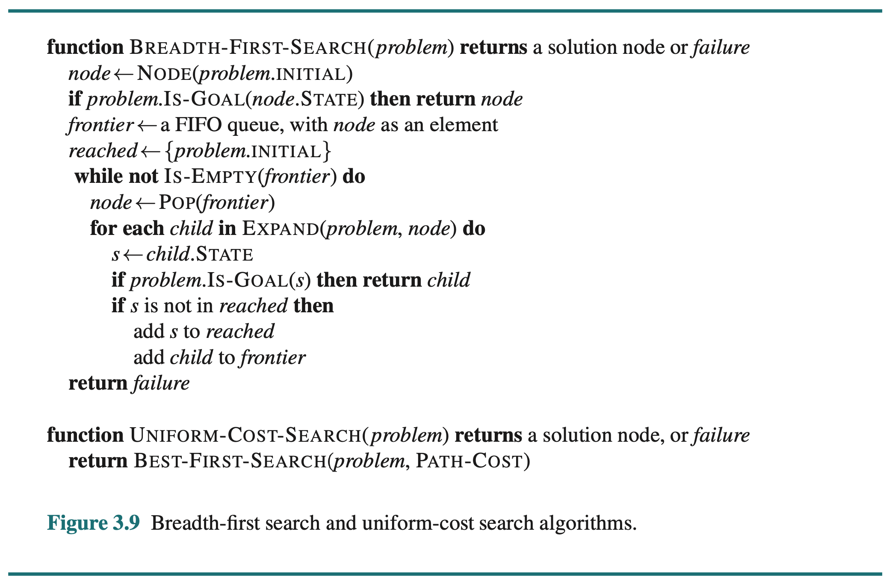

We will cover several shearch algorithms.

We consider only the simplest environments: episodic, single agent, fully observaable, deterministic, static, discrete, and known.

- Informed algorithms: the agent can estimate how far it is from the goal
- Uninformed algorithm: no such estimate is available

# 1. Problem-Solving Agents

Search Problem Formulation

- *State space*: a set of possible states that the environment can be in
- *Initial state*: a state that the agent starts in
- *Goal state*: Given a state $s$, ACTIONS($s$) returns a finite set of actions that cab ev excuted in $s$
- *Transition model*: describing what each action does. RESULT(s, a) returns the state that results from doing action $a$ in the state $s$.
- *Action cost function*: ACTION-COST($s, a, s'$) gives the numeric cost of applying action a in state s to reach state $s'$.
- *Path*: a sequence of actions
- *Solution*: a path from the initial state to a goal state
- *Optimal Solution*: the lowest path among all solutions

The state space can be represented as a graph in which the verices are states and the directed edges between  them are actions.

- *Model* : a abstract mathematical description
- *Abstraction* : the process of removing detail from a representation

The abstraction is useful if carrying out each of the actions in the solution is easier than the original problem.

The choice of a good abstraction thus involves removing as much detail as possible while retaining validity and ensuring that the abstract actions are easy to carry out.

# 2. Example Problems

# 3. Search Algorithms

## 3.4 Measuring problem solving performance

We can evaluate an algorithm's performance in 4 ways:

- **Completeness**: Is the algorithm guaranteed to find a solution when there is one, and to correctly report failure when there is not?
- **Cost Optimality**: Does it find a solution with the lowest path cost of all solutions?
- **Time complexity**: How long does it take to find a solution? This can be measured in seconds, or more abstractly by the number of states and actions considered. / number of nodes expanded
- **Space complexity**: How much memory is needed to perform the search? / maximum number of nodes in memory

# 4. Uninformed Search Strategies

Uninformed search algorithm: is given no clue about how close a state is to the goal

## 4.1 Beadth-first search

Breath-first search always finds a solution with a minimal number of actions, because when it is generating nodes at depth $d$, it has already generated all the nodes at depth $d - 1$

- It is cost-optimal for problems where all actions have the same cost, but not for problems that don't have that property.
- It is complete in either case.

Suppose searching a uniform tree where every state has b successors. The root of the search tree generate b nodes, each of which generates b more nodes, for a totoal of $b^2$ at the secode level. Now suppose that the solution is at depth $d$.

Then the total number of nodes generated is

$$
1 + b + b^2 + b^3 + \dots + b^d = \mathcal{O}(b^d)
$$

All the nodes remain in memory, so both time and space complexity are $\mathcal{O}(b^d)$.

In general, exponential-complexity search problems cannot be solved by uninformed search for any byt the smallest instances.

## 4.3 Depth-first search and the problem of memory

# 5. Informed (Heuristic) Search Strategies

# 6. Heuristic Functions

# Reference

Artificial Intelligence: A Modern Approach Fourth Edition
