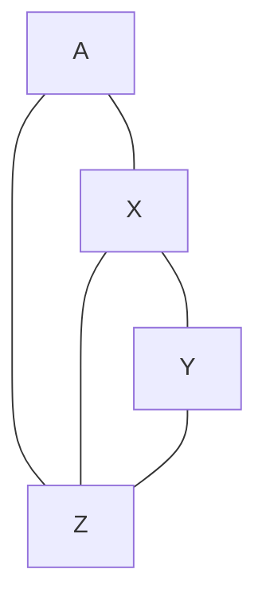

## 1. 그래프

- 그래프는 요소들이 서로 복잡하게 연결되어 있는 관계를 표현하는 자료구조이다.
- 그래프는 선형 자료구조들이나 트리보다 더 일반화된 자료구조로, 선형 자료구조나 트리도 그래프의 한 종류이다.
- 그래프는 정점과 간선의 집합이다.
- 정점(노드) : 여러 가지 특성을 가질 수 있는 객체
- 간선(링크) : 객체 정점들 간의 관계

|그래프의 종류|정의|
|---|---|
|무방향 그래프|간선에 방향이 표시되지 않는 그래프|
|방향 그래프|간선에 방향성이 존재하는 그래프|
|가중치 그래프(네트워크)|간선에 비용이나 가중치가 할당된 그래프|
|부분 그래프|정점의 집합과 간선의 집합의 부분 집합으로 이루어진 그래프|


|그래프의 용어|정의|
|---|---|
|인접 정점|간선에 의해 직접 연결된 정점|
|정점의 차수|정점에 연결된 간선의 수|
|경로|간선을 따라갈 수 있는 길|
|경로의 길이|경로를 구성하는 데 사용된 간선의 수|
|단순 경로|경로 중에서 반복되는 간선이 없는 경로|
|사이클|시작 정점과 종료 정점이 동일한 단순 경로|
|연결 그래프|그래프의 모든 정점들 사이에 경로가 존재하는 그래프|
|트리|사이클을 갖지 않는 연결 그래프|
|완전 그래프|모든 정점이 서로 연결되어 있는 그래프|

그래프의 추상 자료형

```adt
데이터 : 정점의 집합과 간선의 집합

연산 :
    - init() : 그래프를 초기화한다.
    - is_empty() : 그래프가 공백 상태인지 확인한다.
    - insert_vertex(v) : 그래프에 정점 v를 삽입한다.
    - insert_edge(u, v) : 그래프에 간선 (u, v)를 삽입한다.
    - delete_vertex(v) : 그래프의 정점 v를 삭제한다.
    - delete_dege(u, v) : 그래프 g의 간선 (u, v)를 삭제한다.
    - adjacent(v) : 정점 v에 인접한 모든 정점의 집합을 반환한다.
```

## 2. 인접 행렬을 이용한 그래프의 표현

- 인접 행렬 : n개의 정점을 표현하는 n x n의 2차원 배열
- n개의 정점을 가지는 그래프를 인접 행렬로 표현하기 위해서는 간선의 수에 무관하게 항상 $n^2$개의 메모리 공간이 필요하다.

|그래프의 연산|시간 복잡도|방법|
|---|---|---|
|두 정점을 연결하는 간선의 존재 여부 확인|$O(1)$|M[u][v]의 값을 조사하여 정점 u와 정점 v를 연결하는 간선의 존재하는지 바로 알 수 있다.|
|정점의 차수|$O(n)$|인접 행려의 행이나 열을 조사하여 알 수 있다.|
|그래프에 존재하는 간선의 개수|$O(n^2)$|인접 행렬 전체를 조사해야 한다.|

|그래프의 종류|대칭 행렬 여부|
|:---:|:---:|
|무방향 그래프|O|
|방향 그래프|X|
|가중치 그래프|인접 행렬의 각 항목은 해당 간선의 가중치 값을 갖는다.|



```txt
4
A 0 1 0 1
X 1 0 1 1
Y 0 1 0 1
Z 1 1 1 0
```

```c
#include <stdio.h>
#include <stdlib.h>
#define MAX_VTXS 256

void error(char str[]) {
    printf("%s\n", str);
    exit(1);
}

typedef char VtxData;           // 그래프 정점에 저장할 데이터의 자료형
int adj[MAX_VTXS][MAX_VTXS];    // 인접 행렬을 위한 2차원 배열(adj[i][j]는 i번째 정점과 j번째 정점 간의 간선의 유무 또는 간선의 가중치를 나타낸다.)
int vsize;                      // 그래프의 전체 정점의 개수
VtxData vdata[MAX_VTXS];        // 정점을 저장하는 데이터 배열

int is_empty_graph() { return (vsize == 0); }
int is_full_graph() { return vsize >= MAX_VTXS; }
void init_graph()
{
    int i, j;
    vsize = 0;
    for (i = 0; i < MAX_VTXS; i++)
        for (j = 0; j < MAX_VTXS; j++)
            adj[i][j] = 0;
}
void insert_vertex(VtxData name)
{
    if (is_full_graph())
        error("Error: 그래프 정점의 개수 초과\n");
    else
        vdata[vsize++] = name;
}
void insert_edge(int u, int v, int val)
{
    adj[u][v] = val;
}
void insert_edge2(int u, int v, int val)
{
    adj[u][v] = adj[v][u] = val;
}
void print_graph(char* msg)
{
    int i, j;
    printf("%s", msg);
    printf("%d\n", vsize);
    for (i = 0; i < vsize; i++) {
        printf("%c  ", vdata[i]);
        for (j = 0; j < vsize; j++)
            printf(" %3d", adj[i][j]);
        printf("\n");
    }
}
void load_graph(char *filename)
{
    int i, j, val, n;
    char str[80];
    FILE *fp = fopen(filename, "r");
    if (fp != NULL) {
        init_graph();
        fscanf(fp, "%d", &n);
        for (i = 0; i < n; i++) {
            fscanf(fp, "%s", str);
            insert_vertex(str[0]);
            for(j = 0; j < n; j++) {
                fscanf(fp, "%d", &val);
                if (val != 0)
                    insert_edge(i, j, val);
            }
        }
        fclose(fp);
    }
}
int main()
{
    load_graph("graph.txt");
    print_graph("그래프(인접행렬)\n");
    return 0;
}
```

```terminal
그래프(인접행렬)
4
A     0   1   0   1
X     1   0   1   1
Y     0   1   0   1
Z     1   1   1   0
```

## 3. 인접 리스트를 이용한 그래프의 표현과 구현

- 인접 리스트 : 그래프의 각 정점에 인접한 정점들을 연결 리스트로 표현하는 방법

- 무방향 그래프의 경우 간선 (i, j)가 추가되면, 정점 i의 연결 리스트에 j 노드를 추가해야 하고 정점 j의 연결 리스트에 i 노드를 추가해야 한다.
- 정점의 수가 n개이고 간선의 수가 e개인 무방향 그래프를 표시하기 위해서는 n개의 연결 리스트가 필요하고, n개의 헤더 포인터와 2e개의 노드가 필요하다.
- 인접 행렬 표현은 희소 그래프(정점의 개수에 비해 간선의 개수가 매우 적은 그래프)의 표현에 적합하다.
- 그래프에서 간선 (i, j)의 존재 여부나 정점 i의 차수를 알기 위해서는 인접 리스트에서의 정점 i의 연결 리스트를 탐색해야 하므로 연결 리스트에 있는 노드의 수(정점의 차수)만큼의 시간 $O(n + e)$ 이 필요하다.

```c
typedef struct GraphNode {
    int id;
    struct GraphNode* link;
} GNode;
typedef char VtxData;
GNode* adj[MAX_VTXS];
int vsize;
VtxData vdata[MAX_VTXS];

int is_empty_graph() {return vsize == 0;}
int is_full_graph() {return (vsize >= MAX_VTXS);}
void init_graph()
{
    int i;
    vsize = 0;
    for (i = 0; i < MAX_VTXS; i++)
        adj[i] = NULL;
}
void reset_graph()
{
    int i;
    GNode* n;
    for (i = 0; i < vsize; i++)
        while( adj[i] != NULL) {
            n = adj[i];
            adj[i] = n -> link;
            free(n);
        }
    vsize = 0;
}
void insert_vertex(char name)
{
    if (is_full_graph())
        error("Error : 그래프 정점의 개수 초과\n");
    else
        vdata[vsize++] = name;
}
void insert_edge(int u, int v)
{
    GNode* n = (GNode*)malloc(sizeof(GNode));
    n -> link = adj[u];
    n -> id = v;
    adj[u] = n;
}
```

## 4. 그래프의 탐색

- 그래프의 탐색 : 하나의 정점에서 시작하여 모든 정점들을 한 번씩 방문하는 작업
- 많은 그래프 문제들이 단순히 정점들을 탐색하는 것만으로 해결된다.

### 깊이 우선 탐색

- 미로를 탐색할 때 한 방향으로 갈 수 있을 때까지 계속 가다가 더 이상 갈 수 없게 되면 다시 가장 가까운 갈림길로 돌아와서 다른 방향을 다시 탐색하는 방법(스택을 이용한 미로 탐색 방법과 유사)

1. 시작 정점에서부터 임의의 인접한 정점으로 깊이 탐색을 진행한다. 이때 방문한 정점은 표시를 하고, 방문하지 않은 인접 정점으로만 탐색이 가능하다.
2. 더 이상 방문하지 않은 인접 정점이 없으면, 가장 마지막에 만났던 정점으로 되돌아간다.
3. 다시 아직 방문하지 않은 인접 정점을 찾아 다시 동일한 방법의 탐색을 진행한다.
4. 더 이상 방문하지 않은 정점이 없으면, 탐색이 완료된다.

#### 인접 행렬을 이용한 그래프의 깊이 우선 탐색

```txt
8
A   0 1 1 0 0 0 0 0
B   1 0 0 1 0 0 0 0
C   1 0 0 1 1 0 0 0
D   0 1 1 0 0 1 0 0
E   0 0 1 0 0 0 1 1
F   0 0 0 1 0 0 0 0
G   0 0 0 0 1 0 0 1
H   0 0 0 0 1 0 1 0
```

```c
#include <stdio.h>
#include <stdlib.h>
#define MAX_VTXS 256

void error(char str[])
{
    printf("%s", str);
    exit(1);
}

typedef char VtxData;           // 그래프 정점에 저장할 데이터의 자료형
int adj[MAX_VTXS][MAX_VTXS];    // 인접 행렬
int vsize;                      // 전체 정점의 개수
VtxData vdata[MAX_VTXS];        // 정점에 저장할 데이터 배열

int is_empty_graph() { return vsize == 0; }
int is_full_graph() { return vsize >= MAX_VTXS; }
void init_graph()
{
    int i, j;
    vsize = 0;

    for (i = 0; i < MAX_VTXS; i++)
        for (j = 0; j < MAX_VTXS; j++)
            adj[i][j] = 0;
}
void insert_vertex(VtxData name)
{
    if (is_full_graph())
        error("Error : 그래프 정점의 개수 초과\n");
    else
        vdata[vsize++] = name;
}
void insert_edge(int u, int v, int val) // 방향 그래프
{
    adj[u][v] = val;
}
void insert_edge2(int u, int v, int val) // 무방향 그래프
{
    adj[u][v] = adj[v][u] = val;
}
void load_graph(char *filename)
{
    int i, j, val, n;
    char str[80];
    FILE *fp = fopen(filename, "r");
    if (fp != NULL) {
        init_graph();
        fscanf(fp, "%d", &n);
        for (i = 0; i < n; i++) {
            fscanf(fp, "%s", str);
            insert_vertex(str[0]);
            for (j = 0; j < n; j++) {
                fscanf(fp, "%d", &val);
                if (val != 0)
                    insert_edge(i, j, val);
            }
        }
    }
    fclose(fp);
}

int visited[MAX_VTXS];  // 방문 여부를 기록하는 배열
void reset_visited()    // 방문 여부를 기록하는 배열을 초기화하는 함수
{
    int i;
    for (i = 0; i < vsize; i++) {
        visited[i] = 0;
    }
}
void DFS(int v)
{
    int w;
    visited[v] = 1;
    printf("%c ", vdata[v]);
    for (w = 0; w < vsize; w++)
        if (adj[v][w] != 0 && visited[w] == 0)
            DFS(w);
}
void main()
{
    load_graph("graph.txt");
    reset_visited();
    printf("DFS ===> ");
    DFS(0);
    printf("\n");
}
```

```console
DFS ===> A B D C E G H F
```

#### 인접 리스트를 이용한 그래프의 깊이 우선 탐색

```c
void DFS(int v)
{
    GNode *p;
    visited[v] = 1;
    printf("%c ", vdata[v]);
    for(p = adj[v]; p != NULL; p = p -> link)
        if(visited[p -> id] == 0)
            DFS(p -> id);
}   
```

### 너비 우선 탐색

시작 정점으로부터 가까운 정점을 먼저 방문하고 멀리 떨어져 있는 정점을 나중에 방문하는 순회 방법

## 5. 연결 성분 검사

**연결 성분의 개수**를 구하는 것이 핵심이다.

연결 성분 ; 최대로 연결된 부분 그래프

깊이 우선 탐색이나 너비 우선 탐색을 이용해서 연결성분을 찾을 수 있다.

## 6. 신장트리

그래프 내의 모든 정점을 포함하는 트리

신장트리도 트리의 일종이므로 모든 정점들이 연결되어 있고 사이클이 없어야 한다.

## 7. 위상정렬
