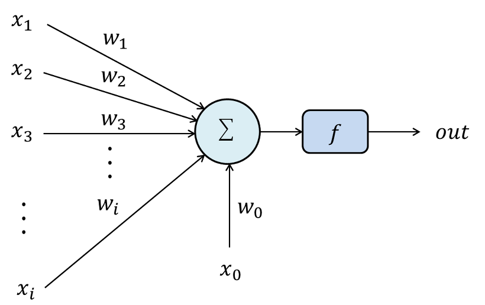
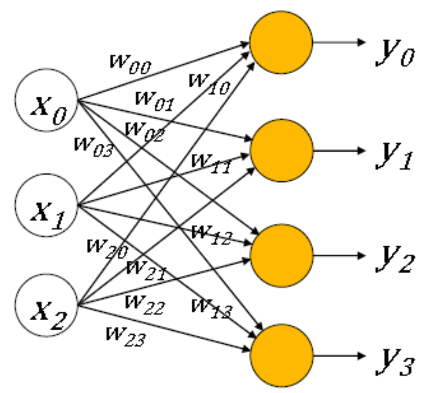
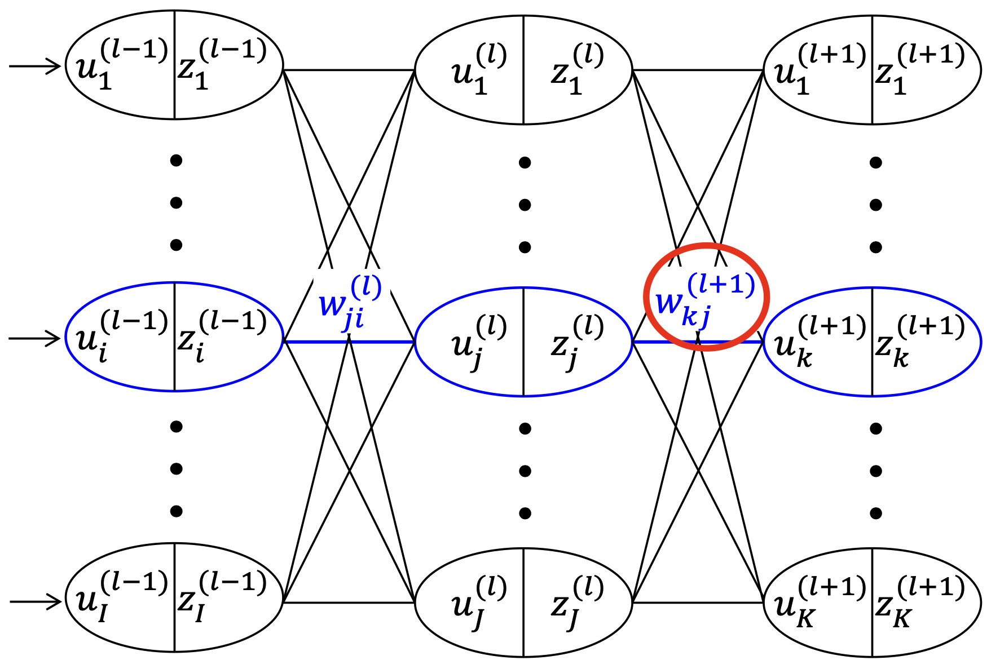
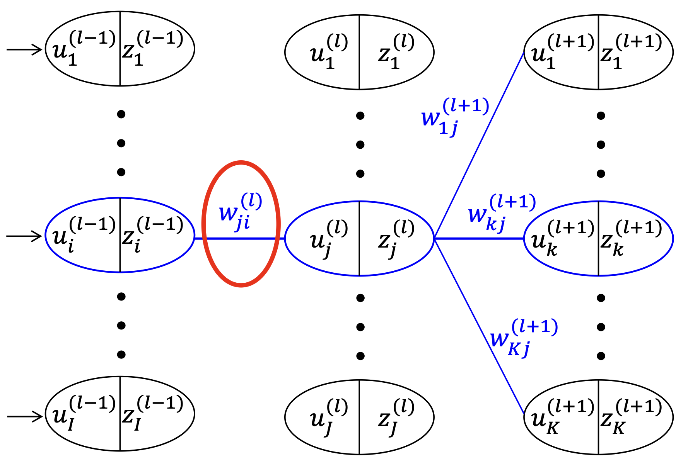

- 인공지능: 인간의 지능적인 행동 미 사고릉 모방할 수 있는 기술

# 인간의 뇌와 신경계

컴퓨터와 뇌

|컴퓨터|뇌|
|---|---|
|serial processing|parallel processing|
|One powerful CPU + memory|$10^{11}$ neurons + $10^{15}$ synapses|
|shared common bus between a CPU and a memory|dedeicated local point to point connnection|
|not power-efficient|very power-efficient (~20W)|
|digital operation|analog operation|
|~ns speed|us ~ ms speed|
|sensitive to errors|robust to errors|

Synapse

- GABA receptor: 음의 전압을 발생시켜서 신호를 감쇄시키고 연결 강도를 약화한다. (양의 synaptic weight)
- AMPA receptor: 양의 전압을 발생시켜서 신호를 증폭시키고 연결 강도를 강화한다. (음의 synaptic weight)

Synapse에서 어떤 reeptor가 많느냐가 연결 강도를 결정한다. AMPA receptor가 우세하면 더 큰 EPSP를 생성한다.

post neuron은 여러 개의 pre neuron으로부터 전기적 신호를 합산한다.

- 인간의 기억의 실체는 synapse이다. synapse의 구조가 변화됨으로써 기억이 저장된다.
- 인간의 학습은 지속적인 자극을 통해 synapse의 구조(연결 강도)를 영구적으로 바꾸는 것이다.

# Artificial Neural Network

학술적으로 artificial Intelligence, machine learning, deep learning은 다른 의미를 갖는다.

- artificial intelligence: perceiving, synthesizing, and inferring information by machine
- machine learning: 학습을 통해 입력에 대해 출력을 하는 모델을 만드는 것
  - 학습: 데이터로부터 지식을 습득하고 새로운 데이터에 대해서도 올바른 결과가 나올 수 있는 모델을 만드는 것
- deep learning: machine learning에서 학습하는 방식을 deep neural network으로 하는 것

## Single Perceptron

다음 그림에서 summation과 activation 부분이 neuron에 해당하고, weight가 있는 부분이 synapse에 해당한다.

{: .align-center width="500" height="300"}

- $x$ : input
- $w$ : weight (-1 ~ 1)
- $f$ : activation function (differentiable, non-linear)

activation function으로는 다음과 같은 것들이 있다.

- Sigmoid
- Hyperbolic Tangent
- ReLU

출력은 다음과 같이 나타낼 수 있다.

$$
f(w_0x_0 + w_1x_1 + w_2x_2 + \dots + w_nx_n ) = f \left(\sum_{i=0}^{n}w_nx_n\right)
$$

## Multiple Percpetron

{: .align-center width="500" height="300"}

각 출력을 다음과 같이 나타낼 수 있다.

$$
\begin{align*}
  y_0 = f(w_{00}x_0 + w_{10}x_1 + w_{20}x_2 + b_0) \\
  y_1 = f(w_{01}x_0 + w_{11}x_1 + w_{21}x_2 + b_1) \\
  y_2 = f(w_{02}x_0 + w_{12}x_2 + w_{22}x_2 + b_2) \\
  y_3 = f(w_{03}x_0 + w_{13}x_3 + w_{23}x_2 + b_3) \\
\end{align*}
$$

**Matrix-Vector Multiplication**을 이용하여 더 단순하게 나타낼 수 있다.

$$
\begin{bmatrix}
  y_0 \\
  y_1 \\
  y_2 \\
  y_3 \\
\end{bmatrix}
= f \left(
\begin{bmatrix}
  w_{00} & w_{10} & w_{20} \\
  w_{01} & w_{11} & w_{21} \\
  w_{02} & w_{12} & w_{22} \\
  w_{03} & w_{13} & w_{23} \\
\end{bmatrix}
\begin{bmatrix}
  x_{0} \\
  x_{1} \\
  x_{2} \\
\end{bmatrix}
+
\begin{bmatrix}
  b_{0} \\
  b_{1} \\
  b_{2} \\
  b_{3} \\
\end{bmatrix}
\right)
$$

$y_0, y_1, y_2, y_3$에 대한 계산을 동시에 할 수 있다. 즉 병렬 처리할 수 있다.

인공지능에서 계산의 핵심은 행렬의 곱과 합이다. 이걸 적은 에너지와 빠른 속도로 하는 것이 인공지능 반도체의 목표이다.

## Artificial Neural Network

- Inference: 입력을 넣어서 출력을 얻는 과정
- Training: 원하는 출력을 얻기 위해 에러를 줄이는 방향으로 synaptic weight들을 조절하는 과정

출력값을 증가 혹은 감소시키기 위해서는 해당 뉴런과 연결된 synapse weight들을 update시켜야 한다.

인공신경망 학습 방법

- Stochastic gradient descent: 각각의 학습 데이터마다 오차를 게산해 신경망의 가중치를 갱신하는 방식
- Batch 학습: 모든 학습 데이터의 오차에 관해 가중치 업데이트를 계산한 다음에 이들의 평균값으로 가중치를 한 번에 갱신하는 기법
- Mini batch 학습: 전체 데이터를 N 등분하여 각각의 학습 데이터를 배치 방식으로 학습하는 기법

Epoch: 전체 학습 데이터를 한 번씩 모두 학습시킨 횟수

Gradient descent: 함수의 기울기를 구하고 경사의 반대 방향으로 계속 이동시켜 극값에 이를 때까지 반복하는 것

$$
w = w - \eta \cdot \dfrac{\partial E}{\partial w}
$$

### Output Layer Wight Update

Cost function (error function)을 다음과 같이 모든 에러의 제곱의 합으로 정의한다.

$$
E = \dfrac{1}{2}\sum_{k=1}^{K}\left( z_k^{(l+1)} - d_k \right)^2
$$

출력 layer의 노드(뉴런)의 개수가 $K$개 있다고 할 때, 각 노드의 출력값은 다음과 같은 과정에 의해 결정된다.

{: .align-center width="500" height="300"}

$$
z_l^{(l+1)} = f(u_k^{(l+1)}) = f\left( \sum_{j=1}^J w_{kj}^{(l+1)} z_j^{(l)} \right)
$$

모든 출력을 matrix vector multiplication을 이용해서 다음과 같이 나타낼 수 있다.

$$
\mathbf{Z}^{(l)} = f(\mathbf{U}^{(l)}) = f(\mathbf{W}^{(l)} \cdot \mathbf{Z}^{(l-1)})
$$

다음의 Gradient descent 식을 통해 하나의 output synaptic weight를 update한다.

$$
w_{kj}^{(l+1)} = w_{kj}^{(l+1)}  - \eta \cdot \dfrac{\partial E}{\partial w_{kj}^{(l + 1)}}
$$

이때 $\dfrac{\partial E}{\partial w_{kj}^{(l + 1)}}$를 어떻게 계산할까? Chain rule을 적용하자.

$$
\begin{align*}
  \dfrac{\partial E}{\partial w_{kj}^{(l + 1)}}
  &= \dfrac{\partial E}{\partial z_k^{(l+1)}} \cdot \dfrac{\partial z_k^{(l+1)}}{\partial u_k^{(l+1)}} \cdot  \dfrac{\partial  u_k^{(l+1)}}{\partial w_{kj}^{(l + 1)}} \\
  &= \dfrac{\partial E}{\partial z_k^{(l+1)}} \cdot \dfrac{\partial f(u_k^{l+1})}{\partial u_k^{(l+1)}} \cdot  \dfrac{\partial  u_k^{(l+1)}}{\partial w_{kj}^{(l + 1)}} \\
  &= (z_k^{(l+1)} - d_k) \cdot f'(u_k^{(l+1)}) \cdot z_j^{(l)} \\
  &= \delta_k^{(l+1)} \cdot z_j^{(l)}
\end{align*}
$$

where $\delta_k^{(l+1)} := (z_k^{(l+1)} - d_k) \cdot f'(u_k^{(l+1)})$

Cost function에 대한 gradient를 차와 곱을 통해 계산할 수 있음을 확인할 수 있다.

### Hidden Layer Weight Update

{: .align-center width="500" height="300"}

$$
z_j^{(l)} = f(u_j^{(l)}) = f \left(\sum_{i=1}^J w_{ji}^{(l)} z_i^{(l-1)} \right)
$$

다음의 Gradient descent 식을 통해 하나의 hidden layor의 synaptic weight를 update한다.

$$
w_{ji}^{(l)} = w_{ji}^{(l)}  - \eta \cdot \dfrac{\partial E}{\partial w_{ji}^{(l + 1)}}
$$

$$
\begin{align*}
  \dfrac{\partial E}{\partial w_{ji}^{(l)}}
  &= \sum_{k=1}^{K} \dfrac{\partial E}{\partial z_k^{(l+1)}} \cdot \dfrac{\partial z_k^{(l+1)}}{\partial u_k^{(l+1)}} \cdot  \dfrac{\partial u_k^{(l+1)}}{\partial z_j^{(l)}} \cdot \dfrac{\partial z_j^{(l)}}{\partial u_j^{(l)}} \cdot \dfrac{\partial u_j^{(l)}}{\partial w_{ji}^{(l)}} \\
  &= \sum_{k=1}^{K} \dfrac{\partial E}{\partial z_k^{(l+1)}} \cdot \dfrac{\partial f(u_k^{(l+1)})}{\partial u_k^{(l+1)}} \cdot  \dfrac{\partial u_k^{(l+1)}}{\partial z_j^{(l)}} \cdot \dfrac{\partial f(u_j^{(l)})}{\partial u_j^{(l)}} \cdot \dfrac{\partial u_j^{(l)}}{\partial w_{ji}^{(l)}} \\
  &= \sum_{k=1}^{K} (z_k^{(l+1)} - d_k) \cdot f'(u_k^{(l+1)}) \cdot w_{kj}^{(l+1)} \cdot f'(u_j^{(l)}) \cdot z_i^{(l-1)}\\
  &= \sum_{k=1}^{K} \delta_k^{(l+1)} \cdot w_{kj}^{(l+1)} \cdot f'(u_j^{(l)}) \cdot z_i^{(l-1)}\\
  &= \delta_j^{(l)} \cdot z_i^{(l-1)} \\
\end{align*}
$$

where $\delta_j^{(l)} = \sum_{k=1}^K \left[ \delta_k^{(l+1)} \cdot w_{kj}^{(l+1)} \right] \cdot f'(u_j^{(l)})$
