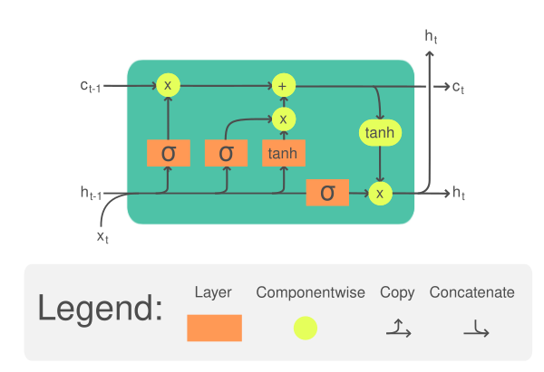

# Recurrent Neural Network

시계열 데이터 (음성 인식, video)와 같이 시간의 흐름에 따라 변화하는 데이터를 학습하는 deep neural network

시계열 데이터의 의미를 알기 위해서는 과거의 데이터도 알고 있어야 한다.

RNN은 hidden layer에 순환 구조를 적용한다. 새롭게 입력으로 주어지는 데이터와 과거 데이터를 연결시켜서 그 의미를 알아내는 기능을 가지고 있다.

RNN은 feedback을 사용한다.

- Feedforward neural network (FNN): information only flows in one direction
- Recurrent neural network (RNN): RNN makes predictions based on current and previous inputs recurrently.

>I work at Google

I -> hidden state 1

work -> work + hidden state 1 -> hidden state 2

이전 시점의 hidden state와 현재 시점에 들어온 단어

# Long Short Term Memory

{: .align-center width="500" height="300"}

LSTM is designed to catpure long term dependency and overcome the vanishing/exploding gradient problem in SimpleRNN.

LSTM의 핵심은 cell state이다. LSTM은 gate라는 구조를 이용해서 현재 cell state에 이전 cell state과 새로운 입력에 대한 정보를 얼마나 반영할지 결정한다.

- $x_t$: 새로운 입력
- $h_{t-1}$: 이전 시간의 은닉 상태

input gate, forget gate, output gate, RNN core

- input gate: 새로운 정보를 반영할 정도를 결정한다.
- forget gate: 이전 cell state을 잊어버릴 정도를 결정한다.
- output gate: 현재 시간의 셀 상태에서 은닉 상태로 얼마나 정보를 출력할지 결정한다.

$$
\begin{align*}
  i_t &= \sigma (W_{xh}^i x_t + W_{hh}^i h_{t-1} + b_h^i) \\
  f_t &= \sigma (W_{xh}^f x_t + W_{hh}^f h_{t-1} + b_h^o) \\
  o_t &= \sigma (W_{xh}^o x_t + W_{hh}^o h_{t-1} + b_h^o) \\
  g_t &= \tanh (W_{xh}^g x_t + W_{hh}^g h_{t-1} + b_h^g) \\
\end{align*}
$$

Cell state: 이전 셀 상태에서 필요한 정보는 유지하고, 새로운 정보는 추가하는 방식으로 업데이트된다.

$$
c_t = f_t \odot c_{t-1} + i_t \odot g_t
$$

Hidden state: LSTM의 최종 출력으로, 다음 시간 단계로 전달되고, 네트워크의 출력에도 영향을 미친다.

$$
h_t = o_t \odot \tanh (c_t)
$$

# Reference

[Long Short-Term Memory 이해하기](https://dgkim5360.tistory.com/entry/understanding-long-short-term-memory-lstm-kr)
