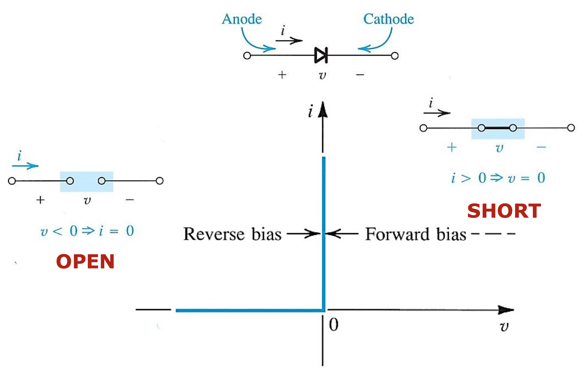
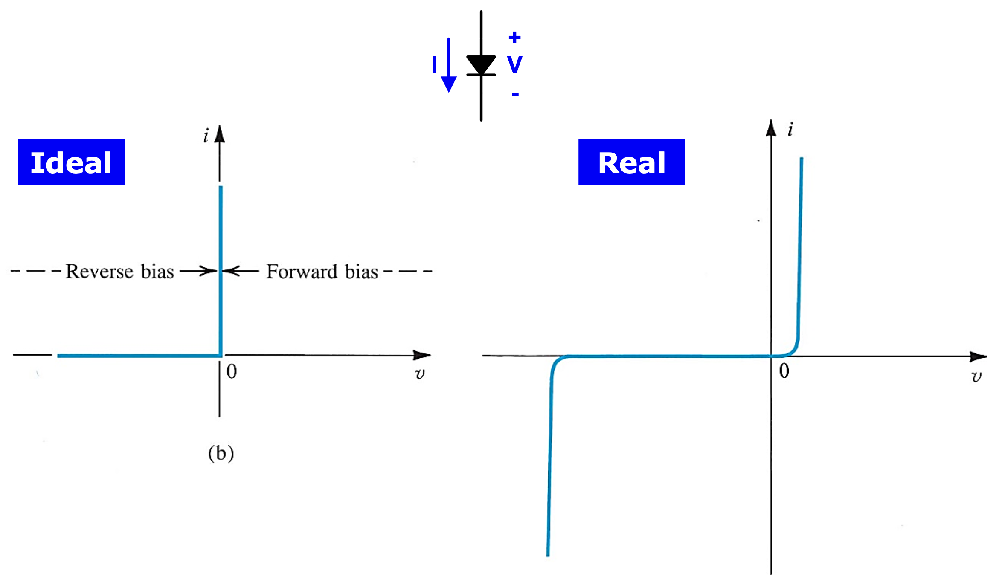
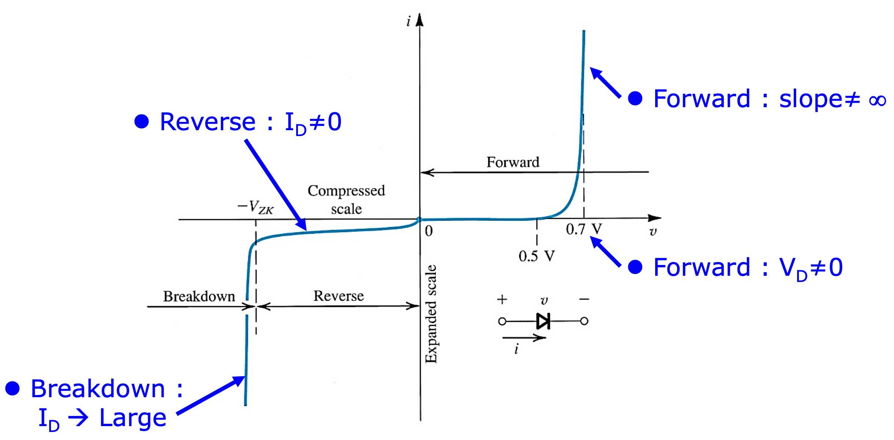
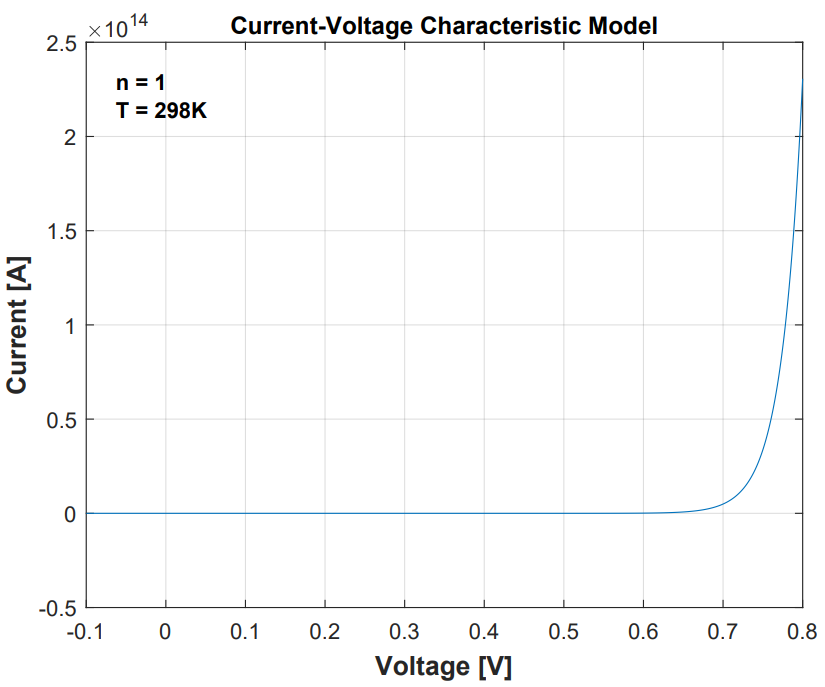
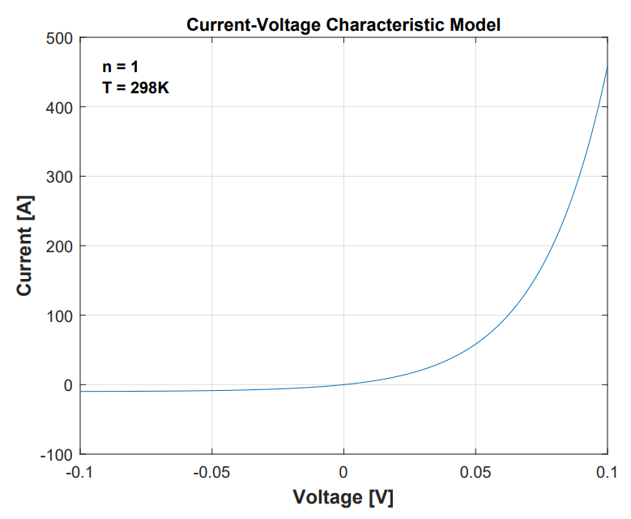
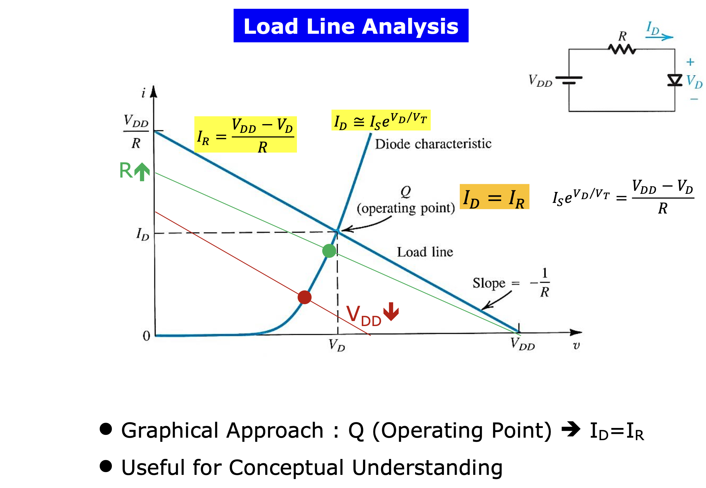
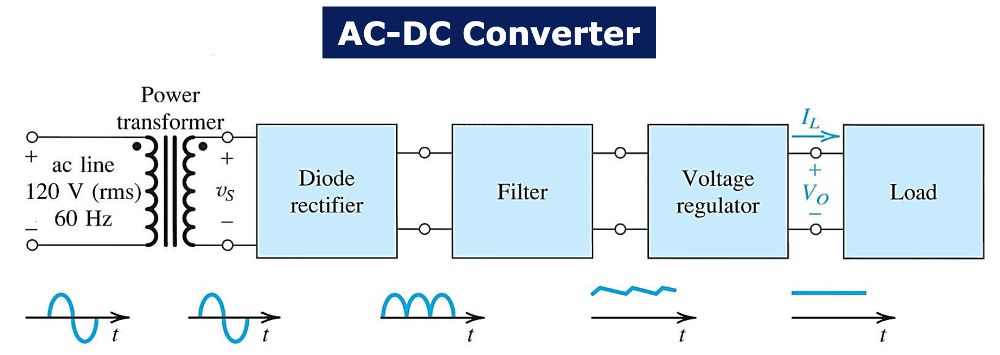

## 1 The Ideal Diode

### 1.1 Current Voltage Characteristic

The ideal diode can be considered the most fundemental nonlinear circuit element.

- 저항은 극성에 관계 없이 동일하게 동작하기 때문에 극성을 구분하지 않는지만 diode는 다르다. -> anode(양극), cathode(음극)
- Ideal diode에서 정의된 전류의 방향은 anode $\rightarrow$ cathode이다.
- Diode의 극성에 따라 $R = 0$ 인 영역과 $R = \infty$인 영역이 나뉜다.
- 인간은 다이오드의 비선형성을 이용해 많은 것들을 할 수 있다. 인류가 존재하는 한 diode는 존재할 것이다. 지금까지의 소자들로는 할 수 없었던 switch 역할을 할 수 있다.
- 언제 shot / open가 되도록 할지 고민해야 한다. 언제 forward / reverse인지를 판단할 수 있다면 회로 분석이 쉬워진다.

### 1.2 The Rectifier

- The series connection of a diode and a resister

### 1.3 Limiting and Protection Circuits

## 2 Terminal Characteristics of Junction Diodes (current-voltage characteristic)

The i-v characteristic of a silicon junction diode

The i-v characteristic of a silicon junction diode with some expended and others compressed

The characteristic curve consists of three distinct regions

1. The forward-bias region
2. The inverse-bias region
3. The breakdown region

실제 diode가 이상적인 diode와 다른 점

1. 순방향 전압에서 전류가 많이 흐르는 전압은 0V가 아니라 약 0.7V이다.
2. 이때 diode의 저항은 영이 아니다.
3. 역방향 전압에서도 기본적으로 미세한 전류가 흐른다.
4. 역방향 전압에서도 전류가 많이 흐르는 구간이 존재한다.

### 2.1 The Forward-Bias Region

In the forward region, the i-v relationship is closely approximated by

$$
i = I_s(e^{v/nV_T} - 1)
$$

  
  
<figcaption align="center"></figcaption>

- Saturation current (or scale current) $I_s$ : a constant for a given diode at a given temperature. $I_s$ doubles in value for every $5^{\circ}$ rise in temperature. 다이오드의 형상에 종속된 고유한 값이며 온도에도 종속적이다. 일반적으로 10~15A의 값을 갖는다.
- Thermal Voltage : $V_T = \dfrac{kT}{q} = 0.0862$T, mV (상온에서 약 26mV(25.6876 mV))
  - $k$ = Boltzmann's constant $= 8.62 \times 10^{-5} \text{eV/k} = 1.38 \times 10^{-23} \text{joules/kelvin}$ (constant)
  - $T$ = the absolute temperature in kelvins = 273 + temperature in $^{\circ}C$
  - $q$ = the magnitude of electronic charge = $1.60 \times 10^{-19}$ coulomb (constant)
- $n$ : 전압과 전류의 관계를 exponential로 modeling하지만 실제 그래프와 차이가 발생한다. 이것을 보완하기 위해 parameter n을 추가한다. 이것은 diode마다 다른 값을 갖는다. 우리는 보통 1로 두고 게산한다.

$$
i = I_s(e^{v/nV_T} - 1) \cong I_s(e^{v/V_T} - 1) \cong I_se^{v/V_T}
\\
v = V_T\ln \left (\dfrac{i}{I_s} \right)
\\
v_2 - v_1 = V_T \ln \left (\dfrac{i_2}{i_1} \right) = 2.3V_T \log \left(\dfrac{i_2}{i_1} \right )
$$

>실생활 이야기 \
>$i_2$의 전류가 10배 커지면 $2.3V_T$ 커진다. 상온에서 약 60mV 증가한다. 반도체의 온도가 1도 상승하면, 반도체에 걸리는 전압이 2mV 감소한다. 넓은 범위에서 선형적으로 나타나는 특성이다. 이 성질은 반도체의 온도를 측정할 때 쓰인다. CPU 팬을 끄고 컴퓨터를 부팅하면 조금 실행되다 꺼진다. CPU가 특정 온도 이상이 되면 cpu를 shut down시키는 장치가 있는 것이다. 즉 CPU의 온도를 측정할 수 있는 것이다. 1mA를 넣어주고 순방향 전압의 감소폭을 모니터링하여 온도를 알아낼 수 있다.

### 2.2 The Reverse-Bias Region

- 실제 Diode에서는 forward bias보다 reverse bias를 더 많이 사용한다.
- Diode는 빛에 굉장히 민감한 특성을 가지고 있다.
- 빛이 들어올 때 미세한 전류가 흐흔다.
- 빛을 전기 신호로 바꾸는 모든 장비에 사용된다. 카메라, 태양광...
- Camera Image Sensor(CIS)에서 reverse bias current를 이용한다.
  - 하나의 픽셀당 세 개의 다이오드가 있다. 각 다이오드 위에는 각각 RGB에 해당하는 광학 필터가 있어 각 다이오드는 하나의 색이 얼마나 들어오고 있는지를 감지한다. 그 양에 비례하는 reverse bias current를 발생시킨다. 그것을 증폭한다.(analog) -> A/D -> Monitor

### 2.3 The Breakdown Region

다이오드의 사양에 breakdown voltage가 표기되어 있다.

## 3 Modeling the Diode

We'll assess the sustainablitiy of these two models in various analysis situations.

### 3.1 The Exponential Model

The exponential model provides the most accurate description od diode operation outside of the breakdown region.

It's severely nonlinear nature makes it the most difficult to use.

다이오드의 전류 전압 특성

$$
I_D = I_Se^{V_D/V_T}
$$

저항의 전류 전압 특성

$$
I_R = \dfrac{V_{DD}-V_D}{R}
$$

다이오드와 저항이 직렬 연결되어 있으므로 키르히호프의 전류 법칙에 의해 $I_D = I_R$

### 3.2 Graphical Analysis Using the Exponential Model

우리는 다이오드가 포함된 회로에 흐르는 전류를 알고싶다.

- Exponential이 들어간 방정식을 풀 수 없다.
- 간단한 회로에서조차도 전압에 대한 일반화된 식을 얻을 수 없다.
- computer로 반복하면서 error가 특정값 이하로 들어오면 멈추는 방식으로 구한다.
- 회로에서 다이오드를 분석하려면 골치 아프다.

Load line analysis

- 회로에 흐르는 전류에 대한 정보를 준다.
- 실질적인 값을 알려주지는 않지만 회로의 동작을 분석하는 굉장히 중요한 기법
- 저항의 특성과 diode의 특성을 한 그래프에 그린다. 두 그래프의 교점이 우리가 얻고자 하는 점이다.
- 저항이 커진다면 혹은 $V_{DD}$가 작아진다면, 회로에 흐르는 전류는 어떻게 될지 등에 대한 정보를 알려준다.

### 3.3 Iterative Analysis Using the Exponential Model

### 3.4 The Need for Rapid Analysis

### 3.5 The Constant-Voltage-Drop

### 3.6 The Ideal-Diode Model

### 3.7 Operation in the Reverse Breakdown Region

## 4 The Small-Signal Model

An alternative technique for modeling nonlinear devices that preserves the benefits of linear circuit analysis but provides more accuracy than piecewise-linear models as long as the circuit voltages and currents stay within a narrow range.

- Small : this diode model applies only when the voltage applied to diode is kept sufficiently small.
- Signal : input voltage can be a time-varying quantity.

Procedure

1. Perform dc analysis precisely using the exponential model, or approximately using the constant-voltage drop model, or other piecewise-linear model. Thus, for the circuit, we analyze the circuit to find $I_D$.
2. Linearize the circuit. For a forward-biased diode, we find $r_d$ by substituting the current $I_D$ into $r_d = V_T / I_D$. We infd the small-signal equivalent circuit by eliminating all independent dc sources (whose contribution to the final solution we already included in step 1) and replacing the diode with its small-signal resistance $r_d$.
3. Solve the linearized circuit. For example, we find the incremental quantites $\Delta I_D$ and $\Delta V_D$ using the small-signal equivalent circuit. We may want to check that the solution is consistent with our small-signal approximation. That is $\Delta \leq 5mV$.

## 5 Voltage Regulation

A Voltage regulator is a circuit designed to provide a constant dc voltage between its output terminals.

The output voltage must remain as constant as possible in spite of (a) **changes in the load current drawn from the regulator output terminal** and (b) **changes in the dc power-supply voltage that feeds the regulator circuit**.

Since the forward-voltage drop of the diode remains almost constant at approximately $0.7V$ while the current through it varies by relatively large amounts, a forward-biased diode can make a simple voltage regulator.

Shunt regulator

DC power supply를 만들 때 diode를 가장 많이 사용한다. Rectifier와 voltage regulator에 diode가 들어간다.

General p-n junction diode vs. Zener diode

|P-N Juction Diode|Zener Diode|
|---|---|
|0V부터 breakdown까지 거리가 멀다.|Breakdown이 발생하는 전압의 크기가 작다.|
|Breakdown이 일어나는 전압이 정확하게 알려져있지 않다.|Breakdown이 발생하는 전압을 구체적으로 안다.|

Zener diode i-v curve의 breakdown region에서 굉장히 큰 기울기를 갖으므로 Zener diode는 굉장히 작은 저항 값을 갖는다는 것을 알 수 있다. 따라서 Zener diode는 저항과 이상적인 전압원으로 modeling할 수 있다.

Important specification of Zener diode

|Important specification of Zener diode|Description|Feature|
|---|---|---|
|Line Regulation|Voltage regulatior의 입장에서 입력 전압의 변화에 대한 출력 전압의 변화|작을수록 좋다.|
|Load Regulation|부하 저항의 변화에 대한 출력 전압의 변화|작을수록 좋다.|

## 6 Rectifier Circuits

An important application of diodes is in the design of rectifier circuits. A diode rectifier forms an essential building block of the dc power supplies requited to power electronic equipment.

|Block of dc power supply|Description||
|---|---|---|
|Power transformer||한국의 전압 국가 표준은 220V이고 미국은 120V이다. transformer는 2개의 inductor의 감은 수 비를 이용해서 승압 또는 감압을 한다. 일반적으로 감압을 한다.|
|Diode rectifier|converts the input sinusiod to a unipolar output|정현파의 AC 입력을 정방향으로 정류한다.|
|Filter|the variations in the magnitude of the rectifier output are considerably reduced.|감쇄폭을 줄인다.|
|Voltage regulator|reduce the ripple (time-dependent component) and stabilize the magnitude of the dc output voltage against variations caused by changes in load current.|평탄화한다.|

### 6.1 The Half-Wave Rectifier

The half-wave rectifier uses alternate half-cycles of the input sinusoid.

Using constant-voltage-drop diode model,

$v_o = 0$ when $v_s < V_D$

$v_o = v_s - V_D$ when $v_s \geq V_D$

In selecting diodes for rectifier design, we specify two important parameters

1. The current-handling capability required of the diode, determined by the largest forward current the diode is expected to conduct
2. The peak inverse voltage (PIV) that the diode must be able to withstand breakdown, determined by the largest reverse voltage that is expected to appear across the diode

$$
PIV = V_s
$$

It is usually a good idea to select a diode that has a reverse breakdown voltage at least 50% greater than expected PIV.

### 6.2 The Full-Wave Rectifier

The full-wave rectifier uses both halves of the input sinusoid.

The important point is that the currnet through $R$ always flows in the same direction, and the $v_o$ will be unipolar.

$$
PIV = 2V_s - V_D
$$

### 6.3 The Bridge Rectifier

The bridge rectifier does not requite a center-tapped transformer but requires four diodes as compared to two in the previous circuit.

The important point to node is that during half-cycles, current flows through $R$ in the same direction, and thus $v_o$ will be always be positive.

Notice that there are two diodes in series in the conduction path, and so $v_o$ will be lower than $v_s$ by two diode drops, which is somewhat of a disadvantage of the bridge rectifier.

$$
PIV = V_s - V_D
$$

Notice that here the PIV is about half the value ofr the full-wave rectifier with a center-tapped transformer, which is another advantage of the bridge rectifier.

### 6.4 The Rectifier with a Filter Capacitor - The Peak Rectifier

The pulsating nature of the output voltage produced by the rectifier circuits make it unsuitable as a dc supply for electronic circuits. A simple way to reduce the variation of the output voltage is to place a capacitor across the load resistor.

### 6.5 Precision Half-Wave Rectifier - The Superdiode

## 7 Other Diode Applications

We will consider additional nonlinear circuit applications of diodes along with special types of diodes worth noting.

### 7.1 The Clamped Capacitor and Bootstrapping

### 7.2 The Voltage Doubler

### 7.3 Varactors

### 7.4 Photodiodes

### 7.5 Light-Emitting Diodes

## 궁금한 점

- 2.1절에서 thermal voltage 개념이 갑자기 왜 나오는 것일까? $\rightarrow$ diode의 i-v characteristic을 exponential function을 이용해 modeling할 때 열전압이 들어가기 때문이다.
- 칩 내부의 온드를 추정할 수 있는 것은 저항 온도 계수 때문이 아닐까? https://www.rohm.co.kr/electronics-basics/resistors/r_what9 / https://blog.naver.com/dibaoi/222579435860
