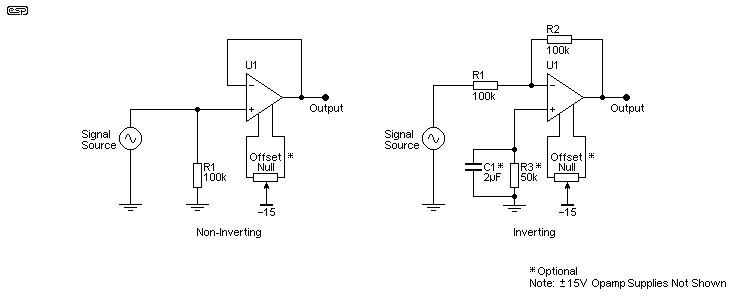
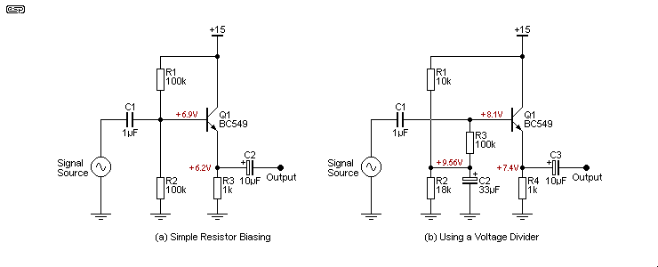
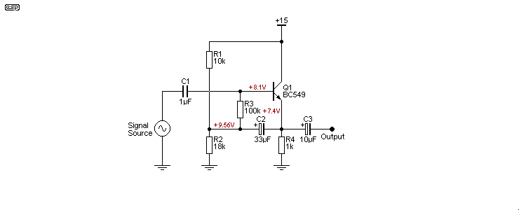

### Preamble

||Voltage Follower|Voltage Amplifier|
|---|---|---|
|정의|a current amplifier regardless of the technology used to build it|increase the amplitude of the signal|
|용도|A small available current from the source is usually due to the circuit having a high impedance, so it cannot supply enough current to drive the following circuitry.|These are used when the voltage from the source is too low to be useful.|

Voltage Follower

- increase only current : the current from the load can be increased by a factor of between a few hundred up to many thousands of times, depending on the topology of the circuit.
- do not increase amplifude of the signal : Indeed, most actually reduce the voltage slightly, with outputs varying between around 0.9 to 0.99 of the input voltage. 

초보자에게는 출력 임피던스와 출력 전류가 완전히 다른 개념이며, 하나가 다른 것을 의미하지 않는다는 것을 이해하는 것이 어려울 수 있습니다. 이 기사의 목적은 소스의 출력 전류가 회로에서 필요로 하는 것보다 현저히 적을 때, 중요한 전류 이득을 얻기 위한 다양한 방법을 보여주는 것입니다.

전류 증폭기(사실상 임피던스 변환기)가 필요한 장치의 예로는 커패시터(즉, '콘덴서') 마이크 요소와 피에조 센서(주로 진동 측정용)가 있습니다. 다른 좋은 이유로 전류 증폭기/전압 팔로워를 사용하는 경우도 많습니다. 특히 진공관과 같은 일부 증폭 장치는 높은 임피던스 출력을 가지고 있어 현대의 일반적인 부하에 적합하지 않습니다. 현대의 부하는 일반적으로 100k 이하이며, 많은 경우 10k 이하입니다.

### Introduction

||Invering Configuration|Non-Inverting Configuration|
|---|---|---|
|장점|input impedance is very high (if FET input opamp it can be very close to infinite)  Output current is determined by the opamp you use, as is the DC offset which may be problematical with extremely high input impedance.  Noise is usually fairly low, but with high impedances it will be dominated by the noise voltage from the input resistor unless the source bypasses the noise (as happens with a capacitor (aka 'condenser') microphone for example).|solves the common mode distortion problem, because there is virtually none.|
|단점|The non-inverting connection suffers from (slightly) higher distortion because the common mode voltage is high (i.e. the voltage seen by both inputs at the same time), but with modern opamps this is rarely a problem.  The distortion can be measured with (very) good equipment, but there are now opamps that have such low distortion that it's almost impossible to measure it.  It is very rare indeed for the distortion to be audible, and if so, it usually means something else is wrong with the circuit.|its input impedance is limited by the resistor values used.  They can't be too high or noise becomes a major problem for low level signals.|

**An important point to make is that an impedance converter circuit should ideally be able to source and sink current equally well.**  If it can't, the output may be asymmetrical with some loads.  Sourcing current is taken to mean that the circuit is providing current to the load, while sinking current means that it's drawing current from the load.  Any follower should also be able to provide the same peak voltage (positive and negative) to its rated load, and preferably down to the lowest load impedance likely to be encountered (real life is unpredictable).

**Simple emitter followers can't usually provide fully symmetrical operation** unless their operating current is unrealistically high.  In some cases you can offset the output voltage so that there's less voltage across the transistor, and more across the resistor, and that can restore symmetry for a defined load impedance and reduce distortion.  However, creating deliberate asymmetry isn't a cure-all and will only work if you know exactly what you're doing.

**Be very aware that simple circuits such as emitter followers have relatively poor power supply rejection ratios (PSRR), so hum or noise on the supplies will affect the signal to some extent.**  Simple emitter followers as shown in Figure 2 will have a PSRR to the emitter circuit of around -27dB, and about -44dB to the collector circuit, with a 10k source impedance.  These figures depend on the component values and (especially) the source impedance, so are only a guide.

Of the circuits discussed here, very few are suitable for buffering DC voltages.  Because there are DC offsets that can seriously affect the performance of many of the circuits, they are only suitable for AC operation, **meaning that there is a requirement for an output coupling capacitor to block the DC component.  In many cases, an input coupling capacitor will also be used, especially if the source has a DC potential.**

Many single opamps have provision for an offset null potentiometer, so that input transistor DC offsets can be zeroed, allowing the circuit to operate accurately with DC voltages.  This is rarely necessary in audio frequency circuits because the DC is removed by a capacitor, but it's essential for high accuracy circuits that include a DC component that must be preserved.  Note that there are many advanced techniques to obtain very high accuracy for DC (such as chopper stabilised amplifiers), but these are not covered here because they are specialised (and usually expensive) parts and aren't necessary or desirable for normal audio frequencies.

**An 'ideal' (i.e. theoretical) voltage follower has an infinite input impedance and an output impedance of zero ohms.**  Obviously the 'ideal' doesn't exist other than in simulators, but it's still a useful tool during simulation because opamps (in particular) come close enough to the ideal case that any difference is largely academic.  The input impedance of a JFET input opamp is usually in the gigohms range, and the output impedance is a few ohms at most.  The output voltage is limited by the power supply voltages, and the output current is set by the opamp itself.  It's usually about ±25mA or so, but if loaded that heavily the available output voltage is reduced.

### 1. Opamp Voltage Followers

The basic opamp circuits will be covered first, because they set the goal posts for the parameters that we aspire to.  With few exceptions, discrete transistor designs don't even come close to the opamp based followers.  The main parameters we are interested in are input impedance, output impedance, and gain.  While it's accepted that followers in general don't have gain as such, if the internal gain is too low, then there will be a loss of signal.  It's usually less than 1dB even with a valve cathode follower, but it's still a loss of level that will compromise the effectiveness of circuits such as active filters that rely on feedback to get the desired performance.

There is a full discussion about output impedance below, but a word of warning is needed here as well.  While a typical opamp may offer an output impedance (with feedback) of less than 1Ω, there is also a limit to the short-circuit current, and the maximum output swing is dependent on the load impedance (and hence the peak output current).

**This means that if you use a load impedance that's too low, you will not be able to get the maximum output voltage, and distortion is increased - often dramatically.**  Most common opamps are limited to a load impedance of 2k or more, but there are also quite a few that can handle 600Ω loads, and a few that can handle even lower impedances.  If you need to drive a low impedance, you must check datasheets to verify that you can get both the output current and voltage you need, or the circuit may not be acceptable for your purposes.

Figure 1 shows the standard opamp buffers, non-inverting and inverting.  Of these, the non-inverting configuration is the most common, and although it does invoke common-mode distortion (because both inputs are driven to the same voltage), it is one of the most used circuits known.  A great many ESP projects use non-inverting buffers, and they are particularly common with active filter circuits.  The input impedance is set by R1 (100k - although it may be a great deal higher with some opamps), and that's in parallel with the opamp's input impedance.

The offset null connections are optional, and are only necessary if an absolute DC level must be maintained.  Pin numbers and pot value vary, so the datasheet must be consulted to determine the proper connections and value for the opamp being used.  In most cases the offset null isn't necessary, particularly when capacitor coupling is used.

Minimising DC offset is usually not particularly important for audio, especially when the supply voltages are greater than ±5V or so, because there's plenty of 'headroom' and even a few hundred millivolts of offset isn't an issue.  The output capacitor removes the DC component and everyone is happy.  However, if you do need a low offset, that's achieved by keeping the DC resistance from each input to earth/ ground equal.  This is shown above in the inverting circuit, with a bypassed resistor to earth from the non-inverting input.  Its value is equal to the resistance of R1 and R2 in parallel - assuming that the source resistance/ impedance is zero.

The resistor is bypassed by a capacitor so that the resistor's thermal noise is not added to the signal, thereby reducing the signal to noise ratio.  This arrangement used to be very common, but most modern opamps are good enough to let you simply earth the unused input (no series resistance).  It is rarely necessary to ensure input resistance balance, but if you are designing a high gain DC amplifier then it's advisable to keep the resistance at each input the same.

### 1.1 Non-Inverting Configuration

### 1.2 Inverting Configuration

Inverting opamp buffer stages have a couple of major disadvantages.  **The input impedance is set by the input and feedback resistors.  These must both be the same value for a unity gain inverting buffer.  It's inadvisable to make them very high values (> 100k) because noise becomes a serious issue.**  In general, it's not a good idea to use the inverting buffer for high impedance low-level signals due to the circuit noise.  The input impedance is simply the value of the input resistor, and it doesn't need to be measured.

There is also an advantage, in that the input common mode input voltage is close to zero, ensuring minimum common-mode distortion.  While this is rarely a problem for most decent opamps where distortion remains at close to immeasurable levels, it's something to be aware of.  This is one of many trade-offs that are required in all aspects of electronics design - for every disadvantage, there is usually an advantage, but neither may be of any real consequence for most designs.

The inverting configuration also has a noise gain of 2, so the opamp contributes more noise than a non-inverting buffer which has unity noise gain.  As mentioned above, there is a benefit in that distortion is usually lower because there's no common mode voltage, and both opamp inputs sit at close to zero volts regardless of input signal (assuming a dual supply).  However, the reduction of distortion is generally rather small with most opamps, and using that as an excuse for not using a non-inverting buffer would be unwise.

  What is 'noise gain'?  If you examine the configuration of an inverting buffer, you'll see that the feedback and input resistors are just what you'd expect to see in a non-inverting amp with a gain of 2.  When the source impedance is low compared to the input resistor, noise is therefore amplified by 2, but the signal is only amplified by -1.  The noise gain is simply a measure of how much the noise is amplified compared to the signal.  This applies to all inverting opamp stages - the noise gain is equal to the signal gain plus 1.

It's common (or it used to be common) to include a resistor (shown in Figure 1 as 'Optional') in series with the +ve opamp input to ground (R3).  The value depends on whether the input is AC or DC coupled.  If there's a cap in series with the input, R3 will have the same value as the feedback resistance (R2).  With no cap (DC coupled), R3 will be equal to half the value of R1 and R2 - 50k as shown.  If R3 is replaced by a short to ground, the DC offset at the output of the inverting buffer will be around 13mV, vs. well under 1mV when the resistor is used.  Of course, this depends on the opamp used.

**So, while the extra resistor removes much of the input stage DC offset, the resistor must be bypassed with a capacitor to minimise noise.  The bypass cap needs to be large enough to bypass noise down to the lowest frequency of interest.  If you need response to 20Hz, the cap's reactance needs to be equal to the resistance at one tenth of that frequency - 2Hz.  For example, a 50k resistor needs a bypass cap of 1.59µF (use at least 2µF as shown, 10µF is fine).  It's unrealistic to expect the cap to bypass 1/f (aka 'shot') noise, so there may be a small uncertainty when measuring DC.**

With most newer opamp designs the resistor is not necessary, especially if the opamp has offset null terminals.  For audio, it's rarely used because it simply adds more parts for no useful purpose.  The output should always be capacitively coupled unless response to DC is a requirement.

### 2. Simple Discrete Emitter Followers

**The simplest and best known voltage follower is the emitter follower, also known as a common collector stage.**  The collector is at AC ground potential, because it's connected to the supply rail.  These used to be very common in all kinds of audio circuits, but they perform very poorly in almost all respects compared to an opamp.  Input impedance depends on the load that's connected to the output, so rather than maintain a high defined input impedance, it varies when the load is added, changed or removed.  There's a 0.65V DC offset from input to output, and it needs a DC load from the emitter to ground or a supply rail (which rail depends on whether the transistor is NPN or PNP).  The load is most commonly a resistor, but that causes the output drive capability to be asymmetrical.  While it can source a reasonable current via the transistor, its current sinking capability depends on the resistor value.

|Opamp Voltage Follower|Emitter Follower|
|---|---|
|손실이 없다.|All simple follower circuits have a small loss of level, typically providing an output of between 0.99 and 0.999 of the input level, depending on the gain of the transistor(s) used, the topology and the source and load impedances.|
|Opamps avoid this by using very high internal gain and lots of feedback, so while there is still some interdependence it's usually so small that you will be unable to measure the difference.|Unlike opamps, the input and output impedances of emitter followers are interdependent, so changing one also changes the other.|

As shown above, **the two circuits have a 1k emitter load, and the external load impedance should not be less than 10k if a large output voltage swing is required.  If lower load impedances are expected, R2 needs to be reduced, but that reduces the input impedance and increases the quiescent current drawn.**  With ±15V supplies, this single transistor stage draws more current than 3 to 5 opamps (depending on type), but doesn't perform anywhere near as well.  The performance of both circuits is roughly similar, and you can even use both together with the outputs joined with caps to create a complementary emitter follower as shown further below.

With the values shown, **the input impedance of the transistor (ignoring the 100k bias resistors) is about 500k with no load, falling to ~450k when the 10k load is connected.  Input impedance is roughly the value of the load impedance in parallel with the emitter resistor, multiplied by the transistor's gain (hFE of 500 in my simulation), and in parallel with the input bias resistor (R1)**.  Because of the transistor's bias current, there is 1.8V dropped across R1 (18µA base current) and a little over -2.5V at the emitter due to the typical 700mV between base and emitter of a silicon transistor.

Most of the circuits shown here use a dual supply, but when only one supply is available the emitter follower must be biased so the emitter is at roughly half the supply voltage. The most common arrangement is shown next.  As you can see from the voltages shown, the emitter of Q1 sits at a little over 6V rather than the optimum 7.5V.  R1 needs to be reduced to 69k to obtain the optimum bias point, but as long as the signal level never exceeds a couple of volts (RMS) the use of two equal resistors is quite alright.

**It's important to understand that the use of two resistors as shown in (a) reduces the input impedance.**  It's now R1 in parallel with R2 in parallel with the transistor's input impedance.  Equal value resistors were used here to demonstrate that the emitter voltage will be less than desired. **Reduced input impedance can be avoided by either using higher value resistors or the second biasing scheme, using a bypassed voltage divider as the bias supply.**  The second version has the advantage that any power supply noise is not passed on to the base circuit.  The voltage divider (R1 and R2) is deliberately unbalanced to obtain close to half supply at the emitter.

**There are many variations on biasing schemes, including direct coupling the base of the emitter follower to the output of the preceding stage.  There's also a technique known as bootstrapping, where the emitter signal is fed back to the centre tap of the voltage divider as shown above - C2 connects to the emitter rather than ground.**  This trick boosts impedance with positive feedback.  By ensuring that the AC voltage at each end of R3 is almost the same, its apparent impedance for AC is increased by at least an order of magnitude, but DC conditions aren't affected.

The input impedance of the bootstrapped emitter follower is around 340k, so it should be apparent that R3 has little influence for the AC input.  The DC resistance is still 100k of course, so the voltage drop caused by the transistor's base current isn't changed.  Bootstrapping has been used in this way for a very long time, and it can even be applied to valve circuits.

- Bootstrapping has a couple of downsides though, firstly that there's a 2dB gain boost at 1.5Hz with the values shown.  In effect, a rather odd 8 to 9dB/ octave high pass filter is created by the combination of C1, C2 and the associated resistors, and it has a higher than expected Q ('quality factor') that creates a peak before it starts to roll off.  The effect (and Q) of this filter depends on the source impedance, so it can be unpredictable in 'real world' applications.  With a high source impedance, the amount of boost is reduced, and when the source impedance is 100k (for Figure 4) there's no boost at all.  The low frequency response extends to just below 1Hz (-3dB) with a 100kΩ source.  This point is rarely raised in most articles you might come across, but it can be a trap if you don't know about the potential for 'interesting' low frequency effects.
- Secondly, because the bootstrap circuit uses positive feedback, it will cause transient instability if there is a DC change at the input.  Another issue that arises is that the circuit may have a significant settling time, so after power is applied you may have to wait for several seconds (or more, depending on component values) before the DC conditions are stable.  This is also due to the use of positive feedback, which causes a damped low frequency oscillation at a frequency determined by the resistor and capacitor values used.

## Reference

https://blog.naver.com/ansdbtls4067/221412447707 \
https://sound-au.com/articles/followers.html \
https://cmosedu.com/jbaker/courses/ee420L/s17/students/ferret1/Lab%206/lab6.html
