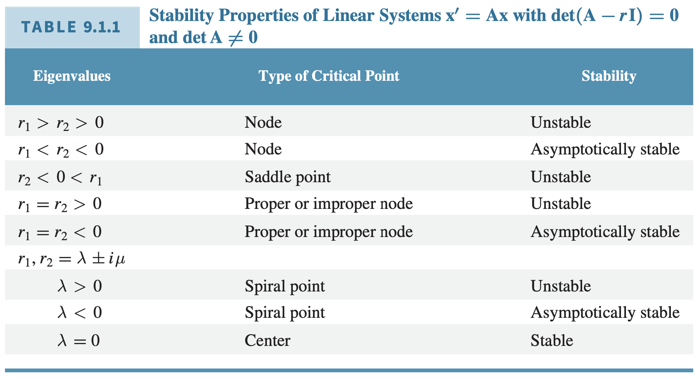
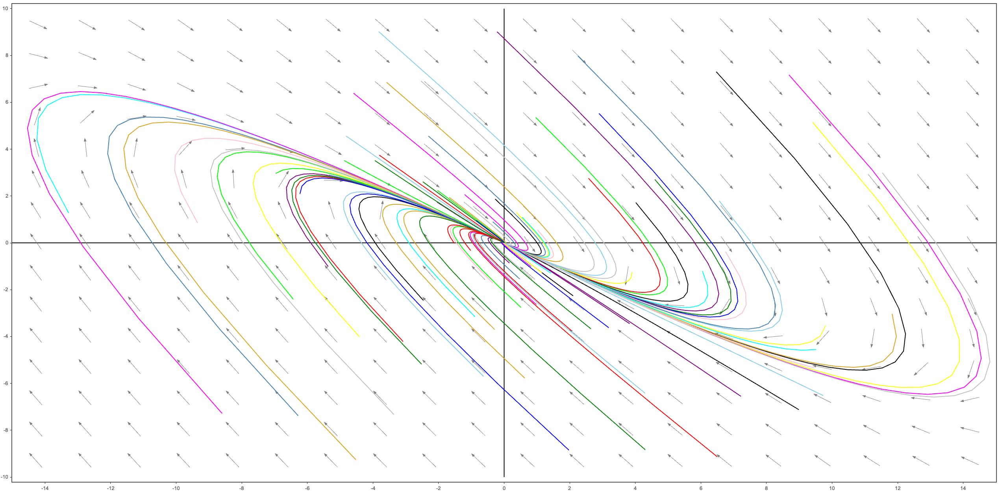
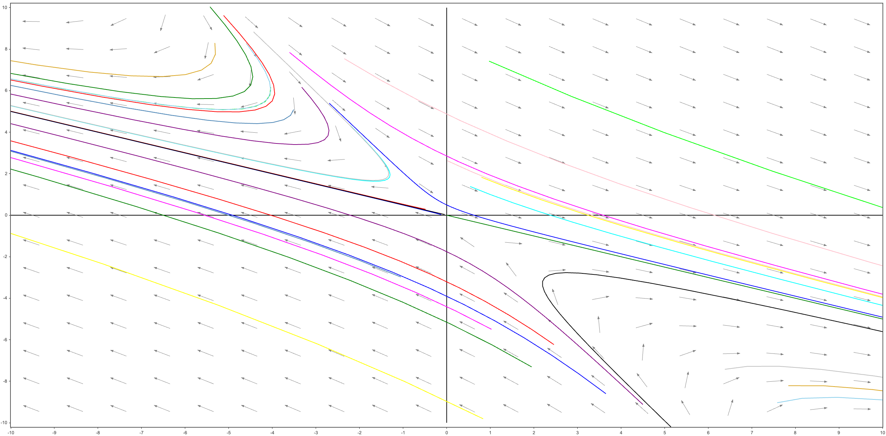
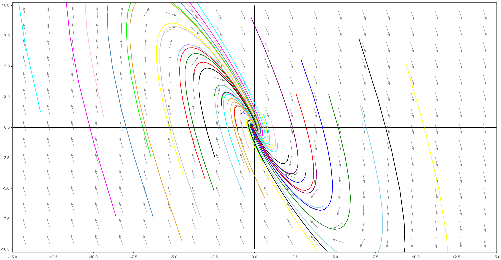
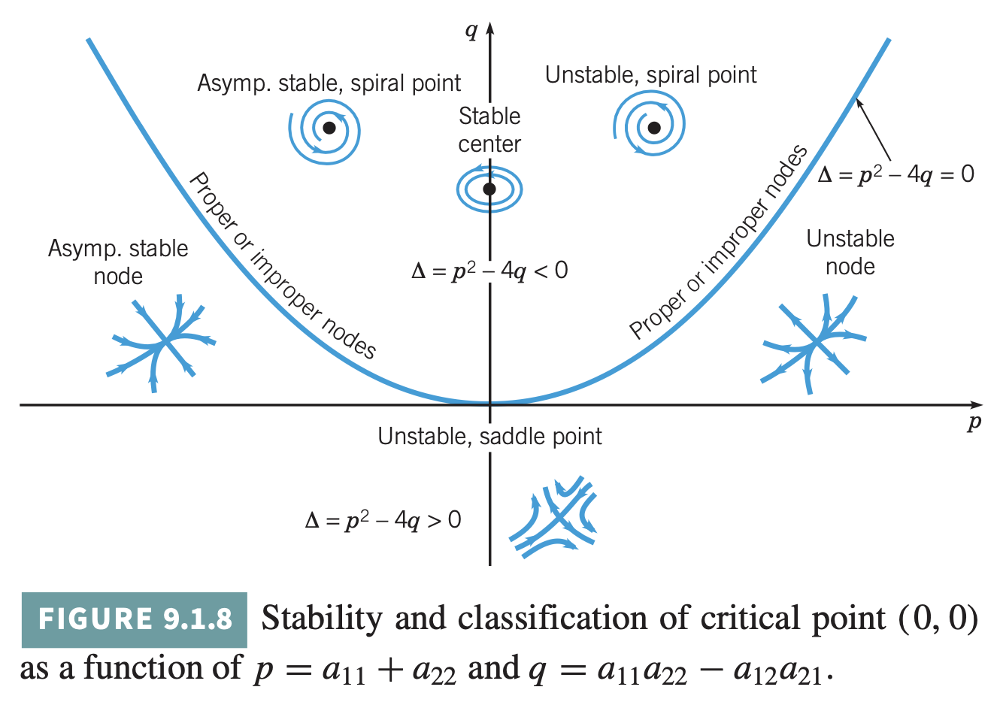
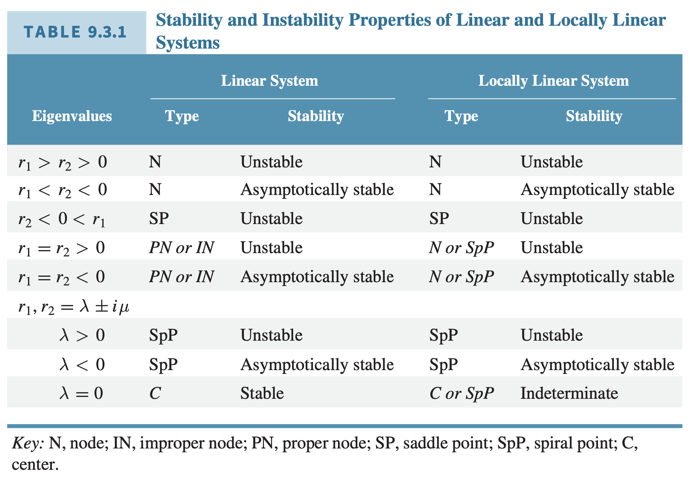
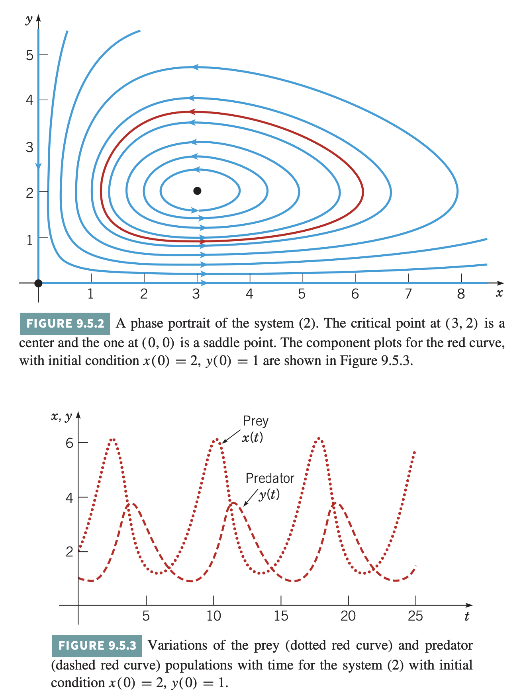

이 장에서는 해에 대해 구체적인 정량적 정보를 얻기보다 기하학적인 방법을 통해 해의 모양을 정성적으로 파악한다.

# 1. Phase Plane: Linear System of Equations

많은 미분방정식들이 해석학적인 방법으로는 쉽게 풀리지 않기 때문에 직접 식을 풀지 않고 정성적인 정보를 얻을 수 있는 방법에 대해 알아보자.

다음 미분방정식

$$
\dfrac{d\mathbf{x}}{dt} = \mathbf{A}\mathbf{x}
$$

에 대해 $\mathbf{A}$ (2 by 2) 의 고윳값들이 갖는 특성에 따라 발생할 수 있는 상황을 분류할 수 있다.

1. 같은 부호의 서로 다른 실수 고윳값들
2. 다른 부호의 실수 고윳값들
3. 서로 같은 고윳값
4. 영이 아닌 실수부를 갖는 복소수 고윳값들
5. 순허수 고윳값들

$\det \mathbf{A} \neq 0$인 2차원 연립방정식 $\mathbf{x}' = \mathbf{A}\mathbf{x}$에 대해서만 유효하다. 고차원 연립방정식에서 발생하는 상황들은 본질적으로 2차원 연립방정식에서 발생했던 상황들의 조합이다.

{: .align-center}
## [Case 1] 같은 부호의 서로 다른 실수 고윳값

고윳값이 $r_1, r_2$이고, 이에 대응되는 고유벡터가 $\xi_1, \xi_2$라고 하자.

일반해

$$
\mathbf{x} = c_1 \xi_1 e^{r_1 t} + c_2 \xi_2 e^{r_2 t}
$$

$r_1 < r_2 < 0$이라고 가정하자.

$c_1, c_2$에 관계 없이 $t \rightarrow \infty$이면 $\mathbf{x} \rightarrow 0$. 즉 모든 해들이 원점에서 임계점으로 다가간다.

미분 방정식의 해를 다음과 같이 표현하자.

$$
\begin{align*}
  \mathbf{x} &= c_1 \xi_1 e^{r_1 t} + c_2 \xi_2 e^{r_2 t} \\
  &= e^{r_2 t} (c_1 \xi_1 e^{(r_1 - r_2) t} + c_2 \xi_2) \\
\end{align*}
$$

- 이때 $r_1 - r_2 < 0$이므로 충분히 큰 t에 대해 $c_1 \xi_1 e^{(r_1 - r_2) t}$ 항은 무시해도 될 만큼 작은 크기를 갖게 된다. 따라서 $t \rightarrow \infty$일 때 궤적은 원점으로 다가갈 뿐 아니라 $\xi_2$를 지나는 직선을 향해 갈 것이다.
- 충분히 작은 $t < 0$에 대해 $\xi_1$을 지나는 직선을 향해 갈 것이다.

이때의 원점을 node라고 한다.

{: .align-center}

## [Case 2] 다른 부호의 실수 고윳값

고윳값이 $r_1 > 0, r_2 < 0$이고, 이에 대응되는 고유벡터가 $\xi_1, \xi_2$라고 하자.

일반해

$$
\mathbf{x} = c_1 \xi_1 e^{r_1 t} + c_2 \xi_2 e^{r_2 t}
$$

극한

- 해가 $\xi_1$을 지나는 직선 위의 한 초깃점에서 시작한다면 $c_2 = 0$. 따라서 이때의 해는 모든 t에 대하여 $\xi_1$을 지나는 직선 위에 놓이게 되고, $\vert\vert \mathbf{x} \vert\vert \rightarrow 0$
- 해가 $\xi_2$를 지나는 직선 위의 한 초깃점에서 시작한다면 항상 그 직선 위에 높여 있게 되고 $t \rightarrow \infty$ 일 때, $\vert\vert \mathbf{x} \vert\vert \rightarrow 0$
- 다른 점에서 시작하는 해들은 $t$가 클 때, 양의 지수를 포함하는 함수가 일반해의 주요 항이 되므로 양의 고윳값 $r_1$에 대한 고유벡터 $\xi_1$에 의해 결정되는 직선을 향이 한없이 점근한다.
- 원점에서 임계점으로 다가가는 해는 $\xi_2$에 의해 결정되는 직선 위에서 시작하는 해들밖에 없다.

다음 그림은 고윳값들이 모두 실수이고 부호가 반대인 전형적인 경우이다. 이때의 원점을 saddle point라고 한다.

{: .align-center}

## [Case 3] 서로 같은 고윳값

$r_1 = r_2 = r < 0$ 인 경우만 살펴보자. 양수인 경우에는 궤적이 움직이는 방향만 반대이고 모양은 동일하다.

중복되는 고윳값이 두 개의 독립적인 고유벡터를 갖는지, 하나의 고유벡터를 갖는지에 따라 두 가지 경우로 세분화된다.

**두 개의 독립 고유벡터**

일반해

$$
\mathbf{x} = c_1 \xi_1 e^{r t} + c_2 \xi_2 e^{r t}
$$

Proper node (or start point)

**한 개의 독립 고유벡터**

일반해

$$
\mathbf{x} = c_1 \xi e^{r t} + c_2 (\xi t e^{r t} + \eta e^{rt})
$$

Improper (degenerate node)

## [Case 4] 영이 아닌 실수부를 갖는 복소수 고윳값

{: .align-center}

## [Case 5] 순허수 고윳값들

## 한편

$$
A =
\begin{bmatrix}
  a_{11} & a_{12} \\
  a_{21} & a_{22} \\
\end{bmatrix}
,\;\;\;
p = a_{11} + a_{22},
\;\;\;
q = a_{11}a_{22} - a_{12}a_{21}
$$

라고 정의하면 행렬 $A$에 대해 발생할 수 있는 상황을 분석하는 데 용의하다.

$$
\begin{align*}
  0 &= \det (A - \lambda I) \\
  &= (a_{11} - \lambda)(a_{22} - \lambda) - a_{12}a_{21} \\
  &= \lambda^2 - (a_{11} + a_{22}) \lambda + a_{11}a_{22} - a_{12}a_{21} \\
  &= \lambda^2 - p\lambda + q
\end{align*}
$$

{: .align-center}

# 2.Autonomous Systems and Stability

## Autonomous Systems

다음과 같은 형태의 두 식으로 된 연립 미분방정식을 살펴보자.

$$
\dfrac{dx}{dt} = F(x, y), \;\;\; \dfrac{dy}{dt} = G(x, y), \;\;\; x(t_0) = x_0, \;\;\; y(t_0) = y_0
$$

다음과 같이 정의하면

$$
\mathbf{x} = (x, y)^T, \;\;\; \mathbf{f}(\mathbf{x}) = (F(x, y), G(x, y))^T, \;\;\;\mathbf{x}^0 = (x_0, y_0)^T
$$

연립 미분방정식을 다음과 같이 표현할 수 있다.

$$
\dfrac{d \mathbf{x}}{dt} = \mathbf{f}(\mathbf{x}), \;\;\; \mathbf{x}(t_0) = \mathbf{x}^0
$$

이때 해 $\mathbf{x} = \mathbf{x}(t)$는 xy 평면(위상 평면)에서 움직이는 점의 자취를 나타내는 곡선으로 해석한다.

자율 연립방정식

함수 $F, G$가 독립변수 t가 아니라 종속변수 $x, y$에만 족속되는 연립방정식

2 x 2 상수행렬 $\mathbf{A}$에 대한 연립방정식

$$
\mathbf{x}' = \mathbf{A}\mathbf{x}
$$

은 2차원 자율 연립방정식의 간단한 예이다.

자율적이지 않은 연립방정식

하나 또는 그 이상의 요소가 독립변수 t에 대한 함수라면 이 연립방정식은 자율적이지 않은 연립방정식이다.

연립 미분방정식에 대한 기하학적 정성 해석은 2차원 자율 연립방정식에서는 가능하지만 자율적이지 않은 연립방정식에서는 거의 불가능하다.

## Stability and Unstability

자율 연립방정식에 대하여

$$
\mathbf{x}' = \mathbf{f}\mathbf{x}
$$

임계점

$\mathbf{f} = 0$인 점

안정적

임의의 $\epsilon > 0$에 대해서 적당한 $\delta > 0$가 존재하여 $t = 0$에서

$$
\vert\vert \mathbf{x}(0) - \mathbf{x}^{(0)} \vert\vert < \delta
$$

을 만족하는 연립방정식의 모든 해 $\mathbf{x} = \mathbf{x}(t)$가 모든 t에 대해서 존재하고 모든 $t \geq 0$에 대해

$$
\vert\vert \mathbf{x}(t) - \mathbf{x}^{(0)} \vert\vert < \epsilon
$$

을 만족한다면 연립방정식의 임계점 $\mathbf{x}^{(0)}$가 안정적(stable)이라고 한다.

불안정

안정적이지 않은 임계점을 불안정(unstable)하다고 한다.

점근적으로 안정적

임계점 $\mathbf{x}^{(0)}$가 안정적이고 적당한 $\delta_0 (>0)$ 가 존재하여 해 $\mathbf{x} = \mathbf{x}(t)$가

$$
\vert\vert \mathbf{x}(0) - \mathbf{x}^{(0)} \vert\vert < \delta_0
$$

을 만족할 때

$$
\lim_{t\to0} \mathbf{x}(t) = \mathbf{x}^{(0)}
$$

이면 이때의 임계점 $\mathbf{x}^{(0)}$을 점근적으로 안정적(asymptotically stable)이라고 한다.

## 진동하는 진자

점근 안정성, 안정성, 불안정성이라는 개념은 진동하는 진자를 이용하면 쉽게 눈으로 확인할 수 있다.

- 질량을 갖는 물체를 낮은 평셩상태의 위치에서 약간 들어올렸다 놓으면 앞뒤로 진동하면서 진폭이 점점 줄어들다가 처음 상태에서 갖고 있던 위치에서니가 감쇠력에 의해 사라져감에 따라 평형 상태의 위치로 수렴한다. (점근적 안정성)
- 질량이 있는 물체를 높은 평형상태의 위치에서 약간 내렸다 놓으면 중력의 융향으로 아래로 떨어지고 결국에는 낮은 평형상태의 위치로 수렴하게 된다. (불안정성)
- 만약 감쇠 계수가 영인 이상적 상황을 가정한다면, 질량이 있는 물체를 낮은 평형상태의 위치에서 약간 들어올린 후 놓으면 평형상태의 위치에서 일정한 진폭을 유지하며 무한히 진동할 것이다. (안정적)

## 임계점의 중요성

선형 자율 연립방정식에서 초기 상태가 임계점에 있다면 영원히 초기 상태를 유지한다.

하지만 비선형 자율 연립방정식에서는 2가지 이유 때문에 그렇지 않다.

1. 소위 경쟁적으로 궤적에 영향을 끼치려고 하는 임계점들이 여러 개 존재할 수 있다.
2. 임계점에서 멀리 떠러진 곳에서는 연립방정식의 비선형성이 중요한 역할을 한다.

그럼에도 비선형 자율 연립방정식의 임계점들도 선형 연립방정식과 똑같이 분류할 수 있다.

## 궤적의 결정

2차원 자율 연립방정식

$$
\dfrac{dx}{dt} = F(x, y), \;\;\; \dfrac{dy}{dt} = G(x, y)
$$

의 궤적은 이식에 해당하는 1계 미분방정식

$$
\dfrac{dy}{dx} = \dfrac{dx/dt}{dy/dt} = \dfrac{F(x, y)}{G(x, y)}
$$

로 바꾸자. 해를

$$
H(x, y) = c
$$

인 음함수 형태로 쓸 수 있다면 이 식은 연립방정식의 궤적에 대한 방정식이다. 즉 궤적들은 $H(x, y)$의 등위선들 위에 놓여있다.

하지만 함수 $H$를 구하는 일반적인 해법이 없기 때문에 특수한 경우에만 적용할 수 있다.

# 3. Locally Linear System

정리 1

$\det A \neq 0$일 때 선형 연립방정식 $\mathbf{x}' = \mathbf{A} \mathbf{x}$의 유일한 임계점 $\mathbf{x} = 0$은

1. 고윳값 $r_1, r_2$가 음의 실수이거나 음의 실수부를 갖는다면 점근 안정적이다.
2. 고윳값 $r_1, r_2$가 순허수라면 안정적이지만 점근 안정적이지는 않다.
3. 고윳값 $r_1, r_2$가 양의 실수이거나 양의 실수부를 갖는다면 불안정하다.

## 섭동 (Perturbation) 효과

응용분야에서 연립방정식의 계수는 대체로 측정된 물리량에 의해서 결정된다. 이런 물리량의 측정값은 약간의 불확실성에도 변하기 쉽기 때문에 계수의 작은 변화(섭동)이 임계점의 안정성이나 불안정성, 궤적의 모양에 영향을 끼치는지 살펴볼 필요가 있다.

몇몇 또는 모든 계수에 대한 작은 섭동은 고윳값에 작은 섭동을 일으킬 수 있다.

- $r_1 = i \mu, r_2 = - i \mu$
- $r_1 = r_2$

## 비선형 연립방정식에 대한 선형 근사

비선형 자율 2차원 연립방정식

$$
\mathbf{x}' = \mathbf{f} (\mathbf{x})
$$

을 고려하자. 주요 목적은 임계점 $\mathbf{x}^{(0)}$ 근처에서 연립방정식의 궤적의 모양을 조사하는 것이다.

비선형 연립방정식은 임계점 근처에서 어떤 선형 연립방정식의 궤적과 비슷한 궤적을 갖는다. 이것은 비선형 연립방정식을 임계점 근처에서 궤적을 구하기 쉬운 선형  연립방정식으로 근사할 수 있음을 시사한다.

>임계점 근처에서 비선형 연립방정식의 궤적에 거의 근접하는 궤적을 갖는 근사 선형 연립방정식을 찾을 수 있을까? 그렇다면 어떻게 찾을 수 있을까?

임계점을 원점으로 선택하자. 만약 $\mathbf{x}^{(0)} \neq 0$이면 $\mathbf{y} = \mathbf{x} - \mathbf{x}^{(0)}$으로 치환하여 $\mathbf{y}$가 원점에서 임계점을 갖는 자율 연립방정식을 만족하도록 바꿀 수 있기 때문에 임계점을 원점으로 두어도 일반성을 잃지 않는다.

고립된 임계점

$\mathbf{x} = 0$가 고립되었다는 것은 그 안에 다른 임계점들을 포함하지 않는 원점을 중심으로 하는 적당한 원이 존해함을 의미한다.

국소적으로 선형인 연립방정식

비선형 방정식이 선형 방정식에 가깝다는 것은 어떤 의미일까?

$$
\mathbf{x}' = \mathbf{A}\mathbf{x} + \mathbf{g}(\mathbf{x})
$$

이고, $\det A \neq 0$라고 가정하여 $\mathbf{x} = 0$은 연립방정식의 고립된(isolated) 임계점이 되도록 하자.

다음 조건을 만족하는 연립방정식을 임계점 $\mathbf{x} = 0$의 근방에서 국소적으로 선형인 연립방정식(locally linear system)이라고 한다.  

$$
\mathbf{x} \rightarrow 0, \;\;\; \dfrac{\vert\vert \mathbf{g}(\mathbf{x}) \vert\vert}{\vert\vert \mathbf{x} \vert\vert} \rightarrow 0
$$

정리 2

함수 $F$와 $G$가 2계까지 연속인 편도함수를 갖는다면 다음 연립방정식은 임계점 $(x_0, y_0)$ 근방에서 국소적으로 선형이다.

$$
x' = F(x, y), \;\;\; y' = G(x, y)
$$

[Remark] 이 정리는 다음의 두 가지 의미가 있다.

1. 함수 $F, G$가 두 번 미분 가능하다면 연립방정식은 국소적으로 선형이다.
2. Jacobian matrix를 통해 임계점 근처에서 국소적으로 선형인 연립방정식에 대응되는 선형 연립방정식을 구할 수 있다.

Jocobian matrix

$$
\mathbf{J} = \mathbf{J}[F, G](x, y) =
\begin{bmatrix}
  F_x(x, y) & F_y(x, y) \\
  G_x(x, y) & G_y(x, y) \\
\end{bmatrix}
$$

이때 $\det (J)$ 가 $(x_0, y_0)$에서 영이 아니라고 가정해야 $(x_0, y_0)$가 선형 연립방정식의 고립된 임계점이 될 수 있다.

정리 3

$r_1, r_2$를 국소적으로 선형인 연립방정식 $\mathbf{x}' = \mathbf{Ax} + \mathbf{g}(\mathbf{x})$에 대응되는 선형 연립방정식 $\mathbf{x}' = \mathbf{Ax}의 고윳값들이라 하자. 그러면 선형 연립방정식과 국소적으로 선형인 연립방정식의 임계점 (0, 0)의 유형과 안정성이 다음 표와 같이 나타난다.

{: .align-center width="800" height="800"}

증명은 생략한다.

위 정리는 $\mathbf{x}$가 작으면 비선형적인항들도 작아지고 따라서 선형인 항에 의해 결정된 임계점의 유형과 안정성에 영향을 끼치지 않음을 의미한다. 두 가지 예외가 있다.

1. $r_1, r_2$가 순허수일 때, 작은 비선형 항이 안정적인 center를 점근 안정 또는 불안정 spiral point로 바꿀 수 있다.
2. $r_1, r_2$가 동일한 실수일 때, 비선형 항이 node를 spiral point로 바꿀 수 있다.

선형 연립방정식의 임계점과 같은 유형의 임계점을 갖더라도 국소적으로 선형인 연립방정식의 궤적들은 그 임계점 바로 근처를 제외하고는 이에 대응되는 성형 연립방정식의 궤적들과는 상당히 다를 수 있다. 그러나 그 임계점을 향해 들어가거나 빠져나오는 점에서 궤적들이 갖는 기울기는 선형 연립방정식으로부터 정확하게 구할 수 있다.

## 감쇠하는 진자

# 4. Competing Species

개체역학에서 발생하는 문제들에 phase portrait analysis를 적용하자. 이 절에서 소개하는 방정식들이 현실에서의 복잡한 관계에 비해 극도로 단순하지만 이런 모델링들을 연구함으로써 생태계의 원리를 이해하는 데 도움이 된다.

폐쇄적인 환경에서 제한적인 식량을 두고 경쟁하는 비슷한 두 개의 종이 있다고 가정하자. 시간 t에 대한 두 종의 개체수를 각각 x, y라 두자. 한 종이 없을 때 다른 종의 개체수는 로지스틱 방정식을 따른다고 가정하자.

두 개체수의 증가율 $\epsilon_1, \epsilon_2$와 두 개체수의 포화 레벨을 나타내는 $\epsilon_1/\alpha_1, \epsilon_2/\alpha_2$에 대해 각각

$$
\dfrac{dx}{dt} = x (\epsilon_1 - \rho_1x) \\
\dfrac{dy}{dt} = y (\epsilon_2 - \rho_2x) \\
$$

이 된다. 그러나 두 종이 모두 있을 때 각각의 종들이 다른 종에 대한 식량 공급을 감소시켜 두 종의 성장률과 포화 개체수가 줄어든다. 이를 반영하자.

$$
\dfrac{dx}{dt} = x (\epsilon_1 - \rho_1x - \alpha_1 y) \\
\dfrac{dy}{dt} = y (\epsilon_2 - \rho_2y - \alpha_2 x) \\
$$

양의 상수 $\epsilon_1, \rho_1, \alpha_1, \epsilon_2, \rho_2, \alpha_2$는 고려 대상인 종이 무엇이냐에 따라 좌우된다.

# 5. Predator - Prey Equations

한 종(포식자)이 다른 종(먹이)을 잡아먹고 먹이는 다른 식량을 먹고 사는 상황을 다루자.

시간 t에 대한 먹이의 개체수와 포식자의 개체수를 각각 x와 y라 두자. 두 종간의 상호작용을 모델링하는 데 있어서 다음과 같은 가정을 세우자.

1. 포식자가 없으면 먹이는 현재의 개체수에 비례하여 증가한다. 즉 $y = 0$일 때 $dx/dt = ax (a > 0)$
2. 먹이가 없으면 포식자는 멸종된다. 즉 $x = 0$일 때 $dy/dt = - cy (c > 0)$
3. 포식자와 먹이가 마주치는 횟수는 두 개체수의 곱에 비례한다. 서로 마주치면 포식자의 증가량은 촉진되고 먹이의 증가량은 억제되는 경향이 있다. 따라서 양의 상수 $\gamma, \alpha$에 대해서 포식자의 증가율은 $\gamma x y$이고, 먹이의 증가율은 $-\alpha x y $이다.

이 가정들에 따라 다음과 같은 연립방정식이 유도된다. (Lotka-Volterra)

$$
\begin{align*}
  \dfrac{dx}{dt} &= ax - \alpha xy = x(a - \alpha y)\\
  \dfrac{dy}{dt} &= -cy + \gamma x y = y (-c + \gamma x) \\
\end{align*}
$$

여기서 상수 $a, c, \alpha, \gamma$는 모두 양수이다. $a, c$는 각각 먹이의 증가율과 포식자의 사망률이고 $\alpha, \gamma$는 두 종간의 상호작용의 영향을 측정하는 값들이다.

{: .align-center width="800" height="800"}

로트카-볼테라 방정식을 해석해보자.

임계점들은

$$
x(a - \alpha y) = 0,\;\;\; y(-c + \gamma x) = 0
$$

의 해인 $(0, 0), (c/\gamma, a/\alpha)$이다.

각 임계점 근처에서의 선형 연립방정식들의 해들을 조사하자.

원점 근방에서 선형 연립방정식은

$$
\dfrac{d}{dt}
\begin{bmatrix}
  x \\
  y \\
\end{bmatrix}
=
\begin{bmatrix}
  a & 0 \\
  0 & -c \\
\end{bmatrix}
\begin{bmatrix}
  x \\
  y
\end{bmatrix}
$$

고윳값들과 고유벡터들은

$$
r_1 = a, \xi_1 =
\begin{bmatrix}
  1 \\
  0
\end{bmatrix}; \;\;\;
r_2 = -c, \xi_2 =
\begin{bmatrix}
  0 \\
  1
\end{bmatrix}; \;\;\;
$$

이고, 일반해는

$$
\begin{bmatrix}
  x \\
  y \\
\end{bmatrix}
=
c_1
\begin{bmatrix}
  1 \\
  0 \\
\end{bmatrix}
e^{at}
+
c_2
\begin{bmatrix}
  0 \\
  1 \\
\end{bmatrix}
e^{-ct}
$$

따라서 원점은 불안정한 안장점이다. y 축 위에 있는 궤적들은 이 안장점을 향해 들어가고, x 축 위에 있는 궤적들은 이 안장점에서 멀어진다.

$(c/\gamma, a/\alpha)$를 살펴보자.

Jacobian 행렬은 다음과 같다.

$$
\mathbf{J} =
\begin{bmatrix}
  a - \alpha y & - \alpha x \\
  \gamma y & - c + \gamma x
\end{bmatrix}
$$

$(c/\gamma, a/\alpha)$에서 $\mathbf{J}$를 계산하면 근사 선형 연립방정식 $u = x - (c/\gamma), v = y - (a/\alpha)$에 대해 

$$
\dfrac{d}{dt}
\begin{bmatrix}
  u \\
  v \\
\end{bmatrix}
=
\begin{bmatrix}
  0 & -\alpha c / \gamma \\
  \gamma a / \alpha & 0 \\
\end{bmatrix}
\begin{bmatrix}
  u \\
  v
\end{bmatrix}
$$

가 된다. 위 연립방정식의 고윳값들은 $r = \pm i \sqrt{ac}$이므로 이 임계점은 선형 연립방정식의 안정적인 center이다.

연립방정식의 궤적들을 구하기 위해서 이것의 두 번째 식을 첫 번째 식으로 나누면

$$
\dfrac{dv}{du} = \dfrac{dv/dt}{du/dt} = - \dfrac{(\gamma a / \alpha)u}{(\alpha c / \gamma)v}
$$

또는

$$
\gamma^2 a u du + \alpha^2 cv dv = 0
$$

음수가 아닌 적분상수 k에 대해

$$
\gamma^2 a u^2 + \alpha^2 c v^2 = k
$$

# 6. 두 번째 Lypunov 법

미분방정식들로 이루어진 연립방정식의 해에 대한 정보가 필요 없다. 적당한 보조 함수를 찾아서 임계점의 안정성이나 불안정성을 판별한다.

## Positive Definite

함수의 positive definite

$V$를 원점을 포함하는 어떤 영역 $D$에서 정의하자. 이때

1. $V(0, 0) = 0$이고
2. $D$ 안의 원점이 아닌 모든 점에 대해 $V(x, y) > 0$이라면

$V$는 $D$에서 positive definite이라고 한다.

negative definite

$V$를 원점을 포함하는 어떤 영역 $D$에서 정의하자. 이때

1. $V(0, 0) = 0$이고
2. $D$ 안의 원점이 아닌 모든 점에 대해 $V(x, y) < 0$이라면

$V$는 $D$에서 negative definite이라고 한다.

positive semidefinite

$V$를 원점을 포함하는 어떤 영역 $D$에서 정의하자. 이때

1. $V(0, 0) = 0$이고
2. $D$ 안의 원점이 아닌 모든 점에 대해 $V(x, y) \geq 0$이라면

$V$는 $D$에서 positive semidefinite이라고 한다.

negative semidefinite

$V$를 원점을 포함하는 어떤 영역 $D$에서 정의하자. 이때

1. $V(0, 0) = 0$이고
2. $D$ 안의 원점이 아닌 모든 점에 대해 $V(x, y) \leq 0$이라면

$V$는 $D$에서 negative semidefinite이라고 한다.

[참고] 행렬의 positive definite

영벡터가 아닌 임의의 열벡터 $x$와 대칭 행렬 $A$애 대해 다음이 성립한다면 $A$는 양의 정부호 행렬이다.

$$
x^\top A x > 0
$$

## Lyapunov and Stability

정리 9.6.1 (Lyapunov 안정성 정리)

자율 연립방정식

$$
\dfrac{dx}{dt} = F(x, y), \;\;\; \dfrac{dy}{dt} = G(x, y)
$$

에 대한 원점에서 고립된 임계점이 존재한다고 가정하자. 연속인 1계 편도함수를 갖는 연속이고 positive definite인 함수 $V$가 존재하고,

$$
\dot{V}(x, y) = V_x(x, y)F(x, y) + V_y(x, y)G(x, y)
$$

에 의해 주어진 함수 $\dot{V}$가 (0, 0)을 포함하는 xy 평면상의 영역 $D$에서 negative definite이라면, 원점은 점근 안정 임계점이다. 만약 $\dot{V}$가 negative semidefinite이면 원점은 안정 임계점이다.

정리 9.6.2 (Lyapunov 불안정성 정리)

원점을 자율 연립방정식의 고립된 임계점이라 두자. $V$를 연속인 1계 편도함수를 갖는 연속함수로 두자. 또한 $V(0, 0) = 0$이고 원점의 모든 근방에서 $V$가 양수(음수)인 점이 적어도 하나 있다고 가정하자. 만약 원점을 포함하는 영역 $D$가 존재하여 함수 $\dot{V}$이 이 영역에서 positive definite (negative definite)이면 원점은 불안정 임계점이다.

이 함수를 Lypunov 함수리고 부른다.

정리 9.6.3

원점을 자율 연립방정식의 고립된 임계점이라 두고 함수 V를 연속인 1계 편도함수를 갖는 연속함수라고 가정하자. 적당한 양수 $K$dp eogo $V(x, y) < K$이고 V는 positive definite, $\dot{V}$는 negative definite인 원점을 포함하는 유한한 영역 $D_k$가 존재하면 $D_k$의 함 점에서 시작하는 식의 해는 모두 t가 무한대로 감에 따라 원점으로 다가간다.

정리 9.6.4

함수

$$
V(x, y) = ax^2 + bxy + cy^2
$$

이 positive definite일 필요충분조건은

$$
a > 0, \;\;\; 4ac - b^2 > 0
$$

이고 negative definite일 필요충분조건은

$$
a < 0, \;\; 4ac - b^2 > 0
$$

이다.

## Lyapunov Functions

한 가지 유의해야 할 사실은 Lyapunov function을 찾는 방법이 언급되어 있지 않아 이 정리들을 사용하기 어렵다는 것이다. 자율 연립방정식이 물리적인 문제를 나타내는 경우에는 자연스럽게 이 연립방정식의 실제 총 에너지 함수를 Lyapunov function으로 생각할 수 있지만 위 두 정리는 물리적인 에너지의 개념이 유효하지 않은 경우에도 적용 가능하다. 이 경우에는 시행착오를 거치는 과정이 필요하다. 따라서 여기서는 다양한 사례를 보이도록 하겠다.

### Ex 1. 감쇠하지 않는 진자의 운동방정식에서 원점

$$
\begin{align*}
  \dfrac{dx}{dt} &= y \\
  \dfrac{dy}{dt} &= -\dfrac{g}{L}\sin x
\end{align*}
$$

Lyapunov function을 다음과 같이 설정하면 원점은 안정 임계점이라는 사실을 알 수 있다.

$$
V(x, y) = mgL(1 - \cos x) + \dfrac{1}{2}mL^2y^2
$$

### Ex 2. 감쇠하지 않는 진자의 운동방정식에서 $(0, \pi)$

다음과 같이 치환하여 원점에 대한 stability를 평가하자.

$$
x = \pi + u, \;\;\; y = v
$$

Lyapunov function을 다음과 같이 설정하면 $(0, \pi)$가 unstable하다는 것을 증명할 수 있다.

$$
V(u, v) = v \sin u
$$

Lyapunov function

$$
V(x, y) = x^2 + y^2
$$

### Ex 3. 원점에서 점근적으로 안정적

$$
\dfrac{dx}{dt} = -x -xy^2 \\
\dfrac{dy}{dt} = -y - x^2y \\
$$

### Ex 4. 감쇠하는 진자

$$
\begin{align*}
  \dfrac{dx}{dt} &= y \\
\dfrac{dy}{dt} &= -y - \sin x \\
\end{align*}
$$

만약 Lyapunov function을 다음과 같이 설정한다면 원점이 안정 임계점임을 보일 수 있고,

$$
V(x, y) = \dfrac{1}{2}y^2 + (1 - \cos x)
$$

# 7. 주기해와 극한 순환 궤적

2차원 자율 연립방정식

$$
\mathbf{x}' = \mathbf{f}(\mathbf{x})
$$

에 대한 주기해가 존재하는지 살펴보자.

주기해를 갖는다는 것은 모든 t와 주기 T (T > 0)에 대하여

$$
\mathbf{x}(t + T) = \mathbf{x}(t)
$$

를 만족한다는 것을 의미한다. 이에 대응하는 궤적들은 위상 평면상에서 폐곡선이다.

선형 자율 연립방정식

$$
\mathbf{x}' = \mathbf{A}\mathbf{x}
$$

의 해가 주기적인 것은 $\mathbf{A}$ 의 고윳값이 순허수인 것과 필요충분조건이다. 이 경우에 원점에서의 임계점이 center이다.

- 극한 순환 궤적 (limit cycle): $t \rightarrow \infty$ 일 때 다른 닫혀있지 않은 궤적들이 나선형을 그리며 다가가거나 멀어지는 위상 평면상의 닫힌 궤적
- 궤도 안정성 (orbital stability): $t \rightarrow \infty$ 일 때 닫힌 궤적을 향해 나선형을 그리며 다가가는 유형
- 준안정적 (semistable): $t \rightarrow \infty$ 일 때 궤적들이 한쪽 방향에서는 나선형을 그리며 이 닫힌 궤적을 향해 들어가고 다른 쪽 방향에서는 빠져나간다는 유형
- 불안정적:  $t \rightarrow \infty$ 일 때 나선형을 그리며 양쪽 방향으로 닫힌 궤적을 빠져나가는 유형
- 안정적: 다른 궤적들이 다가가지도 않고 멀어지지도 않는 닫힌 궤적이 존재하는 유형

$$
\dfrac{dx}{dt} = F(x, y) \\
\dfrac{dy}{dt} = G(x, y) \\
$$

정리 9.7.1

함수 F와 G가 xy 평면상의 영역 D에서 연속이 1계 편도함수를 갖는다고 하자. 연립방정식에 대한 닫힌 궤적은 적어도 하나의 임계점(평형상태의 점)을 둘러싸고 있어야 한다. 만약 이 궤적이 단 한 개의 임계점만을 둘러싸고 있다면 이 임계점은 안장점일 수 없다.

정리 9.7.2

함수 F와 G가 xy 평면 상에서 단순연결된 (simply connected) 영역 D에서 연속인 1계 편도함수를 갖는다고 하자. 만약 D의 전 구간에서 $F_x + G_y$의 부호가 모두 같다면 D 안에 완전히 속해있는 연립방정식의 닫힌 궤적은 존재하지 않는다.

정리 9.7.3 (Pointcare-Bendixson 정리)

함수 $F$와 $G$가 xy-평면상의 영역 $D$에서 연속인 1계 편도함수를 갖는다고 하고 $D_1$을 $D$에 속하는 유한한 영역, $R$을 $D_1$과 $D_1$의 경계를 합친 영역이라 두자. ($R$의 점들은 모두 $D$ 안에 속한다.) 이때 $R$이 연립방정식의 임계점을 포함하지 않는다고 가정하자. 만약 어떤 상수 $t_0$에 대해 모든 $t \geq t_0$에 대해 $R$ 안에 존재하고 계속 그 안에 머물러 있는 연립방정식의 해가 존재한다면, 그 해는 둘 다 주기해(닫힌 궤적)이거나 또는 $t \rightarrow \infty$일 때 나선형을 그리며 어떤 닫힌 궤적을 향해가는 해이다. 어떤 경우든 연립방정식은 $R$ 안에서 주기해를 갖는다.

# Reference

William E. Boyce, Boyce’s Elementary Differential Equations and Boundary Value Problems
