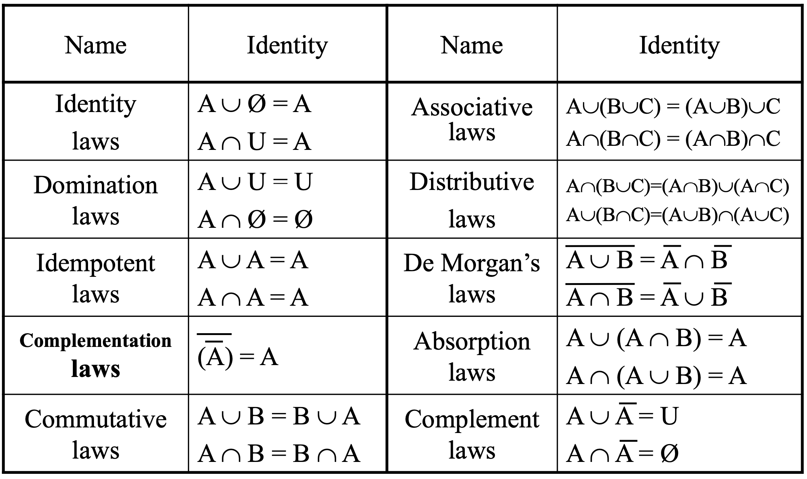

## 1. Sets

## 2. Set Operations

### 2.1 Introduction

Two, or more, sets can be combined in many differenct ways.

**[Definition 1]**
>Let $A$ and $B$ be sets. The *union* of the sets $A$ and $B$, denoted by $A \cup B$, is the set that contains those elements that are either in $A$ or in $B$, or in both.

**[Definition 2]**
>Let $A$ and $B$ be sets. The *intersection* of the sets $A$ and $B$, denoted by $A \cap B$, is the set that contains those elements that are in both $A$ and in $B$.

**[Definition 3]**
>Two sets are called disjoint if their intersection is the empty set.

**[Definition 4]**

**[Definition 5]**

### 2.2 Set Identities

### 2.3 Generalized Unions and Intersections

### 2.4 Computer Represetation of Sets

A method for storing elements using an arbitrary ordering of the elements of the universal set.

1. Assume that the universal set $U$ is finite.
2. Specify an arbitrary ordering of the elements of $U$, for instance $a_1, a_2, ..., a_n$.
3. Represent a subset $A$ of $U$ with the bit string of length $n$, where the $i$th bit in this string is 1 if $a_i$ belongs to $A$ and  is 0 if $a_i$ does not belong to $A$.

let bit strings of $U$ is 1111 1111 1111 1111 1111 1111 11, bit strings of {a, b, c, d, e} is 1111 1000 0000 0000 0000 0000 00

### 2.5 Multisets

## 3. Functions

### 3.1 Introduction

>**[Definition 1]**
>Let $A$ and $B$ be sets. A *function f* from $A$ to $B$ is an assignment of exactly on element of $B$ to each element of $A$. We write $f(a) = b$ if $b$ is the unique element of $B$ assigend by the function $f$ to the element $a$ of $A$. If $f$ is a function from $A$ to $B$, we write $f : A \rightarrow B$.

### 3.2 One-to-One and Onto Functions

>**[Definition 5]**
>A function $f$ is said to be *one-to-one*, or an injection, if and only if $f(a) = f(b)$ implies that $a = b$ for all $a$ and $b$ in the domain of $f$. A function is said to be *injective* if it is one-to-one.

>**[Definition 7]**
>A function $f$ from $A$ to $B$ is called *onto*, or a surjection, if and only if for every element $b \in B$ there is an element $a \in A$ with $f(a) = b$. A function $f$ is called *surjective* if it is onto.

### 3.3 Inverse Functions and Compositions of Functions

>**[Definition 9]**
>Let $f$ be a one-to-one correspondence from the set $A$ to the set $B$. The *inverse* function of $f$ is the function that assigns to an element $b$ belonging to $B$ the unique element $a$ in $A$ such that $f(a) = b$. The inverse function of $f$ is denoted by $f^{-1}$. Hence, $f^{-1}(b) = a$ when $f(a) = b$.

>**[Definition 10]**
>Let $g$ be a function from the set $A$ to the set $B$ and let $f$ be a function from the set $B$ to the set $C$. The composition of the functions $f$ and $g$, denoted for all $a \in A$ by $f \cdot g$, is the function from $A$ to $C$ defined by $(f \cdot g)(a) = f(g(a))$.

### 3.4 The Graphs of Functions

### 3.5 Some Important Functions

>**[Definition 12]**
>The *floor function* assigns to the real number $x$ the largest integer that is less than or equal to $x$. The value of the floor function at $x$ is denoted by $\lfloor x \rfloor$. \
>The *ceiling function* assigns to the real number $x$ the smallest integer that is greater than or equal to $x$. The value of the ceiling function at $x$ is denoted by $\lceil x \rceil$

|Useful Properties of Floor and Ceiling functions. ($n$ is an integer, $x$ is a real number.)|
|:---:|
|$\lfloor x \rfloor = n$ if and only if $n \leq x < n + 1$|
|$\lceil n \rceil = n$ if and only if $n-1 < x \leq n$|
|$\lfloor x \rfloor = n$ if and only if $x-1 < n \leq x$|
|$\lceil n \rceil = n$ if and only if $x \leq n < n-1$|
||
|$x-1 < \lfloor x \rfloor \leq x \leq \lceil x \rceil < x + 1$
||
|$\lfloor -x \rfloor = - \lceil x \rceil$|
|$\lceil -x \rceil = - \lfloor x \rfloor$|
||
|$\lfloor x + n \rfloor = \lfloor x \rfloor + n$|
|$\lceil x + n \rceil = \lceil x \rceil + n$|

### 3.6 Partial Functions

## 4. Sequences and Summations

## 5. Cardinality of Sets

### 5.1 Introduction

>**[Definition 1]**
>The sets $A$ and $B$ have the same cardinarity if and only if there is a one-to-one corresponence from $A$ to $B$. When $A$ and $B$ have the same cardinarity, we write $|A| = |B|$.

### 5.2 Countable Sets

>**[Definition 2]**
>If there is a one-to-one function from $A$ to $B$, the cardinality of $A$ is less that or the same as the cardinality of $B$ and we write $|A| \leq |B|$. Moreover, when $|A| \leq |B|$ and A and B have differenct cardinality, we say that the cardinality of $A$ less than the cardinality of $B$ and we write $|A| < |B|$

>**[Definition 3]**
>A set that is either finite or has the same cardinality as the set of positive integers is called *countable*. A set that is not countable is called *uncountable*.

### 5.3 An Uncountable Set

## 6. Matrices

### 6.4 Zero-One Matrices

**Zero-one matrix** is a matrix all of whose entries are either 0 or 1.

>**[Definition 8]**
>Let $A = [a_{ij}]$ and $B = [b_{ij}]$ be $m \times n$ zero-one matrices. Then the *join* of $A$ and $B$ is denoted by $A \vee B$. \
>The *meet* of $A$ and $B$ is the zero matriz with $(i, j)$th entry $a_{ij} \wedge b_{ij}$. The meet of $A$ and $B$ is denoted by $A \wedge B$.

>**[Definition 9]**
>Let $A = [a_{ij}]$ be an $m \times k$ zero-one matrix and $B = [b_{ij}]$ be a $k \times n$ zero-one matrix. Then the Boolean project of $A$ and $B$, denoted by $A \odot B$, is the $m \times n$ matrix with $(i, j)$th entry $c_{ij}$ where $c_{ij} = (a_{i1} \wedge b_{1j}) \vee (a_{i2} \wedge b_{2j}) \vee ... \vee (a_{i3} \wedge b_{3j})$.

>**[Definition 10]**
>Lat $A$ be a square zero-one matrix and let $r$ be a positive integer. The $r$th *Boolean power* of $A$ is the Boolean product of $r$ factors of $A$.
