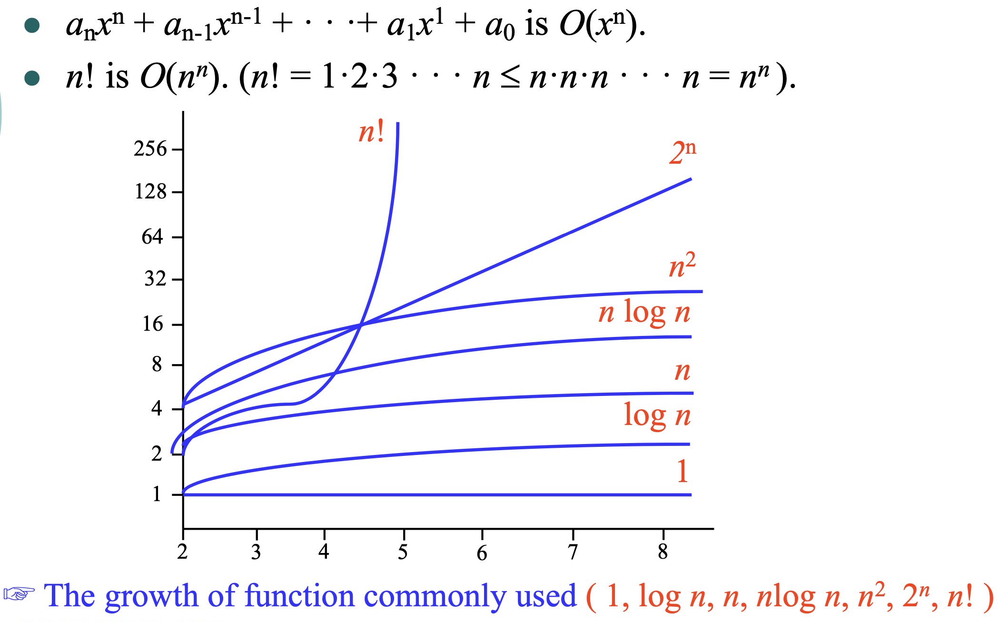

## 1. Algorithms

Pseudocode language

- Precedure statment : the name of an algorithm
- Asiignment statement : assign value to variables
= Block of statement : group procedure (begin and end)
- Comments : statements in {} which are not executed

### 1.1 Introduction

>**[Definition]** An algorithm is a finite set of precise instructions for performing a computation or for solving a problem.

|Properties of Algorithms|Description|
|---|---|
|Input|An algorithm has input values from a specified set|
|Output|From each set of input values an algorithm produces output values from a specified set. The output values are the solution to the problem.|
|Definiteness|The steps of an algorithm must be defined precsiely.|
|Correctness|An algorithm should produce the correct output values for each set of input values|
|Finiteness|An algorithm should produce the desired output after a finite number of steps for any input in the set.|
|Effectiveness|It must be possible to perform each step an algortihm exactly and in a finite amount of time.|
|Generality|The procedure should be applicable for all problems of the desired form, not just for a particular set of input values.|

### 1.2 Searching algorithms

The linear search

Comparing $x$ successively with each term of the list until a match is found, where the solution is the location of that term, unless no match occurs.

```c
int sequential_search(int list[], int key, int low, int high)
{
    int i;
    for (i = low; i <= high; i++)
        if (list[i] == key) return i;
    return -1;
}
```

The binary search

This algorithms can be used when the list hase terms occurring in order of increasing size.

The list is split into two smaller sublists of the same szie, or where one of these smaller lists hase one fewer term than the other.

```c
int binary_search (int list [], int key, int low, int high)
{
    int middle;
    if (low <= high)
    {
        middle = (low + high) / 2;
        if (key == middle) return middle;
        else if (key < list[middle]) return binary_search(list, key, low, middle - 1)
        else return binary_search(list, key, middle + 1, high)
    }
    return -1;
}
```

### 1.3 Sorting

The bubble sort

The bubble sort puts a list into increasing order by successively comparing adjacent elements, interchanging them if they are in the wrong order.

```c
#include <stdio.h>
#define SWAP(x, y, t) ((t) = (x), (x) = (y), (y) = (t))

void printArray(int arr [], int n, int *str)
{
    int i;
    printf("%s = ", str);
    for (i = 0; i < n; i++) printf("%3d", arr[i]);
    printf("\n");
}

void printStep(int arr [], int n, int val)
{
    int i;
    printf("    Step %2d = ", val);
    for (i = 0; i < n; i++) printf("%3d", arr[i]);
    printf("\n");
}

void bubble_sort(int list [], int n)
{
    int i, j, bChanged, tmp;
    for (i = n - 1; i > 0; i--) {
        bChanged = 0;
        for (j = 0; j < i; j++)
            if (list[j] > list[j + 1]) {
                SWAP(list[j], list[j + 1], tmp);
                bChanged = 1;
            }
        if (!bChanged) break;
        printStep(list, n, n - i);
    }
}

int main()
{
    int n = 9;
    int list[9] = {5, 3, 8, 4, 9, 1, 6, 2, 7};
    printArray(list, 9, "Original ");
    bubble_sort(list, n);
    printArray(list, n, "Bubble ");
}
```

살행 결과

```
Original  =   5  3  8  4  9  1  6  2  7
    Step  1 =   3  5  4  8  1  6  2  7  9
    Step  2 =   3  4  5  1  6  2  7  8  9
    Step  3 =   3  4  1  5  2  6  7  8  9
    Step  4 =   3  1  4  2  5  6  7  8  9
    Step  5 =   1  3  2  4  5  6  7  8  9
    Step  6 =   1  2  3  4  5  6  7  8  9
Bubble  =   1  2  3  4  5  6  7  8  9
```

- 시간 복잡도 : $O(n^2)$

The insertion sort

```c
#include <stdio.h>

void printArray(int arr [], int n, int *str)
{
    int i;
    printf("%s = ", str);
    for (i = 0; i < n; i++) printf("%3d", arr[i]);
    printf("\n");
}

void printStep(int arr [], int n, int val)
{
    int i;
    printf("    Step %2d = ", val);
    for (i = 0; i < n; i++) printf("%3d", arr[i]);
    printf("\n");
}

void insertion_sort(int list[], int n)
{
    int i, j, key;
    for (i = 1; i < n; i++) {
        key = list[i];
        for (j = i - 1; j >= 0 && list[j] > key; j--)
            list[j + 1] = list[j];
        list[j + 1] = key;
        printStep(list, n, i);
    }
}

int main()
{
    int n = 9;
    int list[9] = {5, 3, 8, 4, 9, 1, 6, 2, 7};
    printArray(list, 9, "Original ");
    insertion_sort(list, n);
    printArray(list, n, "Insertion");
}
```

실행 결과

```
Original  =   5  3  8  4  9  1  6  2  7
    Step  1 =   3  5  8  4  9  1  6  2  7
    Step  2 =   3  5  8  4  9  1  6  2  7
    Step  3 =   3  4  5  8  9  1  6  2  7
    Step  4 =   3  4  5  8  9  1  6  2  7
    Step  5 =   1  3  4  5  8  9  6  2  7
    Step  6 =   1  3  4  5  6  8  9  2  7
    Step  7 =   1  2  3  4  5  6  8  9  7
    Step  8 =   1  2  3  4  5  6  7  8  9
Insertion  =   1  2  3  4  5  6  7  8  9
```

- 시간 복잡도 : $O(n^2)$
- 레코드 양이 많거나 레코드 크기가 클 경우에 적합하지 않으며며, 레코드의 수가 적거나 대부분의 레코드가 이미 정렬되어 있는 경우에 효율적이다.

## 2. The growth of functions

함수의 성장 : 인풋에 대해 아웃풋이 얼마나 변하느냐.

- One of the advatages of using big-O notation is that we can estimate the growth of a function without worrying about constant multipliers or smaller order terms.
- Big-O notatino is used to estimate the number of operations an algorithm uses as its input grows.
- With the help of big-O notation, we can determine whether it is practical to use a particular algorithm to solve a problem as the size of the input inceases.

### 2.2 Big-O Notation

>**[DEFINITION 1]** \
>Let $f$ and $g$ be functions from the set of integers or the set of real numbers to the set of real numbers. We say that $f(x)$ is $O(g(x))$ if there are constants $C$ and $k$ such that $|f(x)| \leq C|g(x)|$ whenever $x > k$. This is read as "$f(x)$ is big-oh of $g(x)$."

>**[THEOREM 1]** \
>Let $f(x) = a_nx^n + a_{n-1}a^{n-1} + \dots + a_1x + a_0$, where $a_0, a_1, \dots , a_n$ are real numbers. Then $f(x)$ is $O(x^n)$.

### 2.3 Big-O Estimates for Some Important Functions



### 2.4 The Growth of Combinations of Functions

>**[THEOREM 2]** \
>Suppose that $f_1(x)$ is $O(g_1(x))$ and taht $f_2(x)$ is $O(g_2(x))$. Then $(f_1(x) + f_2(x))$ is $O(g(x))$, where $g(x) = \text{max}(|g_1(x)|, |g_2(x)|)$ for all $x$.

>**[Corollary 1]** \
>Suppose that $f_1(x)$ and $f_2(x)$ are both $O(g(x))$. Then $(f_1 + f_2)(x)$ is $O(g(x))$.

>**[THEOREM 3]** \
> Suppose that $f_1(x)$ is $O(g_1(x))$ and $f_2(x)$ is$O(g_2(x))$. Then $(f_1f_2)(x)$ is $O(g_1(x)g_2(x))$.

### 2.5 Big-Omega and Big-Theta Notation

>**[DEFINITION 2]** \
>Let $f$ and $g$ be functions from the set of integers or the set of real numbers to the set of real numbers. We say that $f(x)$ is $\Omega(g(x))$ if there are constants $C$ and $k$ with positive $C$ such that $|f(x)| \geq C|g(x)|$ whenever $x > k$.

>**[DEFINITION 3]** \
>Let $f$ and $g$ be functions from the set of integers or the set of real numbers to the set of real numbers. We say that $f(x)$ is $\theta(g(x))$ if $f(x)$ is O(g(x)) and $f(x)$ is $\Omega(g(x))$.

## 3. Complexity of algorithms

## Reference

Kenneth H. Rosen - Discrete Mathematics and Its Applications : Ch03
