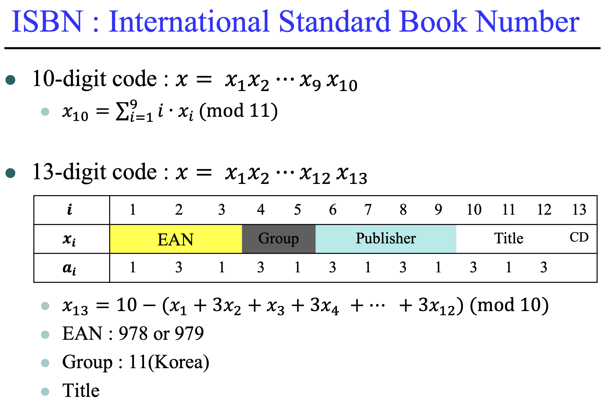
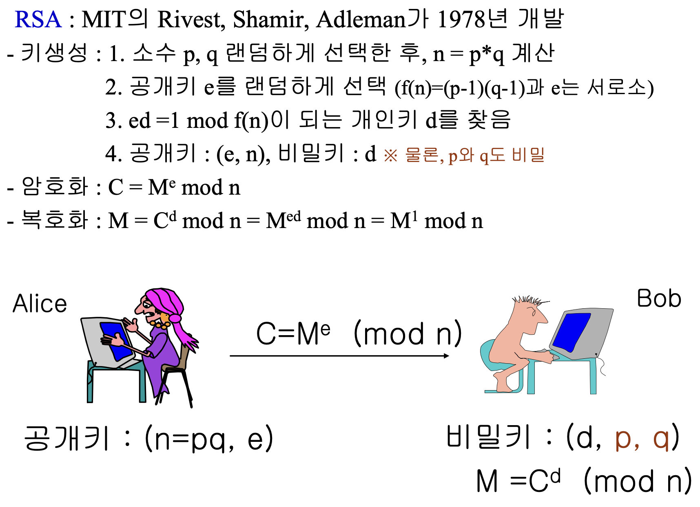

## 1 Disivility and Modular Arithmetic

Division of an integer by a positive integer produces quatient and remainder. Working with these remainders leads ot modular arithemtic, which plays an important role in mathematics and which is used throughout computer science.

### 1.2 Division

>**[DEFINITION 1]** \
>If $a$ and $b$ are integers with $a \neq 0$, we say that $a$ divides $b$ if thers is an integer $c$ such that $b = ac$ (or equivalently, if $\dfrac{b}{a}$ is an integer). When $a$ divides $b$, we say that a is a *factor* or *divisor* of $b$, and that $b$ is a muliple of $a$. The notation $a|b$ denotes that $a$ devides $b$. We write $a\;\not| \;b$ when $a$ does not divide $b$.

>**[THEOREM 1]** \
>Let $a, b$ be integers, where $a \neq 0$, Then \
>(i) if $a \;|\; b$ and $a \;|\; c$, then $a \;|\; (b + c)$; \
>(ii) if $a | b$, then $a \;|\; bc$ for all integers $c$; \
>(iii) if $a | b$ and $b \;|\; c$, then $a \;|\; c$.

>**[COROLLARY 1]** \
>If $a, b,$ and $c$ are integers, where $a \neq 0$, such that $a \;|\; b$ and $a \;|\; c$, then $a \;|\; mb + nc$ whenever $m$ and $n$ are integers.

### 1.3 The Division Algorithm

>**[THEORM 2]** **THE DIVISION ALGORITHM** \
>Let $a$ be an integer and $d$ a positive integer. Then there are unique integers $q$ and $r$, with $0 \leq r < d$, such that $a = dq + r$.

>**[DEFINTION 2]** \
>In the equality in the division algorithm,
>
>- $d$ is called the divisor,
>- $a$ is called the dividend,
>- $q$ is called the quotient,
>- and $r$ is called the remainder.
>
>The notation is used to express the quotient and remainder: $q = a$ **div** $d$, $r = a$ **mod** $d$

### 1.4 Modular Arithmetic

Because we are interested only in remainders, we have special notation for them. We have already notation $a$ mode $m$ to represent remainder when integer $a$ is divided by the positive integer $m$. We now introduce a different, but related, notation that indicates that two integers have the same reaminder when they are divided by the positive integer $m$.

>**[DEFINITION 3]** \
>If $a$ and $b$ are integers and $m$ is a positive integer, then **$a$ is congruent to $b$ modulo $m$** if $m$ divides $a-b$. \
>We use the notation $a \equiv b \;(\text{mod m)}$ to indicate that **$a$ is congruent to $b$ modulo $m$**. \
>We say that $a \equiv b \;(\text{mod m})$ is a congruence and that $m$ is its modulus (plural moduli). \
>If $a$ and $b$ are not congruent to modulo $b$, we write $a \not\equiv b \;(\text{mod m})$.

$$
a \equiv b \;(\text{mod m}) \Leftrightarrow m \;|\; b-a
$$

>**[THEOREM 3]** \
>Let $a$ and $b$ be integers, and let $m$ be a positive integer. Then $a \equiv b \;(\text{mod m})$ if and only if $a \;(\text{mod m}) = b \;(\text{mod m})$

>**[THEOREM 4]** \
>Let $m$ be a positive integer. The integer $a$ and $b$ are congruent modulo $m$ if and only if there is an integer $k$ such that $a = b + km$.

The set of all integers congruent to an integer $a$ modulo $m$ is called the **congruence class of $a$ modulo $m$**.

>**[THEOREM 5]** \
>Let $m$ be a positive integer. If $a \equiv b \;(\text{mod m})$ and $c \equiv d \;\text{mod m}$, then \
>$a + c \equiv b + d \;(\text{mod m})$ and $ac \equiv bd \;\text{mod m}$.

>**[COROLLARY 2]** \
>Let $m$ be a positive integer and let $a$ and $b$ be integers. Then \
>$(a + b) \;(\text{mod m}) = ((a \;\text{mod m}) + (b \;\text{mod m})) \;\text{mod m}$ \
>and \
>$ab \;\text{mod m} = ((a \;\text{mod m})(b \;\text{mod m})) \text{mod m}$

## 2 Ineger Representations and Algorithms

Although we commonly use decimal (base 10), representations, binary (base 2), octal (base 8), and hexadecimal (base 16) representations are often used, especially in computer science.

We will introduce an algorithm for finding $a \;\text{div}\; d$ and $a \;\text{mod}\; d$ where $a$ and $d$ are integers with $d > 1$.

We will describe an efficient algorithm for modular exponentiation, which is a particularly important algorithm for cryptography.

### 2.2 Representations of Integers

In the decimal notation, an integer n is written as a sum of the form $a_k10^k + a_{k-1}10^{k-1} + \dots + a_110 + a_0$, where $a_j$ is an integer with $0 \leq a_j \leq 9$ for $j = 0, 1, \dots k$.

However, computer usually use binary notation (with 2 as the base) when carrying out arithmetic, and octal (base 8) or hexadecimal (base 16) notation when expressing characters, such as letters or digits.

>**[THEOREM 1]** base b expansion of n \
>Let $b$ be an integer greater that 1. Then if $n$ is a positive integer, it can be expressed uniquely in the form
>$n = a_kb^k + a_{k-1}b^{k-1} + \dot + a_1b + a_0$, \
>where $k$ is a nonnegative integer, $a_0, a_1, \dots a_k$ are nonnegative integers less than $b$, and $a_k \neq 0$.

|Expansion|Base|
|:---:|:---:|
|binary expansion|base 2 expansion|
|octal expansion|base 8 expansion|
|decimal expansion|base 10 expansion|
|hexadecimal expansion|base 16 expansion|

### 2.3 Algorithms for Integer Operations

## 3 Primes and Greatest Common Divisors

- will discuss the distribution of primes among the integers.
- will describe some of the results about primes found by mathematicians.
- will discuss some of the many old conjectures about primes that remain usettled today.
- will study the greastest common dividor of two integers, as well as the least common multiple of two integers.
- will develop an important algorithm for computing greatest common divisors, called the Euclidean algorithm.

Primes have become essential in modern cryptographic systems, and we will develop some of their properties important in crytography.

### 3.2 Primes

>**[DEFINITION 1]** \
>An integer $p$ greater than 1 is called **prime** if the only positive factors of $p$ are 1 and $p$. \
>A positive integer that is greater than 1 and is not prime is called **composite**.

>**[DEFINITION 2]** \
>Every integer greater than 1 can be written uniquely as a prime or as the product of two or more primes, where the prime factors are written in order of nondecreasing size.

The primes are the building blocks of positive integers.

### 3.3 Trial Division

It is often important to show that a given integer is prime. For instance, in cryptology, large primes are used in some methods for making messages secret.

>**[THEOREM 2]** \
>If n is a composite integer, then n has a prime divisor less than or equal to $\sqrt{n}$.

### 3.4 The Sieve of Eratosthenes

>**[THEOREM 3]** \
>There are infinitely many primes.

>**[THEOREM 4]** The Prime Number Theorem \
>The ratio of $\pi$(x), the number of primes not exceeding $x$, and $x / \ln x$ approaches 1 as $x$ grows without bound.

### 3.5 Conjectures and Open Problems about Primes

### 3.6 Greatest Common Divisors and Least Common Multiples

The largest integer that divides both of two integers is called the greatest common divisor of these integers.

>**[DEFINITION 2]** \
>Let a and b be integers, not both zero. The largest integer d such that $d \; | \; a$ and $d \; | \; b$ is called the greatest common divisor of $a$ and $b$. The greatest divisor of $a$ and $b$ is denoted by gcd(a, b).

>**[DEFINITION 3]** \
>The integers a and b are **relatively prime** if their greatest common divisor is 1.

>**[DEFINITION 4]** \
>The integers $a_1, a_2, \dots, a_n$ are **pairwise relatively prime** if gcd$(a_i, a_j) = 1$ whenever $1 \leq i < j \leq n$.

>**[DEFINITION 5]** \
>The **least common multiple** of the positive integers a and b is the smallest positive integer that is divisible by both a and b. The least common multiple of a and b is denoted by lcm(a, b).

>**[THEOREM 5]** \
>Let a and b be positive integers. Then $ab = gcd(a, b) \cdot lcm(a, b)$.

### 3.7 The Euclidean Algorithm

최대 공약수를 구하는 가장 효율적인 방법

Computing the greatest common divisor of two integers directly from the prime factorizations of these integers is inefficient and time-consuming. We will give a more efficient method of finding the greatest common divisor, called the Euclidean algorithm.

>**[LEMMA 1]**
>Let $a = bq + r$, where a, b, q, and r are integers. Then gcd($a, b$) = gcd($b, r$).

### 3.8 gcds as Linear Combinations

>**[BEZOUT'S THEOREM]**
>If $a$ and $b$ are positive integers, then there exist integers $s$ and $t$ such that gcd(a, b) = sa + tb

>**[DEFINITION 6]** \
>If $a$ and $b$ are positive integers, then integers $s$ and $t$ such that gac(a, b) = $sa + tb$ are called Bezout coefficients of $a$ and $b$. \
>Also the equation gcd$(a, b) = sa + tb$ is called Bezout's identity.

There are two different methods that can be used to find a linear combination of two integers equal to their greatestt common divisor. The first method proceeds by working backward through the divisions of the Euclidean algorithm, so this method requires a forward pass and a backward pass through the steps of the Euclidean algorithm. The main advantage of the second method, known as the extended Euclidean algorithm, is that is uses on pass through the steps of the Euclidean algorithm fo find Bezout codfficients of a and b.

Extended Euclidean Algorithm

$$
s_0 = 1, s_1 = 0, t_0 = 0, t_1 = 1
\\
s_j = s_{j-2} - q_{j-1}s_{j-1}, \;\text{and}\; t_j = t_{j-2} - q_{j-1}t_{j-1}
$$

for $j = 2, 3, \dots, n$, where the $q_j$ are the quotients in the divisions used when the Euclidean algorithm finds gcd(a, b)

## 4 Solving Congruences

Solving linear congruences, which have the form $ax \equiv b (mod \;m)$, is an essential task in the study of number theory and its applications, just as solving linear equations plays an important role in calculus and linear algebra.

Finding discrete logarithms turns out to be an extremely difficult problem in general. The difficulty of this problem is the basis for the security of many cryptographic systems.

### 4.1 Linear Congruences

### 4.2 The Chinese Remainder Theorem

### 4.3 Computer Arithmetic with Large Integers

### 4.4 Fermat's Little Theorem

### 4.5 Pseudoprimes

### 4.6 Primitive Roots and Discrete Logarithm

## 5 Application of Congruences

We will show how we can use modular arithmetic to do hashing, how to use congruences to generate sequences of pseudorandom numbers, and how to construct check digits using congruences for a variety of types of identification numbers.

### 5.1 Hashing Functions

### 5.2 Pseudorandom Numbers

### 5.3 Parity Check Digit

isbm number : 바코드(13자리)

예전에는 10자리였다. 요즘에는 13자리이다.

$$
x_13 = 10 - (x_1 + 3x_2 + )(mod 10)
$$

주민등록번호

앞 : 생년월일

뒤 : 성별( 1, 2, 3, 4) /

4자리 : 동사무소

유치원 동창과

그날 그 동사무소에 몇 번째로 등록했냐 대부분은 1이다. 2라면 그 앞까지 동일한 사람이 한 명 더 있다는 것이다.

- 마지막 자리는 check number이다.
- 1970년에 주민등록번호가 만들어져서 check digit이 잘못 만들어지는 경욱도 있었다.

태어난 곳만 알면 된다. -> 서울

12 26 재수했다.

001226-30_ _ _ 1 _

6, 두 자리는 60~80

2020년도부터 태어난 애들은 뒷 자리 두 번째 수부터 마지막 직전까지 random하게 설정한다.

## 6 Cryptography

- Decryption : the process of determining the original message from the encrypted message

|Cipher|Description|
|---|---|
|Caesar's Cipher|$f(p) = (p - 3) \;\text{mod}\; 26$|
|Shift Cipher|$f(p) = (p + k) \;\text{mod}\; 26$|
|Affine Cipher|$f(p) = (ap + b) \;\text{mod}\; 26$|

- 정수론이 적용되는 분야 중 하나이다.
- RSA(Rivest Shamir Adleman) : 만나지 않고도 가능한 암호, 대표적인 공개 키 암호, 인수분해 문제, $f -> f^{-1}$가 어렵도록 one way function
- 현대 암호는 55년이 되지 않아서 배워야 할 양이 적다.
- Caesar Cipher : 모든 글자를 세 칸 시프트한다. 대칭키 암호(고전 암호)
- 현대 자원을 동원하면 다 깨진다.
- SKC는 암호화 키와 복호화키가 상호 변환 가능하다.
- PKC는 암호화 키는 모두가 가지고 있다. 복호확 키는 나만 가지고 있다. (역함수)
  - f가 알려지더라도 역함수를 알기 어려운 문제가 있냐 -> 수학하는 사람이 해결해야 한다.
- RSA회사도 있다. 때부자. 핵심은 소인수분해는 어렵다는 것이다. 1234565432347는 어떤 수들로 곱해졌을까?
- 10진수로 300자리 이상이다. 이거를 컴퓨터가 루트 n보다 작은 수로 다 나눠봐야 한다.

- 키 생성은 bob이 한다. 두 프라임을 랜덤하게 선택한다.
- 두 소수 p, q를 선택
- 결국 만족하게 한 수식은 $x^ed = x^d (mod n)$이다.
- 나의 공개키는 (e, n)입니다. 메시지 보내세요.
- $c = x^e (mod n)$ 이걸 결국 풀어야 한다. 이게 인수분해만큼이나 어렵다.
- $c^d = (M^e)^d = M^1$
- RSA에 정수론적인 요소가 들어가 있다. inverse를 찾기 어렵다는 점에 기반한 것이다. p q가 커질 때 소인수분해가 어렵다는 것에 기반
- 지금도 어려울까? 양자컴퓨터가 등장하면서 암호에 대해 다시 고민을 해야 할 시점이 왔다.
- 양자컴이 있다면 소인수분해 문제를 polynomial에 의해 해결된다는 이론이 등장했다. 2000년에는 양자컴이 대에는 환상이라고 생각했다. 하지만 지금은 100bit 짜리를 만들었다.
- 깨려면 몇 만 비트가 빌요하다. 양자컴 시대에서 RSA는 끝이다. 10년 후에는 RSA는 역사 속으로 사라질 수 있다.
- 요즘 나오는 암호 PQC : Post Quantom Cryptography
- 양자컴이 나오더라도 살아남을 수 있는 수학적 문제가 뭐가 있을까?
- IFP
- DLP 로가리즘 브라블럼
- 교수 전공은 대체키 암호다. 공개키 암호 상관 ㄴㄴ. 아직까지는 양자컴으로부터도 안전할 것이라 생각된다.
- RSA : 는 컴싸에서도 조금 배우면 할 수 있지만 PQC는 대학원 수학을 알아야만 할 수 있다.

## Reference

Kenneth H. Rosen - Discrete Mathematics and Its Applications : Ch04
