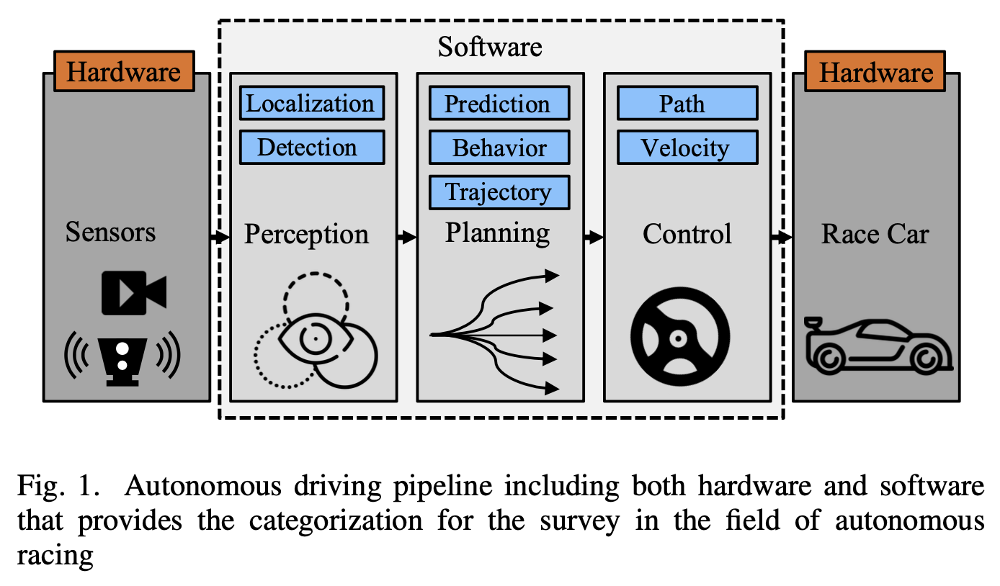
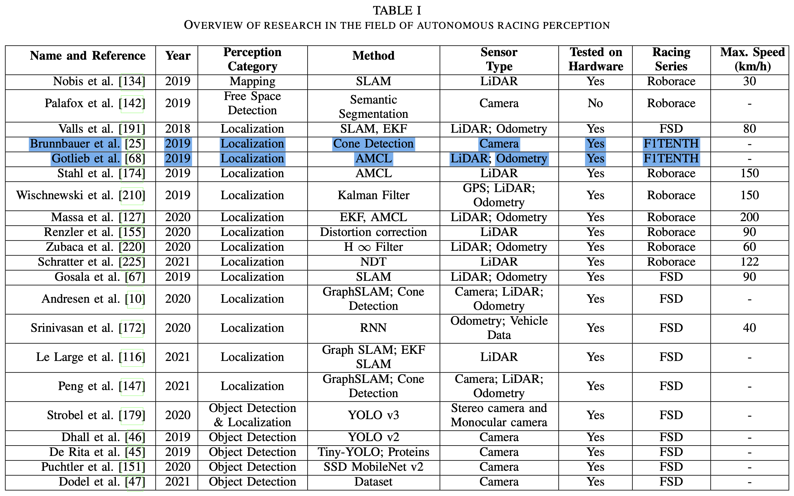
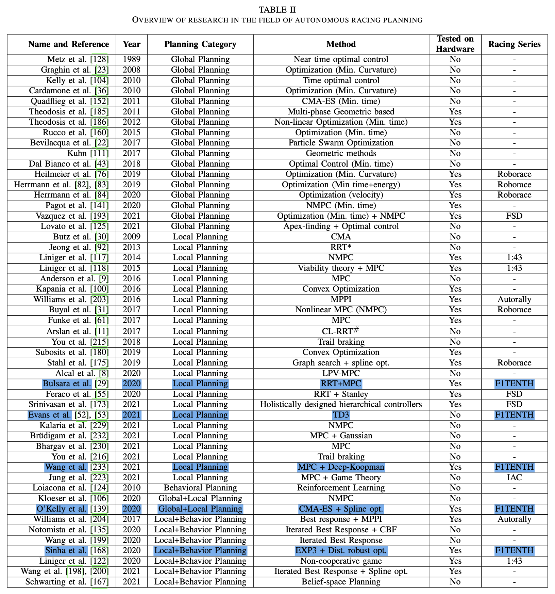
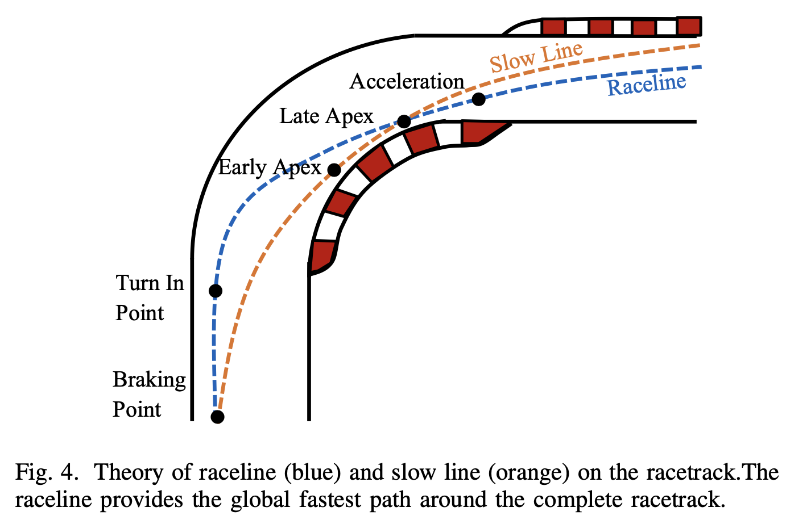
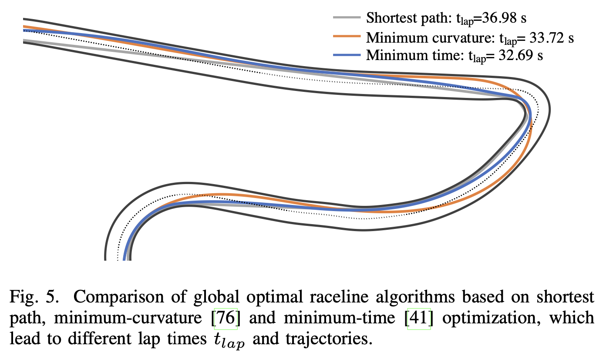
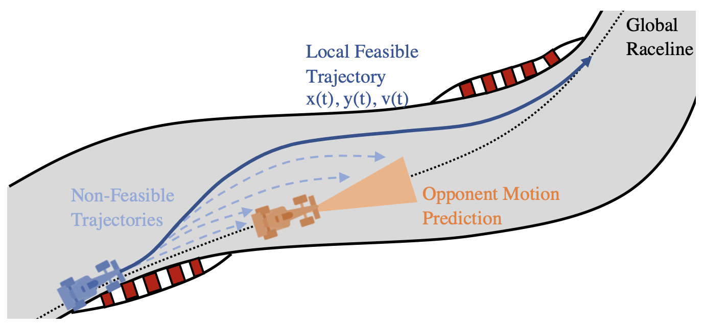
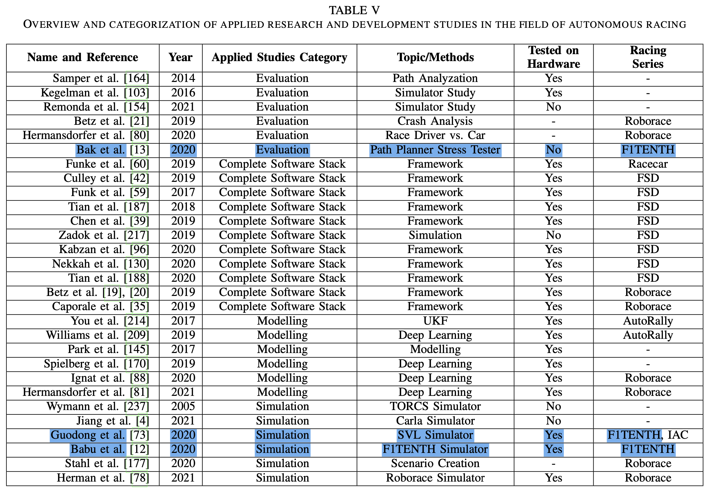

## 1 INTRODUCTION

### *A. Contribution*

1. Cover comprehensively the topic of autonomous vehicle racing for both software and hardware developments.
2. Compare the differenct approaches and explain their algorithmic setup in perception, planning, and control. + DNN, RL.
3. Compare the current autonomous racing competitions - hardware, racing enviroment, orgranization.
4. Present a list of open research challenges in the field of autonomous racing.

### *B. Preliminart Remark*

## 2 AUTONOMOUS RACING SOFTWARE

### *A. Perception*

- Perception : detecting object, detecting the free space, mapping the environment, localizing the autonomous vehicle
- Autonomous racing $\rightarrow$ "How fast is too fast?" (Falanga et al.) $\rightarrow$ The maximum latency an autonomous system can tolerate to guarantee safety (not crashing in an object) is related to the **desired speed**, the **agility of the system** (e.g. the maximum acceleration it can produce) and the **perception parameter of the sensors** (e.g. the sensing range).
- Fundemental problems for autonomous racing perception
  - High speed object detection
  - High speed localization and state estimation
  - Localization on wide areas without specific landmarks
  - Percise localization information necessary to chieve high dynamic trajectory planning and control
- The current state of the art in autonomous racing is heavily based on single vehicle races. Therefore the subcategory of object detection algorithms for high speed applications was not given much attension.

### *B. Planning*

|Planner|Role||
|---|---|---|
|Global Planner|providing an optimal path (raceline) around the racetrack|optimizing for the lowest lap time|
|Local Planner (motion planner)|avoiding obstacles while still provide a fast and and reliable path that does not deviate too much from the optimal global reaceline|operate in a certain time horizon|
|Behavior Planner|high-level mission planning of the racecar|the decision making about overtaking maneuvers (overtaking left / overtaking right / stay behind), the energy management strategy, interaction with other vehicles and the reaction to inputs from race control(e.g. flags, speed limits)|

- Fundemental problems for autonomous racing planning
  - Minimum-time optimization for a global optimal raceline
  - Long local planning horizon for recursive feasibility
  - Obstacle avoidance and vehicle reaction at high speeds
  - High replanning frequency for real-time capability
  - Decision making under high uncertainty
  - Interaction planning with non-cooperative agents

#### Global Planning

Objectives of the overall optimization : **lap time**, geometric properties of the race lines, or energy sepent

- Variations of Evolutionary Algorithms
- Optimal control problem, usually non-linear
  - OCP uses the race vehicle's lap times as the objective function, and respects constraints of the geometry and friction limits $\mu_{max}$ of the race track as well as the dynamics and control limits of the racecar.

#### Local Planning

- In local planning, the main objective is to plan the cars motion for a fixed horizon by avoiding collisions with either the environment or adversaries.
- 3 main strategies
  - Modifying the global plan via optimization
  - Sampling multiple dynamically feasible trajectories and select the best on around obstacles
  - Sample in the free space around obstables to find a feasible trajectory
- 현재 기술 상태에서는 많은 저자들이 지역 궤적 계획을 위해 모델 예측 제어(MPC) 방법을 사용한다.
- 첫 번째 카테고리에서는 장애물 회피를 허용하기 위해 전역 계획이 수정됩니다. 이러한 유형의 공식에서는 모델 예측 제어기가 일반적으로 전역 계획을 최적화하는 데 사용됩니다. 장애물이나 상대 차량을 만날 때마다 최적화 문제의 제약 조건이나 비용 함수가 수정되고 새로운 동작 계획이 수립됩니다.
  Anderson et al. [9]는 최소 시간 목표 또는 최대 속도 목표를 최적화하기 위해 두 가지 MPC 모드 사이를 전환하여 전문 운전자를 모방합니다. Kapania et al. [100]은 참조 경로가 주어졌을 때 최적의 속도 프로필을 먼저 찾은 다음, 고정된 속도 프로필로 주어진 경로를 업데이트하여 볼록 최적화 문제를 풀어 최소 곡률 경로를 찾습니다. Williams et al. [203]는 엔트로피 최소화를 위해 경로 적분 제어에 의존하는 샘플링 기반 MPC를 제안합니다. [61]에서는 충돌 회피, 차량 안정화 및 경로 추적 수행 시 충돌하는 목표를 매개변수화할 수 있는 계획자를 제시합니다. Subosits et al. [180]는 간소화된 점 매직 모델로 다시 계획 문제를 컨벡스 이차 제약 조건 제곱 문제(QCQP)로 근사화하여 실시간 궤적 계획 알고리즘을 제시합니다. Alcal et al. [8]은 비선형 차량 역학을 선형 매개 변수 변동 (LPV) 형태로 재정의합니다. 이를 사용하여 지역 경로를 찾기 위해 해결하기 쉬운 볼록 최적화 문제를 만들 수 있습니다. Kalaria et al. [229]은 목표가 경주 선, 충돌 회피 및 드래프트(공기 저항 감소)를 사용하여 전문 운전자를 모방하는 지역 계획을 위해 비선형 MPC (NMPC)를 사용합니다. Brudigam et al. [232]은 대략적으로 상대의 조작을 예측하기 위해 가우스 과정(GP)을 사용합니다. 이러한 확률적 정보는 효율적인 추월 동작을 계획하기 위해 확률적 MPC에서 사용됩니다.
- 두 번째 카테고리에서는 현재 차량 상태를 사용하여 다양한 조작 입력 순서를 사용하여 차량 역학을 순방향으로 시뮬레이션하여 여러 모션 프리미티브 또는 프로토 타입 모션 계획을 생성합니다. 일반적으로 여러 스플라인 또는 호를 생성합니다. 또한 각 프리미티브에 첨부된 값을 부여하기 위해 비용 함수가 사용됩니다. 이러한 프리미티브 중에서 최적(최소/최대) 비용을 검색하여 최종 궤적을 선택합니다.
  Liniger et al. [117], [118]는 특정 시야까지 차량 속도와 조향 각도의 그리드를 사용하여 차량을 순방향으로 시뮬레이션하여 궤적 라이브러리를 생성합니다. Stahl et al. [175]은 전체 공간을 커버하는 그래프로 경주 트랙을 전파합니다. 노드는 먼저 경주 트랙의 횡단면을 등간격으로 배치한 다음 노드를 연결하는 엣지를 얻기 위해 곡선 모양을 최적화합니다. 이 계획자는 Roborace 차량에서 테스트되었으며 NVIDIA Arm 전기 제어 장치 (ECU)에서 16.8 Hz의 업데이트 속도로 vmax = 223 km/h를 달성했습니다. O'Kelly et al. [139]은 글로벌 레이스 라인을 따라 일정한 그리드의 점을 사용하여 지역 목표 점을 생성합니다. 그런 다음 현재 상태와 그리드 점을 연결하기 위해 삼차 곡선을 최적화하여 최종적으로 지역 궤적을 계획합니다. 마지막으로 [168]에서는 정규화 플로우 방법을 사용하여 차량 앞에 일련의 지역 목표 점을 샘플링합니다. 여기에서도 현재 상태와 그리드 점을 연결하기 위해 삼차 곡선이 최적화됩니다.
- 세 번째 카테고리에서는 샘플링 기반 방법을 사용합니다. 이러한 접근 방식은 주변의 무료 공간을 현재 차량 상태 주위로 무작위로 샘플링합니다. 사용 가능한 목표 상태를 찾은 후 현재 차량 상태와 선택한 목표 상태를 연결하는 동작 계획을 생성합니다. 샘플링 과정에서 무작위성을 도입함으로써 이러한 알고리즘은 일반적으로 효율적이지만 최적성에 대한 보장을 제공하지 않습니다. Jeong et al. [92]은 차량 모델의 동적 모델을 활용하는 로컬 스티어링 알고리즘과 결합하여 빠르게 탐색하는 무작위 트리 (RRT*) 방법을 결합합니다. Arslan et al. [11]은 차량 모델에 기반한 폐쇄 루프 예측과 RRT를 결합하고 최적성이 보장되는 효율적인 트리 구축을 위한 완화 기법을 결합합니다. Feraco et al. [55]는 RRT를 Dubins 곡선과 결합하여 동적으로 실행 가능한 로컬 계획을 생성합니다. 마지막으로 Bulsara et al. [29]는 RRT를 사용하여 무료 공간에서 충돌 없는 참조 경로를 찾습니다.

#### Behavior Planning

- In behavior planning, the focus is usually on high-level decision making on tasks.
- The research in this area mainly focuses on weo different strategies
  1. Assigning multiple cost functions with weighting and selecting the plan with the lowest overall cost
  2. Combine the local planner with game theoretic methods
- 첫 번째 카테고리에서는 트랙을 따라 진행 상황, 장애물과의 근접 정도, 제어 입력에 대한 노력, 최적의 전체 계획으로부터의 이탈 등을 나타내는 특정한 레이싱 가치를 나타내는 비용 함수가 사용됩니다. 그런 다음 각 후보 지역 궤적에 대한 모든 비용 함수를 결합하여 전반적인 비용을 찾습니다. 비용 함수는 자격 없는 계획을 제거함으로써 엄격한 제약 조건도 통합할 수 있습니다. 마지막으로, 최소 전체 비용을 가진 궤적이 로컬 궤적으로 선택됩니다. Liniger 등 [117]은 충돌 없이 원형 궤적을 사용하고 트랙을 따라 가장 큰 진전을 이룹니다. 이 접근 방식은 트랙에 생존 가능한 궤적만 생성하는 타당성 커널을 적용함으로써 확장됩니다. O’Kelly 등 [139]은 전역 계획과의 근접성, 환경과의 충돌을 원형 궤적에 대한 비용 함수로 할당하고 최적의 것을 선택합니다. 마지막으로, Sinha 등 [168]은 트랙을 따라 진행 상황, 전체 곡률, 최대 속도, 예측된 상대방의 움직임과의 충돌을 모든 원형 궤적에 대한 비용 함수로 할당합니다.
- 두 번째 카테고리에서는 주로 두 명 이상의 플레이어 게임에서 최상의 조치를 찾기 위해 게임 이론적 접근 방식이 사용됩니다. 연속적인 모션 플래닝 문제는 일반적으로 각 플레이어가 한 번에 하나씩 "이동"을 할 수 있는 단계별 게임으로 변환됩니다. 이러한 접근 방식은 보통 후회의 개념을 포함하여 즉시 또는 장기적으로 레이싱 게임에서 승리하기 위한 최상의 응답을 찾으려고 합니다. Williams 등 [204]는 상대의 행동에 대한 최상의 응답 모델을 MPC의 변형과 결합하여 다른 차량의 비용에 예측된 상대의 궤적을 포함합니다. Notomista 등 [135]는 감도가 향상된 나시 평형 탐색을 제안하며, 두 대의 차량 레이싱 게임에서 궤적을 최적화하기 위해 반복되는 최상의 응답 알고리즘을 사용합니다. [199]에서는 나시 평형 근사치와 함께 반복되는 최상의 응답을 사용하여 소멸하는 수평 궤적을 계획하는 데 사용됩니다. 이 기술은 상대방의 의도와 응답을 고려하면서 경주차를 트랙을 따라 최대한 진행시키는 데 도움이 됩니다. Sinha 등 [168]은 상대방의 프로토 타입을 오프라인으로 구축하고 라이브러리를 사용하여 현재 상대방을 근사하기 위해 EXP3 알고리즘을 사용합니다. Liniger 등 [122]은 소멸하는 수평 방식으로 다중 플레이어 게임을 반복하며, 이로 인해 일련의 연결된 게임이 생성됩니다. 이 비협력적인 게임 접근 방식으로 저자들은 차량이 블로킹 매니버를 생성하지만 충돌 위험이 더 커진다는 것을 보여 줄 수 있었습니다. Wang 등 [200]은 모든 에이전트에 대한 공동 궤적 공간에서 나시 평형으로 수렴하기 위해 감도가 향상된 반복되는 최상의 응답을 사용합니다. 마지막으로, Schwarting 등 [167]은 믿음 공간에서 지역 반복적인 동적 프로그래밍(DP)을 사용하여 연속적인 부분 관찰 가능한 마르코프 의사 결정 과정(POMDP)을 해결합니다.

### *C. Control*

### *D. End-to-End*

### *E. Applied Autonomous Racing Studies*

#### Evaluation

#### Complete Software Stack

The teams provide different concept to solve individual tasks and display at the same time the underlying computation hardware of the their autonomous race vehicles. In addition, the teams provide insights in the middleware (e.g. ROS) as well as compuations times of their algorithms.

#### Modelling

- The modeling of the vehicle dynamics behavior of the racecar is an essential part in the field of autonomous racing.
- Either these models are used in the simulation environments or model-based trajectory planning/control design aprroaches.
- Not all of parameters of model are available in detail for a vehicle and so different methods for estimating these parameters are proposed - especially for nonlinear vehicle parameters like the tires
  - Unscented Kalman Filter
  - DNNs

#### Simulation

- The Open Racing Car Simulator (TORCS)
- Roborace : have openAI Gym interface for classical control or RL
- SVL Simulator : 3D end-to-end autonomous vehicle simulation platform that provides different maps, vehicles, sensor modelling, weather simulation
- Simulation environment for F1TENTH
  - Babu et al. - ROS and Gazebo based autonomous racing simulator
  - F1TENTH Gym : lirhgtweight, 2D-simulation with an openAi Gym interface
  - Carla

## 3 AUTONOMOUS RACING HARDWARE: VEHICLES AND COMPETITIONS
