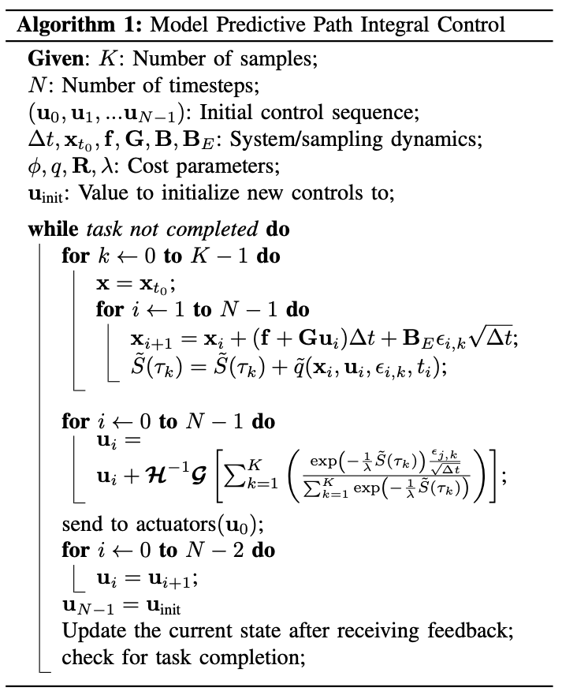

1. Model predictive control algorithm based on the path integral control framework
2. generate new trajectories in real-time
3. based on a stochastic optimal control framework using a fundamental relationship between the information theoretic notions of free energy and relative entropy.
4. Not split the problem into a planning and execution phase, which allows for a simple problem formulation and optimal behavior with respect to the system dynamics.

# Stochastic Trajectory Optimization

The key insight: fundamental relationship between the information theoretic notions of free energy and relative entropy (KL-Divergence).

## classical stochastic optimal control

Notation

- state at time $t$: $\mathbf{x_t} \in \mathbb{R}^n$
- control at time $t$: $\mathbf{u}_t \in \mathbb{R}^m$
- function which maps time to control inputs: $\mathbb{u} (\cdot) : [t_0, T] \rightarrow \mathbb{R}^m$
- trajectory of the system: $\tau: [t_0, T] \rightarrow \mathbb{R}^n$

In classical stochastic optimal control setting we seek a control sequence $\mathbf{u} (\cdot)$ such that:

$$
\begin{aligned}
  \mathbf{u}^*(\cdot) = \underset{\mathbf{u}(\cdot)}{\operatorname{argmin}} \; \mathbb{E} \left[ \phi (\mathbf{x_T}, T) + \int_{t_0}^T \mathcal{L}(\mathbf{x_t, \mathbf{u}_t, t}) \; dt \right]
\end{aligned}
$$

subject to

$$
d\mathbf{x} = \mathbf{F}(\mathbf{x}_t, \mathbf{u}_t, t) \; dt + \mathbf{B}(\mathbf{x}_t, t) \; d\mathbf{w}
$$

where

$$
\mathcal{L}(\mathbf{x_t, \mathbf{u}_t, t})  = q(\mathbf{x}_t, t) + \dfrac{1}{2}\mathbf{u}^T \mathbf{R}(\mathbf{x}_t, t) \mathbf{u}
\\
\mathbf{F}(\mathbf{x}_t, \mathbf{u}_t, t) = \mathbf{f}(\mathbf{x}_t, t) + \mathbf{G}(\mathbf{x}_t, t) \mathbf{u}_t
$$

## Problem Formulation

An interpretation of path integral control is given in terms of the information theoretic concepts of free energy and relative entropy. The interpretation is based on the following equality:

$$
\begin{align}
  -\lambda \mathcal{F}(S(\tau)) = \underset{\mathbb{Q}}{\inf} \left[ \mathbb{E} [\mathcal{S} (\tau)] + \lambda \mathbb{D}_{\text{KL}} (\mathbb{Q} \vert\vert \mathbb{P}) \right]
\end{align}
$$

where

$$
\lambda \in \mathbb{R}^+ \\
$$

$\mathcal{S}(\tau)$ is defined as the state-dependent cost-to-go term

$$
\mathcal{S}(\tau) = \phi (\mathbf{x}_T, T) + \int_{t_0}^T q(\mathbf{x}_t, t) dt
$$

the free energy

$$
\mathcal{F}(\mathcal{S}(\tau) = \log \left( \mathbb{E}_{\mathbb{P}} \left[ \exp \left(-\dfrac{1}{\lambda} \mathcal{S}(\tau) \right) \right] \right)
$$

$\mathbb{P}$ is the probability measure over the space of trajectories induced by the uncontraolled stochastic dynamics

$$
\mathbf{F}(\mathbf{x}_t, \mathbf{u}_t, t) = \mathbf{f}(\mathbf{x}_t, t) + \mathbf{G}(\mathbf{x}_t, t) \mathbf{u}_t
$$

$\mathbb{Q}$ is any probability measure defined over the space of trajectories such that $\mathbb{Q}$ is absolutely continuous with $\mathbb{P}$.

$$
\mathbb{D}_{\text{KL}} (\mathbb{Q} \vert\vert \mathbb{P}) = \mathbb{E}_{\mathbb{Q}} \left[ \log \left( \dfrac{d \mathbb{Q}}{d \mathbb{P}} \right) \right]
$$

The controlled dynamics induce another probability measure on the space of trajectories, which we denote $\mathbb{Q} (\mathbf{u})$. The relative entropy term between the uncontrolled distribution $\mathbb{P}$ and the controlled distribution $\mathbb{Q} (\mathbf{u})$ can be computed by applying Girsanov’s theorem.

$$
\mathbb{D}_{\text{KL}} (\mathbb{Q} (\mathbf{u}) \vert\vert \mathbb{P}) = \dfrac{1}{2} \int_{t_0}^T \mathbf{u}_t^T \mathbf{G} (\mathbb{x}_t, t)^T \Sigma (\mathbf{x}_t, t)^{-1} \mathbf{G}(x_t, t) \mathbf{u}_t dt
$$

where

$$
\Sigma (\mathbb{x}_t, t) = \mathbf{B} (\mathbf{x}_t, t) \mathbf{B} (\mathbf{x}_t, t)^T
$$

If we assume that the control cost matrix takes the form:

$$
\mathbf{R}(\mathbf{x}_t, t) = \lambda \mathbf{G}(\mathbf{x}_t, t)^T \Sigma (\mathbf{x}, t)^{-1} \mathbf{G} (\mathbf{x}_t, t)
$$

we get the following correspondence between the right hand side of (1) and (2):

$$
\mathbb{E}_{\mathbb{Q} (\mathbf{u})} \left[ \mathcal{S} (\tau) \right] + \lambda \mathbb{D}_{\text{KL}} (\mathbb{Q} \vert\vert \mathbb{P}) = \mathbb{E}_{\mathbb{Q}(\mathbf{u})}\left[ \mathcal{S}(\tau) + \dfrac{1}{2} \int_{t_0}^T \mathbf{u}_t^T \mathbf{R} (\mathbf{x}_t, t) \mathbf{u}_t dt \right]
$$

The form of the optimal probability measure $\mathbb{Q}^*$ can be derived in terms of the Radon-Nikodym derivative with respect to the uncontrolled dynamics

$$
\dfrac{d \mathbb{Q}^*}{d \mathbb{P}} = \dfrac{\exp \left( -\dfrac{1}{\lambda} \mathcal{S} (\tau) \right)}{\mathbb{E}_{\mathbb{P}} \left[ \exp \left( -\dfrac{1}{\lambda} \mathcal{S}(\tau) \right) \right]}
$$

Previous works make these connections between the information theoretic notions of free energy, relative entropy, and classical optimal control theory. However, they do not provide a method for computing a control law independent of the HJB-equation, as we do here.

The main idea in our approach is that since we have the form of the optimal distribution, it is possible to pursue the following optimization scheme: instead of trying to directly solve the optimal control problem by computing the solution to the stochastic HJB equation.

$$
\mathbf{u}^*(\cdot) = \underset{\mathbf{u}(\cdot)}{\operatorname{argmin}} \; \mathbb{D}_{\text{KL}} (\mathbb{Q}^* \vert\vert \mathbb{Q}(\mathbf{u}))
$$

## Relative Entropy Minimization

$$
\begin{align*}
  \underset{\mathbf{u}(\cdot)}{\operatorname{argmin}} \; \mathbb{D}_{\text{KL}} (\mathbb{Q}^* \vert\vert \mathbb{Q}(\mathbf{u}))
  &= \underset{\mathbf{u}(\cdot)}{\operatorname{argmin}} \; \mathbb{E}_{\mathbb{Q}^*} \left[ \log \left( \dfrac{d \mathbb{Q^*}}{d \mathbb{Q}(\mathbf{u})} \right) \right] \\
  &= \underset{\mathbf{u}(\cdot)}{\operatorname{argmin}} \; \mathbb{E}_{\mathbb{Q}^*} \left[ \log \left( \dfrac{d \mathbb{Q^*}}{d \mathbb{P}} \cdot \dfrac{d \mathbb{P}}{d \mathbb{Q}(\mathbf{u})} \right) \right] \\
  &= \underset{\mathbf{u}(\cdot)}{\operatorname{argmin}} \; \mathbb{E}_{\mathbb{Q}^*} \left[ \log \left( \dfrac{\exp \left( -\dfrac{1}{\lambda} \mathcal{S} (\tau) \right)}{\mathbb{E}_{\mathbb{P}} \left[ \exp \left( -\dfrac{1}{\lambda} \mathcal{S}(\tau) \right) \right]} \cdot \exp \left( \mathcal{D} (\tau, \mathbf{u}(\cdot))\right) \right) \right] \\
  &= \underset{\mathbf{u}(\cdot)}{\operatorname{argmin}} \; \mathbb{E}_{\mathbb{Q}^*} \left[ -\dfrac{1}{\lambda} \mathcal{S} (\tau) + \mathcal{D} (\tau, \mathbf{u}(\cdot))- \log \left( \mathbb{E}_{\mathbb{P}} \left[ \exp \left( -\dfrac{1}{\lambda} \mathcal{S}(\tau) \right) \right] \right)\right] \\
  &= \underset{\mathbf{u}(\cdot)}{\operatorname{argmin}} \; \mathbb{E}_{\mathbb{Q}^*} \left[ \mathcal{D} (\tau, \mathbf{u}(\cdot)) \right] \\
\end{align*}
$$

where

$$
\begin{align*}
  \mathcal{D} (\tau, \mathbf{u}(\cdot)) &= - \int_0^T \mathbf{u}_t^T \mathbf{G} (\mathbf{x}_t, t)^T \Sigma (\mathbf{x}_t, t)^{-1} \mathbf{G}(\mathbf{x}_t, t) d\mathbf{w}^{(0)} + \dfrac{1}{2} \int_0^T \mathbf{u}_t^T \mathbf{G}(\mathbf{x}_t, t)^T \Sigma (\mathbf{x}_t, t)^{-1} \mathbf{G}(\mathbf{x}_t, t) \mathbf{u}_t dt \\
  &\approx - \sum_{j = 0}^M \mathbf{u}_j^T \int_{t_j}^{t_{j+1}} \mathcal{G}(\mathbf{x}_t, t) d\mathbf{w}^{(0)} + \dfrac{1}{2} \mathbf{u}_j^T \int_{t_j}^{t_{j+1}} \mathcal{H} (\mathbf{x}_t, t) dt \; \mathbf{u}_j \\
\end{align*}
$$

where

$$
\begin{align*}
  i)& \;\;\;\mathcal{G} = \mathbf{G} (\mathbf{x}_t, t)^T \Sigma (\mathbf{x}_t, t)^{-1} \mathbf{B} (\mathbf{x}_t, t) \\
  ii)& \;\;\;\mathcal{H} = \mathbf{G} (\mathbf{x}_t, t)^T \Sigma (\mathbf{x}_t, t)^{-1} \mathbf{G} (\mathbf{x}_t, t) \\
  iii)& \;\;\; N = T / \Delta t
\end{align*}
$$

For small $\Delta t$ we can make the approximations that:

$$
\int_{t_j}^{t_{j+1}} \mathcal{H} (\mathbf{x}_t, t) dt \approx \mathcal{H} (\mathbf{x}_t, t) \Delta t, \;\;\;
\int_{t_j}^{t_{j+1}} \mathcal{G} (\mathbf{x}_t, t) d\mathbf{w}^{(0)} \approx \mathcal{G} (\mathbf{x}_t, t) \int_{t_j}^{t_{j+1}} d\mathbf{w}^{(0)} \\
$$

$$
\begin{align*}
  \mathbb{E}_{\mathbb{Q}^*} \left[ \mathcal{D} (\tau, \mathbf{u}(\cdot)) \right]
  &\approx \sum_{j=0}^N \mathbf{u}_j^T \mathbb{E}_{\mathbf{Q}^*} \left[ \int_{j_j}^{t_{j+1}} \mathcal{G} (\mathbf{x}_t, t) d\mathbf{w}^{(0)} \right] + \sum_{j=0}^N \dfrac{1}{2} \mathbf{u}_j^T \mathbb{E}_{\mathbb{Q}^*} \left[ \int_{j_j}^{{j+1}} \mathcal{H} (\mathbf{x}_t, t) dt \right] \mathbf{u}_j
\end{align*}
$$

Since we cannot sample from the $\mathbb{Q}^*$ distribution, we need to change the expectation to the an expectation with respect to the uncontrolled dynamics $\mathbb{P}$. We can then directly sample trajectories from $\mathcal{P}$ to approximate the controls. The change in expection is achieved by applying the Radon-Hikodym derivative

From $0 = \nabla_{u_j} \mathbb{E}_{\mathbb{Q}^*} \left[ \mathcal{D} (\tau, \mathbf{u}(\cdot)) \right]$

$$
\begin{align*}
  \mathbf{u}_j^* &= \mathbb{E}_{\mathbb{Q}^*} \left[ \int_{t_j}^{t_{j+1}} \mathcal{H} (\mathbf{x}_t, t) dt \right]^{-1} \mathbb{E}_{\mathbb{Q}^*} \left[ \int_{t_j}^{t_{j+1}} \mathcal{G} (\mathbf{x}_t, t) d\mathbf{w}^{(0)} \right] \\
  &= \dfrac{1}{\Delta t} \mathbb{E}_{\mathbb{Q}^*} \left[ \mathcal{H} (\mathbf{x}_t, t_j)\right]^{-1} \mathbb{E}_{\mathbb{Q}^*} \left[ \mathcal{G} (\mathbb{x}_t, t_j) \int_{t_j}^{t_{j+1}} d\mathbf{w}^{(0)}\right] \\
  &= \dfrac{1}{\Delta t} \mathbb{E}_{\mathbb{P}} \left[ \dfrac{\exp (-\dfrac{1}{\lambda} \mathcal{S}(\tau)) \mathcal{H} (\mathbf{x}_{t_j}, t_j)}{\mathbb{E}_{\mathbb{P}}\left[ \exp(-\dfrac{1}{\lambda} \mathcal{S} (\tau)) \right]} \right]^{-1}
  \mathbb{E}_{\mathbb{P}} \left[ \dfrac{\exp (-\dfrac{1}{\lambda} \mathcal{S}(\tau)) \mathcal{G} (\mathbf{x}_{t_j}, t_j) \int_{t_j}^{t_{j+1}}d\mathbf{w}^{(0)}}{\mathbb{E}_{\mathbb{P}}\left[ \exp(-\dfrac{1}{\lambda} \mathcal{S} (\tau)) \right]} \right]
\end{align*}
$$

## Special Case: State Independent Control Matrix

We suppose that the control matrix and diffusion matrix have the form. In other word, there are no correlations between noise in the directly actuated and non-directly actuated states, and the diffusion for the directly actuated states is state-independent.

$$
\mathbf{G} =
\begin{bmatrix}
  0 \\
  \mathbf{G}_c
\end{bmatrix}, \;\;\;
\mathbf{B}(\mathbf{x}_t) =
\begin{bmatrix}
  \mathbf{B}_a (\mathbf{x}_t) & 0 \\
  0 & \mathbf{B}_c
\end{bmatrix}
$$

In this case the covariance matrix

$$
\Sigma (\mathbf{x}) =
\begin{bmatrix}
  \mathbf{B}_a (\mathbf{x})\mathbf{B}_a (\mathbf{x})^T & 0 \\
  0 & \mathbf{B}_c \mathbf{B}_c^T
\end{bmatrix}
$$

Then the terms $\mathcal{H} (\mathbf{x}_t)$ and $\mathcal{G} (\mathbf{x}_t)$ are no longer state dependent and reduce to

$$
\mathcal{H} = \mathbf{G}_c^T (\mathbf{B}_c \mathbf{B}_c^T)^{-1} \mathbf{G}_c, \;\;\; \mathcal{G} = \mathbf{G}_c^T (\mathbf{B}_c \mathbf{B}_c^T)^{-1} \mathbf{B}_c
$$

Therefore

$$
\begin{align}
  \mathbf{u}_j^*
  = \dfrac{1}{\Delta t} \mathcal{H}^{-1} \mathcal{G} \;
  \mathbb{E}_{\mathbb{P}} \left[ \int_{t_j}^{t_{j+1}} \dfrac{\exp (-\dfrac{1}{\lambda} \mathcal{S}(\tau))}{\mathbb{E}_{\mathbb{P}}\left[ \exp(-\dfrac{1}{\lambda} \mathcal{S} (\tau)) \right]} d\mathbf{w}^{(0)}\right]
\end{align}
$$

## Numerical Approximation

In order to numerically approximate (3), there are two problems  that need to be addressed.

1. We need to rewrite the equation for sampling in discreate time.
2. The expectation is with respect to the uncontrolled dynamics which in many cases is a very inefiicient ditribution to sample

So we need a way to perform importance sampling with (3).

In discrete time the dynamics of the system

$$
d \mathbf{x}_t = (\mathbf{f} (\mathbf{x}_{t_j}t_j) + \mathbf{G} (\mathbf{x}_{t_j}, t_j) \mathbf{u}_j) \Delta t + \mathbf{B} (\mathbf{x}_{t_j}, t_j) \epsilon_j \sqrt{\Delta t}
$$

where $\epsilon_j$ is a vector where each entry is a standard normal random variable.

Therefore

$$
\begin{align}
  \mathbf{u}_j^*
  = \dfrac{1}{\Delta t} \mathcal{H}^{-1} \mathcal{G} \;
  \mathbb{E}_{p} \left[ \dfrac{\exp (-\dfrac{1}{\lambda} \mathcal{S}(\tau)) \epsilon_j \sqrt{\Delta t}}{\mathbb{E}_{p}\left[ \exp(-\dfrac{1}{\lambda} \mathcal{S} (\tau)) \right]} \right]
\end{align}
$$

where $p$ is the probability distribution corresponding to the discrete time uncontrolled dynamics.

Instead of sampling from $p$ we can choose to sample from a different probability distribution $q_{\mathbf{u}}^{\nu}$ which corresponds to sampling from the dynamics

$$
d \mathbf{x}_t = (\mathbf{f} (\mathbf{x}_{t_j}t_j) + \mathbf{G} (\mathbf{x}_{t_j}, t_j) \mathbf{u}_j) \Delta t + \mathbf{B}_E (\mathbf{x}_{t_j}, t_j) \epsilon_j \sqrt{\Delta t}
$$

where

$$
\mathbf{B}_E (\mathbf{x}_t) =
\begin{bmatrix}
  \mathbf{B}_a(\mathbf{x}_t) & 0 \\
  0 & \nu \mathbf{B}_c
\end{bmatrix}
$$

with $\nu \geq 1$.

When sampling from the distribution $q_{\mathbf{u}}^{\nu}$, the designer gets to choose

1. The initial controls from which sampling is centered about
2. The magnitude of the exploration variance defined by $\nu$.

In order to sample from $q_{\mathbf{u}}^{\nu}$ instead of $p$ it is necessary to compute the likelibood ratio between the two distributions. Inserting the likelibood ratio corresponds to changing the running cost from $ (\mathbf{x}_t, t)$ to

$$
\tilde{q} (\mathbf{x}_t, \mathbf{u}_t, \epsilon_t, t) = q(\mathbf{x}_t, t) + \dfrac{1}{2} \mathbf{u}_t^T \mathbf{R} \mathbf{u}_t + \lambda \mathbf{u}^T \mathcal{G} \dfrac{\epsilon}{\sqrt{\Delta t}} + \dfrac{1}{2} \lambda (1 - \nu^{-1})\dfrac{\epsilon^T}{\sqrt{\Delta t}} \mathbf{B}_c^T (\mathbf{B_c}\mathbf{B}_c^T)^{-1} \mathbf{B}_c \dfrac{\epsilon}{\sqrt{\Delta t}}
$$

- first two additional terms: penalities for shifting the mean for the exploration away from zero
- last term: penalty for sampling from an overaggressive variance
- $\mathbf{B}_c \dfrac{\epsilon}{\sqrt{\Delta t}}$: the effective change in the control input due to noise

Define

$$
\tilde{S}(\tau) = \phi (\mathbf{x}_T, T) + \sum_{j = 0}^N \tilde{q} (\mathbf{x}_T, \mathbf{u}_T, \epsilon_t, t) \Delta t
$$

Then (4) becomes the iterative update rules

$$
\begin{align*}
  \mathbf{u}_j^*
  &= u_j + \mathcal{H}^{-1} \mathcal{G} \;
  \mathbb{E}_{q_{\mathbf{u}}^{\nu}} \left[ \dfrac{\exp (-\dfrac{1}{\lambda} \tilde{\mathcal{S}}(\tau)) \epsilon_j \sqrt{\Delta t}}{\mathbb{E}_{q_{\mathbf{u}}^{\nu}}\left[ \exp(-\dfrac{1}{\lambda} \tilde{\mathcal{S}} (\tau)) \right]} \right] \\
  &\approx u_j + \mathcal{H}^{-1} \mathcal{G} \;
  \sum_{k=1}^K \left[ \dfrac{\exp (-\dfrac{1}{\lambda} \tilde{\mathcal{S}}(\tau)) \epsilon_j \sqrt{\Delta t}}{\sum_{k=1}^K \exp(-\dfrac{1}{\lambda} \tilde{\mathcal{S}} (\tau))} \right] \\
\end{align*}
$$

# Model Predictive Control Algorithm

GPU를 사용한 병렬 궤적 샘플링은 매우 효율적인 작업으로 복잡한 비선형 동역학에서도 수천 개의 궤적을 샘플링할 때 우리의 구현에서는 15ms 이하의 시간이 소요된다. MPPI 알고리즘을 구현하는 가장 간단한 방법은 샘플당 하나의 스레드를 사용하여 샘플링 반복문을 병렬화하는 것이다.

{: .align-center width="500" height="300"}

     

# Dynamics

## Continuous form

$$
d\boldsymbol{x} = \left( f(\boldsymbol{x}_t, t) + G(\boldsymbol{x}_t, t) \boldsymbol{u}_t(\boldsymbol{x}_t, t) \right) dt + B(\boldsymbol{x}_t, t) d\boldsymbol{w}
$$

where

- $\mathbb{x}_t = \mathbb{x}(t) \in \mathbb{R}^n$ : state of a dynamical system at time $t$
- $\mathbb{u}(\mathbb{x}_t, t) \in \mathbb{R}^m$ : control input for the system
- $\tau: [t_0, T] \rightarrow \mathbb{R}^n$ : trajectory of the system
- $d\mathbb{w} \in \mathbb{R}^p$ : Brownian disturbance

$$
G(\mathbb{x}_t, t) =
\begin{bmatrix}
  0_{l \times m} \\
  G_c(\mathbb{x}_t, t) \\
\end{bmatrix},
\quad

B(\mathbb{x}_t, t) =
\begin{bmatrix}
  0_{l \times p} \\
  B_c(\mathbb{x}_t, t) \\
\end{bmatrix},
\quad

f(\mathbb{x}_t, t) =
\begin{bmatrix}
  f_a(\mathbb{x}_t, t) \\
  f_c(\mathbb{x}_t, t) \\
\end{bmatrix},
\quad

\mathbb{x}_t =
\begin{bmatrix}
  \mathbb{x}_t^{(a)} \\
  \mathbb{x}_t^{(c)} \\
\end{bmatrix}
$$

## Discretized form

Dynamics for very general class of system

$$
\boldsymbol{x}_{t+1} = \boldsymbol{x}_t + d\boldsymbol{x}_t
$$

where

$$
d\boldsymbol{x}_t = \left( f(\boldsymbol{x}_t, t) + G(\boldsymbol{x}_t, t) \, \boldsymbol{u}(\boldsymbol{x}_t, t) \right) \, \Delta t + B(\boldsymbol{x}_t, t) \, \varepsilon \, \sqrt{\Delta t}
$$

 

Uncontrolled dynamics of the system

$$
d\boldsymbol{x}_t = f(\boldsymbol{x}_t, t) \Delta t + B(\boldsymbol{x}_t, t) \, \varepsilon \, \sqrt{\Delta t}
$$

or

$$
B(\boldsymbol{x}_t, t) d\boldsymbol{w} \approx d\boldsymbol{x}_t - f(\boldsymbol{x}_t, t) \Delta t
$$

## Special form

A special case used in original mppi implementation

$$
\begin{aligned}
d\boldsymbol{x}_t 
&= f(\boldsymbol{x}_t, t) \Delta t +  G(\boldsymbol{x}_t, t) \left( \boldsymbol{u}(\boldsymbol{x}_t, t) 
+ \dfrac{1}{\sqrt{\rho}} \dfrac{\epsilon}{\sqrt{\Delta t}} \right) \Delta t
\\

&= f(\boldsymbol{x}_t, t) \Delta t +  G(\boldsymbol{x}_t, t) \left( \boldsymbol{u}(\boldsymbol{x}_t, t) 
+ \delta \boldsymbol{u} \right) \Delta t
\\
\end{aligned}
$$

where

$$
\delta \boldsymbol{u} = \dfrac{1}{\sqrt{\rho}} \dfrac{\epsilon}{\sqrt{\Delta t}}
$$

   

# 1. Stochastic Optimal Control Problem

$$
V(\mathbb{x}_t, t) = \underset{\mathbb{u}}{\operatorname{\min}} \; \mathbb{E}_{\mathbb{Q}} \left[ \phi (\mathbb{x}_T, T) + \int_{t}^T \left( q(\mathbb{x}_t, t) + \dfrac{1}{2} \mathbb{u}(\mathbb{x}_t, t)^{\top} R (\mathbb{x}_t, t) \mathbb{u}(\mathbb{x}_t, t) \right) dt \right]
$$

subject to

$$
d\boldsymbol{x} = \left( f(\boldsymbol{x}_t, t) + G(\boldsymbol{x}_t, t) \boldsymbol{u}_t(\boldsymbol{x}_t, t) \right) dt + B(\boldsymbol{x}_t, t) d\boldsymbol{w}
$$

   

# 2. Stochastic Hamilton–Jacobi–Bellman PDE

$$
-\partial_t V = q(\mathbb{x}_t, t) + f(\mathbb{x}_t, t)^{\top} V_x - \dfrac{1}{2} V_x^\top G(\mathbb{x}_t, t) R(\mathbb{x}_t, t)^{-1} G(\mathbb{x}_t, t)^{\top} V_x + \dfrac{1}{2} \text{tr}(B(\mathbb{x}_t, t) B(\mathbb{x}_t, t)^{\top} V_{xx})
$$

with the boundary condition $V(\mathbb{x}_T, T) = \phi(\mathbb{x}_T, T)$

Solution

$$
\mathbb{u}^*(\mathbb{x}_t, t) = - R(\mathbb{x}_t, t)^{-1} G(\mathbb{x_t, t})^{\top} V_x
$$

# 3. Linearization of PDE

1. exponential transformation of the value function
2. assuming a relationship between the noise and controls

We define desirability function $\Psi (\boldsymbol{x}, t)$

$$
V(\mathbb{x}, t) = - \lambda \log(\Psi(\boldsymbol{x}, t))
$$

Then we can get the followings.

$$
\partial_t V = - \dfrac{\lambda}{\Psi} \partial_t \Psi, \quad V_x = -\dfrac{\lambda}{\Psi}\Psi_x
$$

$$
\nabla_{xx} V_{ij} = - \lambda \left( \dfrac{\Psi\dfrac{\partial \Psi}{\partial \boldsymbol{x}_i \partial \boldsymbol{x}_j} - \dfrac{\partial \Psi}{\partial \boldsymbol{x}_i} \cdot \dfrac{\partial \Psi}{\partial \boldsymbol{x}_j}}{\Psi^2} \right)
$$

$$
V_{xx} = - \dfrac{\lambda}{\Psi}\Psi_{xx} + \dfrac{\lambda}{\Psi^2} \Psi_x \Psi_x^\top
$$

We reorganize the HJB PDE

$$
\lambda \dfrac{\partial_t \Psi}{\Psi} = q - \lambda \dfrac{f^{\top} \Psi_x}{\Psi} - \dfrac{\lambda}{2} \dfrac{\Psi_x^\top}{\Psi} G R^{-1}G^{\top} \left( \lambda \dfrac{\Psi_x}{\Psi} \right) - \dfrac{1}{2} \text{tr} \left( BB^{\top} \left( \dfrac{\lambda}{\Psi}\Psi_{xx} \right) \right) + \dfrac{\lambda}{2 \Psi^2} \text{tr}(BB^{\top} \Psi_x \Psi_x^{\top})
$$

or

$$
\partial_t \Psi = \dfrac{\Psi}{\lambda} q - f^{\top} \Psi_x - \dfrac{\lambda}{2\Psi}\Psi_x^\top G R^{-1}G^{\top} \Psi_x - \dfrac{1}{2} \text{tr} \left( BB^{\top} \Psi_{xx} \right) + \dfrac{1}{2 \Psi} B\Psi_x \Psi_x^{\top}B^{\top}
$$

Assuming $BB^{\top} = \lambda G R^{-1} G^{\top}$, relationship between the noise and control costs of the system,

$$
\partial_t \Psi(\boldsymbol{x}, t) = \dfrac{\Psi(\boldsymbol{x}, t)}{\lambda} q(\boldsymbol{x}, t) - f(\boldsymbol{x}, t)^{\top} \Psi_x - \dfrac{1}{2} \text{tr} \left( B(\boldsymbol{x}, t)B(\boldsymbol{x}, t)^{\top} \Psi_{xx} \right)
$$

   

# 4. Feynman–Kac theorem

The solution of PDE by Feynman-Kac formula is

$$
\begin{aligned}
\Psi(\boldsymbol{x}_{t_0}, t_0)

&= \mathbb{E}_{\mathbb{P}} \left[ \exp \left( -\dfrac{1}{\lambda} \int_{t_0}^T q(\boldsymbol{x}_t, t) \; dt \right) \Psi(\boldsymbol{x}_{T}, T) \right]
\\

&= \mathbb{E}_{\mathbb{P}} \left[ \exp \left( -\dfrac{1}{\lambda} \int_{t_0}^T q(\boldsymbol{x}_t, t) \; dt \right) \exp \left(-\dfrac{1}{\lambda} \phi(x_T) \right) \right]
\\

&= \mathbb{E}_{\mathbb{P}} \left[ \exp \left( -\dfrac{1}{\lambda} \left( \phi(x_T) + \int_{t_0}^T q(\boldsymbol{x}_t, t) \; dt \right) \right) \right]
\\

&= \mathbb{E}_{\mathbb{P}} \left[ \exp \left( -\dfrac{1}{\lambda} S(\tau) \right) \right]
\end{aligned}
$$

where

$$
\begin{aligned}
\mathcal{S}(\tau) &= \phi (\boldsymbol{x}_T, T) + \int_{t_0}^T q(\boldsymbol{x}_t, t) dt \\
&\approx \phi (\boldsymbol{x}_T) + \sum_{i = 1}^N q (\boldsymbol{x}_t, t) \Delta t \\
\end{aligned}
$$

$N = \dfrac{T -t}{\Delta t}$

   

# 5. Path Integral

We obtain the following, path integral form of optimal control,

$$
\boldsymbol{u}^* dt
= \boldsymbol{\mathcal{G}}(\boldsymbol{x}_{t_0}, t_0) \dfrac{\mathbb{E}_{\mathbb{P}} \left[ \exp \left( -\dfrac{1}{\lambda} S(\tau) \right) B_c(\boldsymbol{x}_{t_0}, t_0) d\boldsymbol{w} \right]}{\mathbb{E}_{\mathbb{P}} \left[ \exp \left( -\dfrac{1}{\lambda} S(\tau) \right) \right]} \\
$$

where

$$
G(x_t, t) =
    R(\boldsymbol{x}_t, t)^{-1} G_c(\boldsymbol{x}_t, t)^\top
    \left[G_c(\boldsymbol{x}_t, t)
    R(\boldsymbol{x}_t, t)^{-1}
    G_c(\boldsymbol{x}_t, t)^\top
\right]^{-1}
$$

Discretization

$$
\boldsymbol{u}(\boldsymbol{x}_{t_0}, t_0)^* \Delta t
= \boldsymbol{\mathcal{G}}(\boldsymbol{x}_{t_0}, t_0) \dfrac{\mathbb{E}_{\mathbb{P}} \left[ \exp \left( -\dfrac{1}{\lambda} S(\tau) \right) \left( d\boldsymbol{x}_{t_0}^{(c)} - f_c(\boldsymbol{x}_{t_0}, t_0) \Delta t \right) \right]}{\mathbb{E}_{\mathbb{P}} \left[ \exp \left( -\dfrac{1}{\lambda} S(\tau) \right) \right]} \\
$$

or

$$
\boldsymbol{u}(\boldsymbol{x}_{t_0}, t_0)^*
= \boldsymbol{\mathcal{G}}(\boldsymbol{x}_{t_0}, t_0) \dfrac{\mathbb{E}_{\mathbb{P}} \left[ \exp \left( -\dfrac{1}{\lambda} S(\tau) \right) \left( \dfrac{d\boldsymbol{x}_{t_0}^{(c)}}{\Delta t} - f_c(\boldsymbol{x}_{t_0}, t_0) \right) \right]}{\mathbb{E}_{\mathbb{P}} \left[ \exp \left( -\dfrac{1}{\lambda} S(\tau) \right) \right]} \\
$$

   

# 6. Improtance Sampling

$$
\begin{aligned}
\boldsymbol{u}(\boldsymbol{x}_{t}, t)^*

&= \boldsymbol{\mathcal{G}}(\boldsymbol{x}_{t}, t) \dfrac{\mathbb{E}_{p} \left[ \exp \left( -\dfrac{1}{\lambda} S(\tau) \right) \left( \dfrac{d\boldsymbol{x}_{t_0}^{(c)}}{\Delta t} - f_c(\boldsymbol{x}_{t}, t) \right) \right]}{\mathbb{E}_{p} \left[ \exp \left( -\dfrac{1}{\lambda} S(\tau) \right) \right]}
\\

&= \boldsymbol{\mathcal{G}}(\boldsymbol{x}_{t_0}, t_0) \dfrac{\displaystyle\int \exp \left( -\dfrac{1}{\lambda} S(\tau) \right) \left( \dfrac{d\boldsymbol{x}_{t_0}^{(c)}}{\Delta t} - f_c(\boldsymbol{x}_{t}, t) \right) \mathbf{p}(\tau) d\tau}{\displaystyle \int \exp \left( -\dfrac{1}{\lambda} S(\tau) \right) \mathbf{p}(\tau)d\tau}
\\

&= \boldsymbol{\mathcal{G}}(\boldsymbol{x}_{t_0}, t_0) \dfrac{\displaystyle\int \exp \left( -\dfrac{1}{\lambda} S(\tau) \right) \left( \dfrac{d\boldsymbol{x}_{t_0}^{(c)}}{\Delta t} - f_c(\boldsymbol{x}_{t}, t) \right) \left(\dfrac{\mathbf{q}(\tau)}{\mathbf{q}(\tau)} \right)\mathbf{p}(\tau) d\tau}{\displaystyle\int \exp \left( -\dfrac{1}{\lambda} S(\tau) \right) \left(\dfrac{\mathbf{q}(\tau)}{\mathbf{q}(\tau)} \right) \mathbf{p}(\tau)d\tau}
\\

&= \boldsymbol{\mathcal{G}}(\boldsymbol{x}_{t_0}, t_0) \dfrac{\mathbb{E}_{\mathbf{q}} \left[ \exp \left( -\dfrac{1}{\lambda} S(\tau) \right) \left( \dfrac{d\boldsymbol{x}_{t_0}^{(c)}}{\Delta t} - f_c(\boldsymbol{x}_{t}, t) \right) \left(\dfrac{\mathbf{p}(\tau)}{\mathbf{q}(\tau)} \right) \right]}{\mathbb{E}_{p} \left[ \exp \left( -\dfrac{1}{\lambda} S(\tau) \right) \left(\dfrac{\mathbf{p}(\tau)}{\mathbf{q}(\tau)} \right) \right]}
\\

\end{aligned}
$$

   

# Final

Define

$$
\tilde{S}(\tau) = \phi(\boldsymbol{x}_T) + \sum_{j=1}^N \tilde{q}(\boldsymbol{x}, \boldsymbol{u}, d\boldsymbol{x})
$$

$$
\begin{aligned}
\boldsymbol{u}(\boldsymbol{x}_{t}, t)^*

&= \boldsymbol{\mathcal{G}}(\boldsymbol{x}_{t}, t) \dfrac{\mathbb{E}_{\mathbf{q}} \left[ \exp \left( -\dfrac{1}{\lambda} \tilde{S}(\tau) \right) \left( \dfrac{d\boldsymbol{x}_{t}^{(c)}}{\Delta t} - f_c(\boldsymbol{x}_{t}, t) \right) \right]}{\mathbb{E}_{\mathbf{q}} \left[ \exp \left( -\dfrac{1}{\lambda} \tilde{S}(\tau) \right) \right]}
\\

&= \boldsymbol{\mathcal{G}}(\boldsymbol{x}_{t}, t) G_c(\boldsymbol{x}_t, t) \boldsymbol{u}(\boldsymbol{x}_t, t)

+\boldsymbol{\mathcal{G}}(\boldsymbol{x}_{t}, t) \dfrac{\mathbb{E}_{\mathbf{q}} \left[ \exp \left( -\dfrac{1}{\lambda} \tilde{S}(\tau) \right) B_c(\boldsymbol{x}_t, t) \dfrac{\epsilon}{\sqrt{\Delta t}} \right]}{\mathbb{E}_{\mathbf{q}} \left[ \exp \left( -\dfrac{1}{\lambda} \tilde{S}(\tau) \right) \right]}
\\

\end{aligned}
$$

   

$$
\begin{aligned}
\boldsymbol{u}(\boldsymbol{x}_{t}, t)^*

&= \boldsymbol{u}(\boldsymbol{x}_{t}, t)
+ \dfrac{\mathbb{E}_{\mathbf{q}} \left[ \exp \left( -\dfrac{1}{\lambda} \tilde{S}(\tau) \right) \delta \boldsymbol{u} \right]}{\mathbb{E}_{\mathbf{q}} \left[ \exp \left( -\dfrac{1}{\lambda} \tilde{S}(\tau) \right) \right]}
\\

&\approx \boldsymbol{u}(\boldsymbol{x}_{t}, t)
+ \dfrac{\sum_{k=1}^K \exp \left( -\dfrac{1}{\lambda} \tilde{S}(\tau_{i, k}) \right) \delta \boldsymbol{u}_{i, k}}{\sum_{k=1}^K \exp \left( -\dfrac{1}{\lambda} \tilde{S}(\tau_{i, k}) \right)}
\\

\end{aligned}
$$

where

- $K$: number of random samples (rollouts)
- $S(\tau_{i, k})$ :  cost to go of the $k$ th rollout from time $t_i$ onward

This expression is simply a reward-weighted average of random variations in the control input.

# Reference

- [Aggressive driving with model predictive path integral control](https://www.scribd.com/document/832363051/Aggressive-driving-with-model-predictive-path-integral-control)
- [Model Predictive Path Integral Control: From Theory to Parallel Computation](https://arc.aiaa.org/doi/pdf/10.2514/1.G001921)
