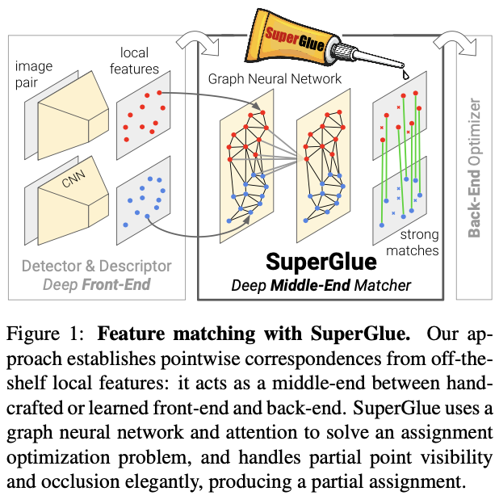
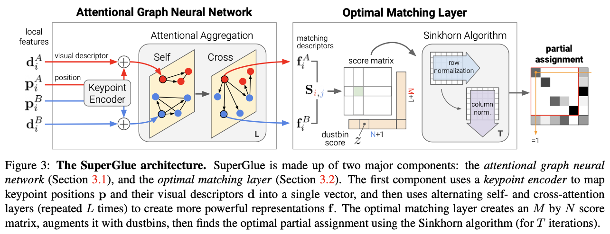
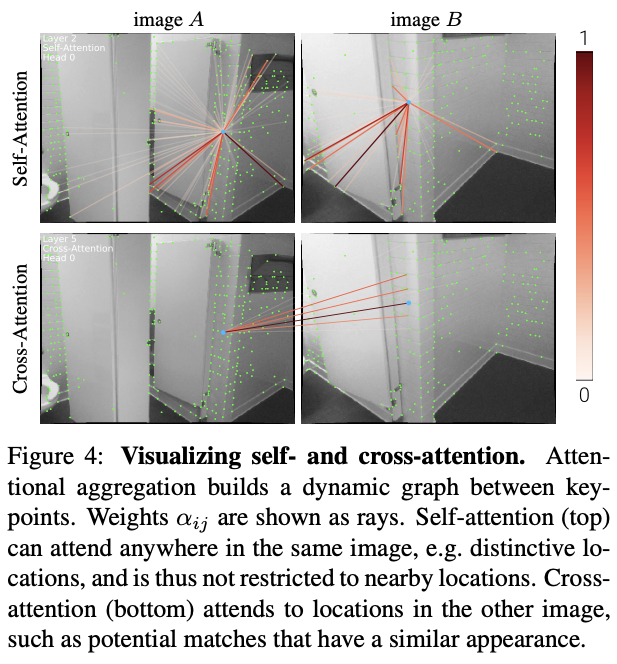

# SuperGlue

SuperGlue: a neural network that maches two sets of local features by jointly finding correspondences and rejecting non-matchable points.

1. a linear assignment problem, which, when relaxed to an optimal transport problem, can be solved differentiably (classical graph-based strategy of matching)
2. The cost function of this optimization is predicted by a GNN.

SuperGlue in context of SLAM

1. [front-end] visual feature extraction
2. [middle-end] feature matching (SuperGlue)
3. [back-end] bundle adjustment or pose estimation

SuperGlue Architecture

Image has $\mathbf{p}$ and $\mathbf{d}$

- $\mathbf{p}$ : *a set of keypoint positions*
- $c$ : detection confidence
- $\mathbf{p}_i := (x, y, c)_i$ : position
- $\mathbf{d}$ : *associated visual descriptors*
- $(\mathbf{p}, \mathbf{d})$ : *local features*

We suppose visual descriptor $\mathbf{d}_i \in \mathbb{R}^D$ already was extracted by a CNN lke SuperPoint. Image $A$ and $B$ have M and N local features, indexed by respectively

$\mathcal{A} := [1, \dots, M], \;\;\; \mathcal{B} := [1, \dots, N]$

재밌는 점

1. Visual Slam에 대한 강력한 단서를 제공한다. (with SuperPoint)

# Reference

- SuperGlue: Learning Feature Matching with Graph Neural Networks (CVPR'20 Oral)
- LightGlue: Local Feature Matching at Light Speed (ICCV'23)

# Memo

Regularities of the world in the image matching problem

1. 3D world is largely smooth and sometimes planar
2. all correspondences for a given image pair derive from a single epipolar transform if the scence is static
3. some poses are more likely than others

2D keypoints are usually projecttions of salient 3D points, like corners or blobs, thus correspondences across images mush adhere to certain physical constraints

1. a keypoint can have at most a single correspondence in the other image
2. some kypoints will be unmatched due to occlusion and failure of the detection
