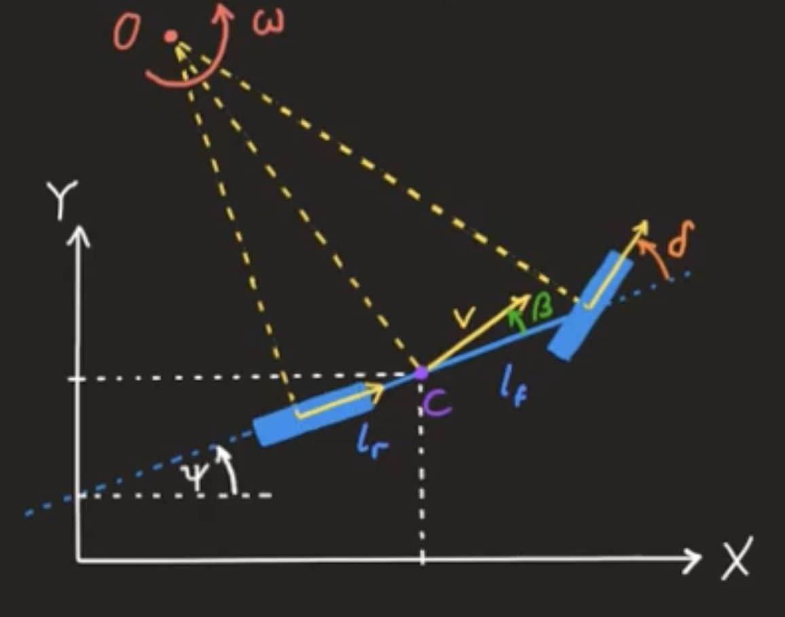

# 1. Kinematic Bycycle Model (Single Track Model)

Notation

- $x$: absolute position x (m)
- $y$: absolute position y (m)
- $\psi$: yaw (deg)
- $v$: velocity (m/s)
- $\delta$: steering angle (deg)
- $\beta:$ side slip angle

State and action

$$
\mathbf{x} =
\begin{bmatrix}
  x_1 \\
  x_2 \\
  x_3 \\
  x_4 \\
  x_5 \\
\end{bmatrix}
=
\begin{bmatrix}
  x \\
  y \\
  \psi \\
  v \\
  \delta \\
\end{bmatrix}, \;\;\;
u = \delta
$$

Kinematic Bicycle Model

{: .align-center}

$$
\begin{align*}
  \dot{x} &= v \cos(\psi + \beta) \\
  \dot{y} &= v \sin(\psi + \beta) \\
  \dot{\psi} &= \dfrac{v}{l_r + l_f} \cos\beta \tan\delta \\
\end{align*}
$$

where

$$
\beta = \arctan{\left(\dfrac{l_r}{l_r +l_f} \tan\delta\right)}
$$

Therefore

$$
\begin{bmatrix}
  \dot{x}_1 \\
  \dot{x}_2 \\
  \dot{x}_3 \\
  \dot{x}_4 \\
  \dot{x}_5 \\
\end{bmatrix}
=
\begin{bmatrix}
  x_4 \cos{\left(x_3 + \arctan{\left(\dfrac{l_r}{l_r +l_f} \tan\delta\right)} \right)} \\
  x_4 \sin{\left(x_3 + \arctan{\left(\dfrac{l_r}{l_r +l_f} \tan\delta\right)} \right)}  \\
  \dfrac{x_4}{l_r + l_f} \cos\left( \arctan{\left(\dfrac{l_r}{l_r +l_f} \tan\delta\right)} \right) \tan\delta \\
  \dot{x}_4 \\
  \dot{x}_5 \\
\end{bmatrix}
$$

Implementation

$$
\beta = \arctan{\left(\dfrac{l_r}{l_r +l_f} \tan\delta\right)} \\
$$

$$
\begin{bmatrix}
  \Delta{x_1} \\
  \Delta{x_2} \\
  \Delta{\psi} \\
  \Delta \delta \\
\end{bmatrix}
=
\begin{bmatrix}
  v \cos(\psi + \beta) \Delta t\\
  v \sin(\psi + \beta) \Delta t \\
  \dfrac{v}{l_r + l_f} \cos\beta \tan\delta \Delta t \\
  \dfrac{\delta - \delta}{\tau}\Delta t \\
\end{bmatrix}
$$

$$
\begin{bmatrix}
  x_1(k+1) \\
  x_2(k+1) \\
  x_3(k+1) \\
  x_4(k+1) \\
  x_5(k+1) \\
\end{bmatrix}
=
\begin{bmatrix}
  x_1(k) + \Delta x_1(k) \\
  x_2(k) + \Delta x_2(k) \\
  \arctan \left( \dfrac{\sin{(x_3(k) + \Delta x_3(k))}}{\cos{(x_3(k) + \Delta x_3(k))}} \right) \\
  x_4(k+1) \\
  x_5(k) + \Delta x_5(k) \\
\end{bmatrix}
$$

- $x_4(k+1) = v(k+1)$ 는 global planner로부터 받은 reference speed를 이용한다. (look-up table)
- $\Delta \delta$ 는 1차 지연을 이용한다.

# 2. Dynamic Bicycle Model

Notation for state and action

$$
\mathbf{x} =
\begin{bmatrix}
  x \\
  y \\
  v_x \\
  v_y \\
  \psi \\
  \dot{\psi} \\
\end{bmatrix}, \;\;\;
u = \delta
$$

based on the 3 Degrees of Freedom dynamics bicycle model of the vechicle combined with a linear tire model

$$
\begin{align*}
  m(\dot{v}_x - \dot{\psi}v_y) &= F_{xf} + F_{xr} \\
  m(\dot{v}_y + \dot{\psi}v_x) &= F_{yf} + F_{yr} \\
  I_z \ddot{\psi} &= I_f F_{yf} - I_r F_{yr}
\end{align*}
$$

$C_{\tau}, C_{\alpha}$ corresponds to the longitudinal (lateral) tire stiffness coefficient

$$
\begin{align*}
  F_{xp_f} &= C_{\tau_f}\tau_{x_f} \\
  F_{yp_f} &= C_{\alpha_f} \left(\delta_f - \dfrac{v_y + I_f \psi}{v_x} \right) \\
  F_{xp_r} &= C_{\tau_r} \tau_{x_r} \\
  F_{yp_r} &= - C_{\alpha_r}\left( \dfrac{v_y - I_r \psi}{v_x} \right)
\end{align*}
$$

...

$$
\begin{bmatrix}
  \dot{x} \\
  \dot{y} \\
  \dot{v_x} \\
  \dot{v_y} \\
  \dot{\psi} \\
  \ddot{\psi} \\
\end{bmatrix}
=
\begin{bmatrix}
  v_x \cos{\psi} - v_y \sin{\psi} \\
  v_x \sin{\psi} + v_y \cos{\psi} \\
  \dfrac{F_{xf} + F_{xr}}{m} + \dot{\psi}v_y \\
  \dfrac{F_{yf} + F_{yr}}{m} - \dot{\psi}v_x \\
  \dot{\psi} \\
  \dfrac{I_f F_{yf} - I_r F_{yr}}{I_z} \\
\end{bmatrix}
$$

# 3. Pacejka Magic Tire Formula

- Lookahead point와 현재 위치의 벡터 계산

$$
\vec{p}
=
\begin{bmatrix}
  x_{\text{lookahead}} - x \\
  y_{\text{lookahead}} - y \\
\end{bmatrix}
$$

- 차량의 좌측 방향 벡터

차량의 전방 방향 벡터는 다음과 같다.

$$
\vec{d}
=
\begin{bmatrix}
  \cos{\psi} \\
  \sin{\psi} \\
\end{bmatrix}
$$

차량의 좌측 방향은 방향 벡터를 90 degree 회전시켜야 한다. 90 degree에 해당하는 회전 행렬을 곱한다.

perpendicular vector는 다음과 같다.

$$
\vec{d}_{\bot} =
\begin{bmatrix}
  0 & -1 \\
  1 & 0 \\
\end{bmatrix}
\begin{bmatrix}
  \cos{\psi} \\
  \sin{\psi} \\
\end{bmatrix}
=
\begin{bmatrix}
  -\sin{\psi} \\
  \cos{\psi} \\
\end{bmatrix}
$$

- 차량의 측면 각도

lookahead vector를 기준으로 얼마나 벗어났는지를 나타내는 측면 각도를 $\eta$라고 하자.

$$
\sin{\eta} = \dfrac{\vec{p} \cdot \vec{d}_{\bot}}{\vert\vert \vec{p} \vert\vert \cdot \vert\vert \vec{d}_{\bot} \vert\vert}
$$

- 차량의 횡가속도

lateral acceleration

$$
a_{\text{lateral}} = 2 \dfrac{v_{\text{target}}^2}{L_1} \sin{\eta}
$$

- steering angle

$$
\delta = f(a_{\text{lateral}}, v_{\text{target}})
$$

where $f$ is a look-up table function. Look-up table function $f$는 pacejka의 magic tire model에서 횡가속도와 조향각 간의 관계를 반영하여 생성되었다.

- command

$$
\begin{align*}
  v_{\text{next}} &= \max{ \left( v_{\text{target}}, 0 \right)} \\
  \delta_{\text{next}} &= \delta \\
\end{align*}
$$

# Implementation

## Kinematic Bicycle Model

하나의 state sequence를 예측하는 것이 목적이다.

```cpp
// Predict both local and global state sequence from control sequence
void MPCBase::predict_state_seq(const ControlSeq& control_seq,
                                const State& global_init_state,
                                const grid_map::GridMap& reference_map,
                                StateSeq* global_state_seq,
                                StateSeq* local_state_seq) const {
    // observed state
    global_state_seq->row(0) = global_init_state;

    // // observed state
    local_state_seq->row(0) = State::Zero(STATE_SPACE::dim);
    local_state_seq->row(0)(STATE_SPACE::vel) = global_init_state(STATE_SPACE::vel);

    // This is for linear prediction mode of speed
    const double init_x = global_init_state(STATE_SPACE::x);
    const double init_y = global_init_state(STATE_SPACE::y);
    double current_reference_speed = 0;
    if (reference_map.isInside(grid_map::Position(init_x, init_y))) {
        current_reference_speed = reference_map.atPosition(speed_field_layer_name_, grid_map::Position(init_x, init_y));
    }

    // double prev_steer_angle = control_seq(0, CONTROL_SPACE::steer);
    for (size_t i = 0; i < prediction_step_size_ - 1; i++) {
        double steer_angle = 0.0;
        if (i <= steer_delay_steps_) {
            // To consider input delay
            steer_angle = control_seq(0, CONTROL_SPACE::steer);
        } else {
            steer_angle = control_seq(i, CONTROL_SPACE::steer);
        }
        // const double steer_angle = control_seq(i, CONTROL_SPACE::steer);
        // const double accel = control_seq(i, CONTROL_SPACE::accel);

        // Update global state
        const double global_x = global_state_seq->row(i)(STATE_SPACE::x);
        const double global_y = global_state_seq->row(i)(STATE_SPACE::y);
        const double global_yaw = global_state_seq->row(i)(STATE_SPACE::yaw);
        const double global_vel = global_state_seq->row(i)(STATE_SPACE::vel);
        const double global_steer = global_state_seq->row(i)(STATE_SPACE::steer);

        const double beta_global = atan(lf_ / (lf_ + lr_) * tan(global_steer));

        // Kinematic Bicycle Model with steer 1st order delay
        const double delta_global_x = global_vel * cos(global_yaw + beta_global) * prediction_interval_;
        const double delta_global_y = global_vel * sin(global_yaw + beta_global) * prediction_interval_;
        const double delta_global_yaw = global_vel * sin(beta_global) / lr_ * prediction_interval_;
        const double delta_global_steer = ((steer_angle - global_steer) / steer_delay_tau_) * prediction_interval_;

        double next_vel = 0.0;
        if (speed_prediction_mode_ == SpeedPredictionMode::CONSTANT) {
            next_vel = constant_speed_prediction(global_vel);
        } else if (speed_prediction_mode_ == SpeedPredictionMode::LINEAR) {
            next_vel = linear_speed_prediction(global_vel, current_reference_speed, prediction_interval_, min_accel_, max_accel_);
        } else if (speed_prediction_mode_ == SpeedPredictionMode::REFERENCE) {
            next_vel = reference_speed_prediction(global_x, global_y, reference_map);
        }

        global_state_seq->row(i + 1)(STATE_SPACE::x) = global_x + delta_global_x;
        global_state_seq->row(i + 1)(STATE_SPACE::y) = global_y + delta_global_y;
        global_state_seq->row(i + 1)(STATE_SPACE::yaw) = std::atan2(sin(global_yaw + delta_global_yaw), cos(global_yaw + delta_global_yaw));
        global_state_seq->row(i + 1)(STATE_SPACE::vel) = next_vel;
        global_state_seq->row(i + 1)(STATE_SPACE::steer) = global_steer + delta_global_steer;

        // Update local state
        const double local_x = local_state_seq->row(i)(STATE_SPACE::x);
        const double local_y = local_state_seq->row(i)(STATE_SPACE::y);
        const double local_yaw = local_state_seq->row(i)(STATE_SPACE::yaw);
        const double local_vel = local_state_seq->row(i)(STATE_SPACE::vel);
        const double local_steer = local_state_seq->row(i)(STATE_SPACE::steer);

        const double beta_local = atan(lf_ / (lf_ + lr_) * tan(local_steer));

        // Kinematic Bicycle Model with steer 1st order delay
        const double delta_local_x = local_vel * cos(local_yaw + beta_local) * prediction_interval_;
        const double delta_local_y = local_vel * sin(local_yaw + beta_local) * prediction_interval_;
        const double delta_local_yaw = local_vel * sin(beta_local) / lr_ * prediction_interval_;
        const double delta_local_steer = ((steer_angle - local_steer) / steer_delay_tau_) * prediction_interval_;

        local_state_seq->row(i + 1)(STATE_SPACE::x) = local_x + delta_local_x;
        local_state_seq->row(i + 1)(STATE_SPACE::y) = local_y + delta_local_y;
        local_state_seq->row(i + 1)(STATE_SPACE::yaw) = std::atan2(sin(local_yaw + delta_local_yaw), cos(local_yaw + delta_local_yaw));
        local_state_seq->row(i + 1)(STATE_SPACE::vel) = next_vel;
        local_state_seq->row(i + 1)(STATE_SPACE::steer) = local_steer + delta_local_steer;
    }
}
```

## Pacejka Magic Tire Formula

```py
# Vector from the current position to the point at lookahead distance
position_la_vector = np.array([lookahead_point[0] - self.position[0], lookahead_point[1] - self.position[1]])
yaw = self.position[2]
eta = np.arcsin(np.dot([-np.sin(yaw), np.cos(yaw)], position_la_vector)/np.linalg.norm(position_la_vector))
lat_acc = 2*target_speed**2 / lookahead_distance * np.sin(eta)

steering_angle = self.steer_lookup.lookup_steer_angle(lat_acc, target_speed)
ack_msg.drive.steering_angle = steering_angle
ack_msg.drive.speed = np.max(target_speed, 0)  # no negative speed
```

## Dynamic Bicycle Model

타이어의 종방향(x) 힘과 횡방향(y) 힘을 계산한다.

$$
\begin{align*}
  F_{xp_f} &= C_{\tau_f}\tau_{x_f} \\
  F_{yp_f} &= C_{\alpha_f} \left(\delta_f - \dfrac{v_y + I_f \psi}{v_x} \right) \\
  F_{xp_r} &= C_{\tau_r} \tau_{x_r} \\
  F_{yp_r} &= - C_{\alpha_r}\left( \dfrac{v_y - I_r \psi}{v_x} \right)
\end{align*}
$$

다음과 같다.

$$
F_{xf} = F_{xp_f} \\
F_{xr} = F_{xp_r} \\
F_{yf} = F_{yp_f} \\
F_{yr} = F_{yp_r} \\
$$

따라서 다음의 종방향 운동 방정식, 횡방향 운동 방정식, yaw 회전 운동 방정식에 대입하자.

$$
\begin{align*}
  m(\dot{v}_x) - \dot{\psi}v_y &= F_{xf} + F_{xr} \\
  m(\dot{v}_y) + \dot{\psi}v_x &= F_{yf} + F_{yr} \\
  I_z \ddot{\psi} &= I_f F_{yf} - I_r F_{yr}
\end{align*}
$$
