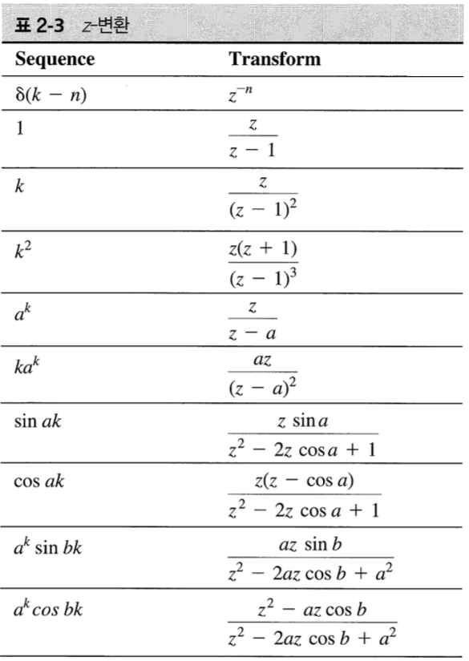
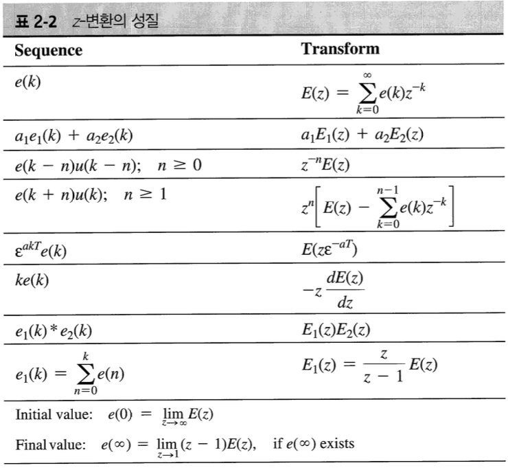

## 1 Introduction

|Continuous Time System|Discrete Time System|
|:---:|:---:|
|Differentil Equation|Difference Equation|
|Laplace Transform|Z-Transform|

차분 방정식, 전달함수, 그리고 상태 방정식에 의한 이산 시간 시스템의 모델링을 제시한다.

이산 시간 시스템은 차분 방정식으로 표현되며, 시스템 내의 신호들의 숫자 배욜로 표현된다는 것을 배운다. 이 숫자 배열은 연속 시간 신호를 샘플링하여 만들 수 있다. 이것은 디지털 제어 시스템의 예시이다.

## 2 Discrete-Time Systems

n차 선형 차분 방정식의 일반적인 형태 - 디지털 필터

$$
x(k) =b_ne(k) + b_{n-1}e(k-1) + \dots + b_0e(k-n) \\
-a_{n-1}x(k-1) - \dots - a_0x(k-n)
$$

플랜드가 선형이고 시불변이면, 전체 시스템은 차분 방정식에 의해 모델링될 수 있다.

디지털 보상기 설계

1. 아날로그 보상기를 설계하고 근사화 과정을 통해 디지털 보상기로 변환한다.
2. 디지털 보상기를 설계한다.

## 3 Transform Methods

**DEFINTION**

$$
E(z) = Z{e(k)} = e(0) + e(1)z^{-1} + e(2)z^{-2} = \sum_{k=0}^{\infty}e(k)z^{-k}
$$

z-transform은 임의의 수열에 대해 정의되며, 선형 시불변 차분 방정식에 의해 타나내지는 임의의 형태의 시스템 해석에 사용할 수 있다.

## 4 Properties of the z-Transform

- 가산과 감산 : 수열의 합의 z 변환은 수열의 z 변환의 합과 같다.
- 상수배 : 상수가 곱해진 수열의 z 변환은 수열의 z 변환에 상수를 곱한 것과 같다.

## 5 Finding z-Transform

## 6 Solution of Difference Equations

## 7 The Inverse z-Transform

## 8 Simulation Diagrams and Flow Graphs

## 9 State Variables

system을 표현하는 세 가지 방법

1. Differential equation or difference equation
2. Transfer function
3. State-space model

In preceding section we defined a discrete-time system as one that can be described by a difference equation. If the discrete-time system is linear and time-invariant we can also represent the system by a transfer function.

The more modern approach to the analysis and synthesis of discrete-time systems employs the state-variable method. The state vaiables represent the minimum amount of information which is necessary to determine both the future states and the system outputs for given input functions : that is, given the system states, the system dynamics and the input functions, ws can determine all subsequent states and outputs.

## 10 Other State-Variable Formulations

## 11 Transfer Functions

For a given system, there is no unique state-variable formulation

- A higher-order transfer function as a product of simpler transfer functions
- A higher-order transfer function as the sum of simper transfer functions through partial-fraction expansion.

앞서 전달함수로부터 상태 모델을 유도하였다. 이절에서는 상태 모델로부터 전달 함수를 구하는 두 가지 방법을 알아본다.

1. 이산 시간 시스템의 상태 방정식으로부터 모의 실험 선도를 구성한 후 Mason의 이득 공식을 이용하여 모의 실험 선도로부터 전달함수를 구한다.
2. 상태 방정식에 z-transform을 취하고 X(z)를 제거한다.

$$
\dot{x} = Ax + Bu \\
y = Cx + Du \\
$$

$$
sX(s) = AX(s) + BU(s) \\
Y(s) = CX(s) + DU(s) \\
$$

$$
X(s) = (sI-A)^{-1}BU(s) \\
$$

$$
Y(s) = CX(s) + DU(s) \\
= C(sI-A)^{-1}BU(s) + DU(s)
$$

$$
\therefore \dfrac{Y(s)}{U(s)} = C(sI-A)^{-1}B + D
$$

## 12 Solutions of the State Equations

상태 방정식의 해를 구할 때 핵심은 상태 천이 행렬을 계산하는 것이다.

$$
\bold{x}(k+1) = A\bold{x}(k) + B\bold{u}(k)
\\
\bold{y}(k) = C\bold{x}(k) + D\bold{u}(k)
$$

의 일반해는 다음과 같다.

$$
\bold{x} = \bold{A}^k\bold{x}(0) + \sum_{j=0}^{k-1}\bold{A}^{k-1-j}\bold{B}\bold{u}(j)
\\
=\bold{\Phi}(k)\bold{x}(0) + \sum_{j=0}^{k-1}\bold{\Phi}(k-1-j)\bold{B}\bold{u}(j)
$$

where $\bold{\Phi}(k) = \bold{A}^k$. (상태천이행렬)

## 13 Linear Time-varying Systems

## Questions

- If the discrete-time system is linear and time-invariant we can also represent the system by a transfer function. (63.page) : time-variant한 경우에는 시스템을 어떻게 이해할 수 있을까?
- For certain analysis or design procedures, certain formulations present advantages with respect to calculations, as will eb shown in later chapters. (71.page)
- [11] (sI-A)가 invertible한지 어떻게 알 수 있을까?

## Reference

Charles L. Philips - Digital Control System
