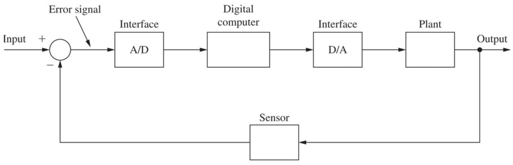
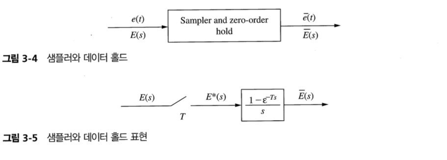
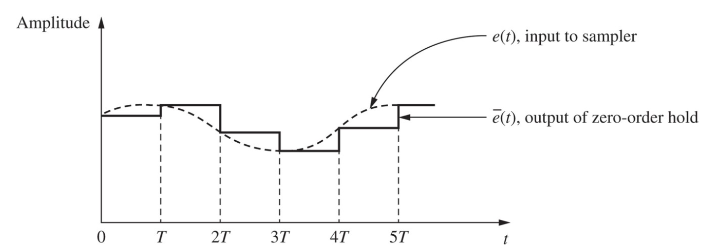

- 이 장의 중요한 목표 중 하나는 starred transform을 구하는 것이다.

## 1 Introduction

To provide a basis for thoroughly understanding the operation of digital control systems, it is necessary to determine the effects of sampling a continuous-time signal.

이 장에서는 A/D + Digital Computer + D/A를 하나의 시스템으로 본다.

## 2 Sampled-Data Control Systems

- Sampled-data system : A/D + D/A + plant
- In general, it is undesirable to apply a signal in sampled form, such as a train of narrow rectangular pulses to a plant, because of the high-frequency components inherently present in that signal. - 무슨 의미인지 모르겠다.
- Therefore, a data-reconstruction device, called a data hold, is inserted into the system directly following the sampler.
- Data hold : to reconstruct the simpled signal into a form that closely resembles the signal brefore sampling.
- Zero-order hold : the simplest data-reconstruction device
- 샘플러로 표현된 동작은 전달함수로 표현할 수 없지만 holder는 전달함수로 표현될 수 있다.

$$
\bar{e}(t) = e(0)[u(t) - u(t - T)] + e(T)[u(t-T)-u(t-2T)] + e(2T)[u(t-2T)-u(t-3T)] + \dots
$$

Laplace transform

$$
\bar{E}(s) = e(0)\left[\dfrac{1}{s} - \dfrac{\epsilon^{-Ts}}{s}\right]
+ e(T)\left[\dfrac{\epsilon^{-Ts}}{s} - \dfrac{\epsilon^{-2Ts}}{s}\right]
+ e(2T)\left[\dfrac{\epsilon^{-2Ts}}{s} - \dfrac{\epsilon^{-3Ts}}{s}\right] \\
= \left[\dfrac{1-\epsilon^{Ts}}{s} \right]\left[e(0) + e(T)\epsilon^{-Ts} + e(2T)\epsilon^{-2Ts}  + \dots  \right]\\
= \left[\sum_{n=0}^{\infty}e(nT)\epsilon^{-nTs}\right] \left[\dfrac{1-\epsilon^{Ts}}{s} \right]
$$

- First factor : a function of the input $e(t)$ and the sampling period $T$
- Second factor :  a transfer function independent of $e(t)$ and therefore can be considered to be a transfer function. (zero-order hold).
The function $E^*(S)$, called the starred transform, is defined as

$$
E^*(s) := \sum_{n=0}^{\infty}e(nT)\epsilon^{-nTs}
$$

$E^*(s)$ does not appear in the physical system but appear as a result factoring.

## 3 The Ideal Sampler

Ideal sampler(임펄스 변조기) : sampler and hold model에 나타난 sampler. 실제로 존재하지 않는 신호인 임펄스 함수가 출력에 나타난다.

Inverse laplace transform

$$
e^*(t) = \mathcal{L}^{-1}[E^*(s)]
= e(0)\delta(t) + e(T)\delta(t-T) + e(2T)\delta(t-2T) + \dots
$$

$e^*(t)$ is not a physical signal

$$
\delta_T(t) := \sum_{n=0}^{\infty}\delta(t-nT)
$$

Then

$$
e^*(t) = e(t)\delta_T(t)
$$

## 4 Evaluation of $E^*(s)$

Definition

$$
E^*(s) := \sum_{n=0}^{\infty}e(nT)\epsilon^{-nTs}
$$

$E^*(S)$에 대한 추가적인 두 개의 표현식

$$
E^*(s) = \sum_{\text{at poles of E}(\lambda)} \left[ \text{residues of} \; E(\lambda) \dfrac{1}{1-\epsilon^{-T(s-\lambda)}}\right]
$$

$$
E^*(s) = \dfrac{1}{T}\sum_{n=-\infty}^{\infty} E(s + jn\omega_s) + \dfrac{e(0)}{2}
$$

## 5 Results from the Fourier Transform

## 6 Properties of $E^*(s)$

$E^*(s)$ have two important properties in the s-domain.

**Property 1**

$E^*(s)$ is periodic in s with the period $j\omega_s$

$$
E^*(s + jn\omega_s) = E^*(s) \;\text{for}\; n \in \mathbb{Z}
$$

**Property 2**

$E(s)$가 $s = s_1$에서 극점을 가지면 $E^*(s)$는 $s = s_1 + jm\omega_s$에서 극점을 갖는다.

## 7 Data Reconstruction

샘플값을 사용하는 대부분의 피드백 제어 시스템은 샘플링된 신호로부터 연속 신호를 복원한다. 현실적인 데이터 홀드는 이상적인 저역필터를 근사한 장치이다.

데이터 복원의 일반적인 방법은 다항식 외삽법이다.

Tylor 급수를 이용한다.

$$
e(t) = e(nT) + e'(nT)(t - nT) + \dfrac{e''(nT)}{2!} + \dots
$$

$e(t)$는 샘플링된 형태로 data hold에 입력되므르 미분값은 알 수 없지만, 후방 차분을 이용하여 미분값을 알 수 있다.

$$
e'(T) = \dfrac{1}{T}[e(nT)-e[(n-1)T]]
\\
e''(T) = \dfrac{1}{T}[e'(nT)-e'[(n-1)T]]
\\
= \dfrac{1}{T^2}[e(nT)-2e[(n-1)T] + e[(n-2)T]]
$$

- 0차 홀드 : Taylor 전개에서 첫 번째 항(상수항)만을 사용한다.
- 1차 홀드 : Taylor 전개에서 두 번째 항(1차항)까지 사용한다.
- 분수차 홀드

## 궁금한 점

- Plugin effector에서는 AD/DA 변환 과정과 디지털 회로에서의 처리 과정에서 시간이 소요되어 real time이 어렵다. 일반적인 제어에서 이런 문제가 발생할 수 있을까? 빈번할까?
- Optimal Control이나 MPC을 통한 경로 생성 과정에서 sampling and reconstruction 과정은 어디에 해당할까?
- 아날로그 회로와 디지털 회로를 구분하는 기준을 AD/DA 과정 여부로 할 수 있을까? O
- "폭이 좁은 사각형 펄스 열과 같이 샘플링된 모양의 신호는 고주파 성분이 들어있기 때문에 플랜트에 입력하는 것이 바람직하지 않다."(100p)라는 문장의 의미가 무엇일까?
- A/D + Digital Computer + D/A를 하나의 시스템으로 보는 것일까? O
- A/D + Digital Computer + D/A를 하나의 시스템으로 볼 수 있을까? 신호 처리가 되는 과정은 무시하는 것인가? O
- 왜 E starred transform은 실제로 나타나지 않을까?
- 전달함수는 s-domain에서만 의미가 있는 것일까?

## Reference

Charles L. Philips - Digital Control System
