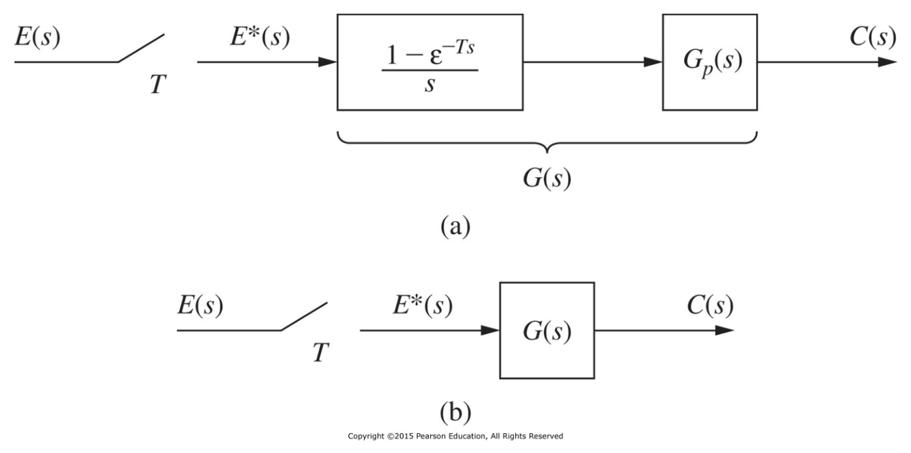
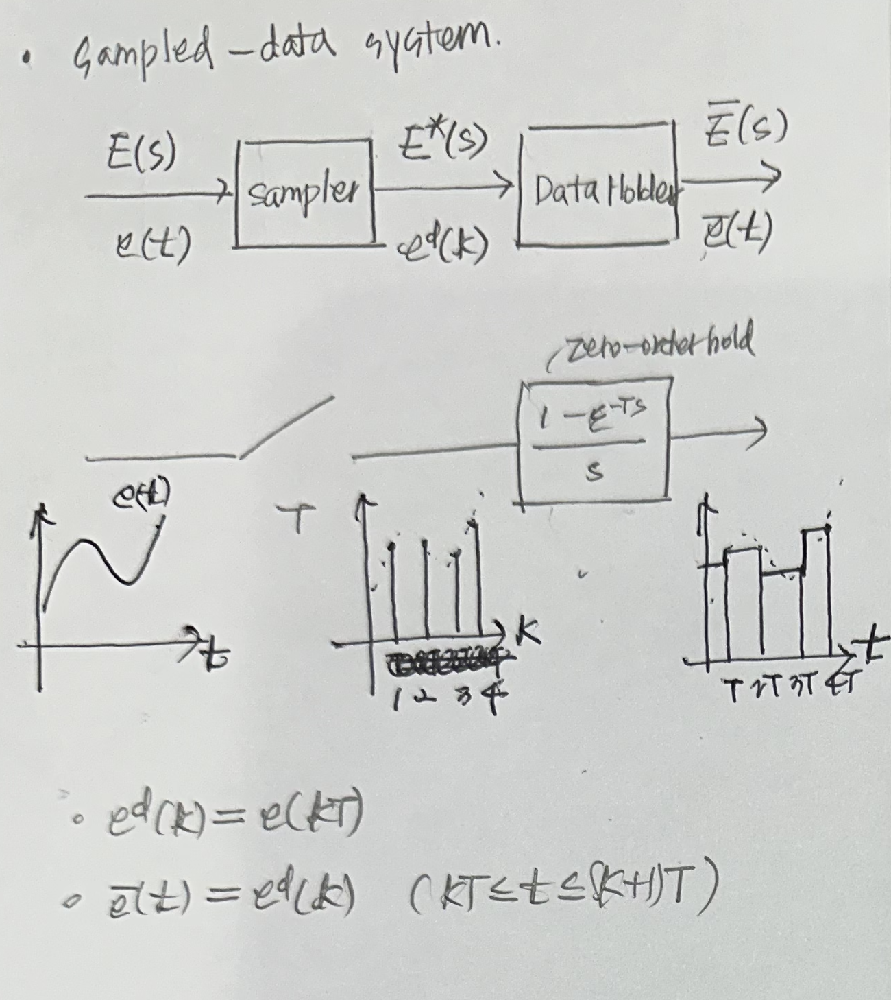
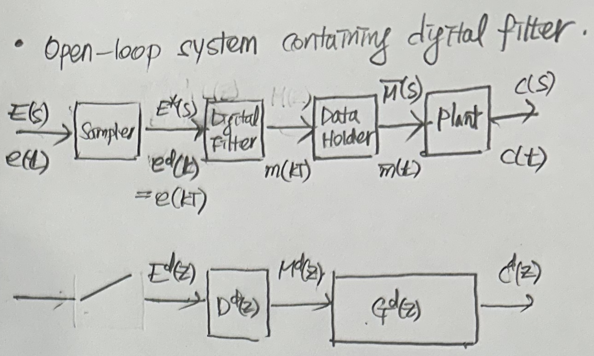
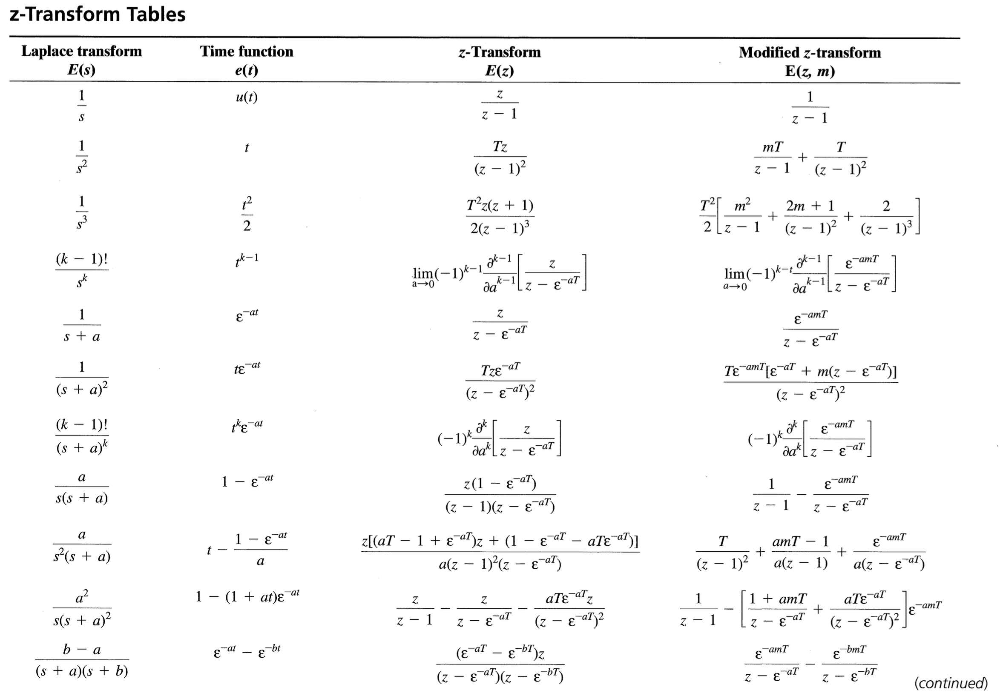
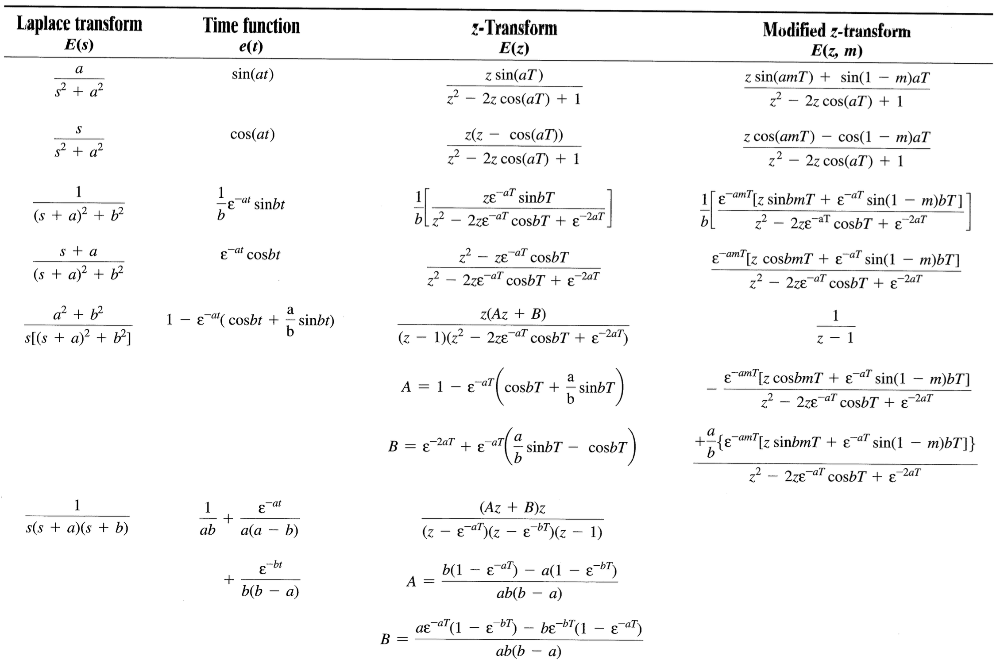

## 1 Introduction

- 앞서 배운 이산 시간 시스템, z-transform, sampling, data reconstruction에 대한 내용들을 open-loop discrete-time system을 분석하는 데 활용할 것이다.
- Since ideal sampler don't have transfer function, these analysis technique of discrete-time system is required.
- 이 분석 기술은 폐루프 시스템으로 확장된다.

## 2 The Relationship Between $E(Z)$ and $E^*(S)$

starred transform $E^*(s)$ of $e(t)$

$$
E^*(s) = e(0) + e(T)\epsilon^{-Ts} + e(2T)\epsilon^{-2Ts} + \dots
$$

z-transform $E(z)$ of $e^d(k)$

$$
E^d(z) = e^d(0) + z^{-1}e^d(1) + z^{-2}e^d(2) + \dots
$$

Therefore

$$
E(z) = E^*(s) |_{\epsilon^{sT}=z} \;\; \text{or} \;\; E^*(s) = E(z) |_{z=\epsilon^{sT}}
$$

이것은 z-transform이 laplace transform의 특별한 경우라는 것을 의미한다.

우리는 이산 시간 시스템을 분석할 때 앞으로 star-transform 대신 z-transform을 이용할 것이다. star-transform이 필요하다면, 먼저 $E(z)$를 구하고 inverse-transform을 이용하여 $E^*(s)$를 구할 것이다.

$$
E(z) = \sum_{\text{at poles of} \;E(\lambda)} \left [\text{residues of} \;E(\lambda)\dfrac{1}{1-z^{-1}\epsilon^{T\lambda}}\right]
$$

이 표현은 z-transform table을 만드는 데 유용하다. $z = \epsilon^{Ts}$로 치환하면 z-transform table이 된다.

$E(z)$와 $E^*(s)$의 관계를 이용해 2장에서 다루었던 z-transform에 관한 정리들을 star-transform에도 적용할 수 있다.

## 3 The Pulse Transfer Function

In this section, we develop an expression for the z-transform of the output of open-loop sampled-data systems

- Open-loop sampled-data system : sampler + zero-order hold + plant

- $G_p(s)$ : plant transfer function
- $\dfrac{1-\epsilon^{-Ts}}{s}$ : zero-holder hold transfer function
- $G(s)$ : zero-order hold와 plant를 하나의 system으로 볼 때 transfer function. The product of the plant transfer function and the zero-order hold transfer function.

$$
G(s) = \dfrac{1-\epsilon^{-Ts}}{s}G_p(s)
$$

$$
C(s) = G(s) \cdot E^*(s)
\\
C^*(s) = G^*(s) \cdot E^*(s)
\\
C^d(z) = G^d(z) \cdot E^d(z)
$$

(증명 생략)

- Pulse transfer function $G^d(z)$ : zero-order hold + plant + sampler로 이루어진 system의 전달함수. z-transform version of $G(s)$

정리의 의미 : s-domain transfer function에서 time-domain을 거치지 않고 z-transform으로 바꿀 수 있다.

>**[Example 4.2]**

$$
A(s) = \dfrac{1 - e^{-Ts}}{s(s+1)}
= F^*(s)B(s)
\\
F^*(s) = 1 - e^{-Ts}, B(s) = \dfrac{1}{s(s+1)}
\\
A^*(s) = F^*(s)B^*(s)
\\
A(z) = F(z)B(z)
= (1 - z^{-1}) \dfrac{(1-e^{-T})z}{(z-1)(z-e^{-T})}
= \dfrac{1-e^{-T}}{z-e^{-T}}
$$

## 4 Open-Loop Systems Containing Digital Filters

System을 계속해서 확장한다.

- Sampled-data system
  
- Open-loop sampled-data system
  
- Open-loop system
  

A digital filer that solves a linear difference equation with constant coefficients can be represented by a transfer function $D(z)$, such that $M(z) = D(z)E(z)$

## 5 The Modified z-Transform

## 6 Systems with Time Delays

## 7 Nonsynchronous Sampling

## 8 State-Variable Models

2장에서 사용된 상태변수 기법을 이용하여 이 장에서 다루게 될 개루프 샘플값 시스템의 상태변수 모델을 구할 수 있다.

## 9 Review of Continuous-Time State Variables

Presented in the preceding section is a technique for obtaining a set of state equations describing a linear time-variant discrete-time system. This technique is base on transfer functions, and has two major disadvantages.

In taking the transfer function approach to discrete state modelinf, we would have difficulty in choosing velocity as the second state variable. Thus we lose the natural, and desirable, states of the system.

Anothor advantage of the transfer function approach is the difficulty in deriving the pulse transfer functions for high-order systems.

A different approach for obtaining the discrete-time state model of a system is presented in the following section. This approach based on the use of continuous-time state variables.

## 10 Discrete-Time State Equations

연속시간 상태 방정식으로부터 이산상태 방정식을 직접 유도하는 방법을 학습한다.

연속 시간 모델의 상태 변수는 이산 시간 모델의 상태 변수가 된다.

$$
\begin {align*}
\mathbf{\dot{v}}(t) &= \mathbf{A}_c\mathbf{x}(t) + \mathbf{B}_c(t)
\\
y(t) &= \mathbf{C}_c(t) + D_cu(t)
\\
\mathbf{v}(k+1) &= \mathbf{A}\mathbf{x}(k) + \mathbf{B}(k)
\\
y(k) &= \mathbf{C}(k) + Du(k)
\\
\mathbf{x}(kT) &= \mathbf{v}(kT)
\\
\mathbf{A} &= \Phi_c(T)
\\
\mathbf{B} &= \int_{kT}^{kT+T}\mathbf{\Phi}_c(kT+T-\tau)\mathbf{B}d\tau
\end {align*}
$$

## 11 Practical Calculations

## z-Transform Table

## 궁금한 점

- $E(z) = E^*(s) \vert _{\epsilon^{sT}=z}$ 왜 이런 식으로 표현할까?

## Reference

Charles L. Philips - Digital Control System
