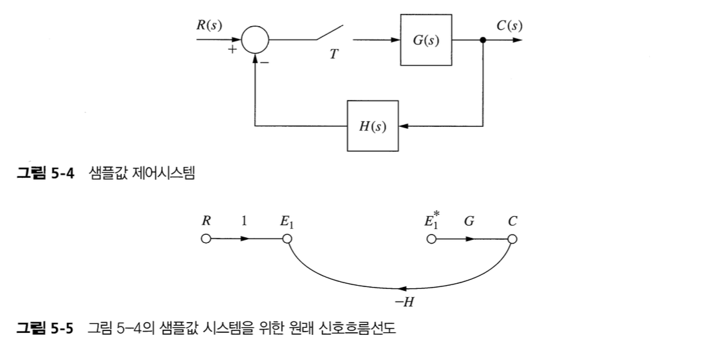

- 개루프 선형시불변 이산시간 시스템의 출력함수를 계산하는 방법을 이용하여 폐루프 선형시불변 이산시간 시스템의 출력함수를 계산하는 방법
- 폐루프 이산시간 시스템을 위한 상태변수 모델을 개발

## 1 Introduction

## 2 Preliminary Concepts

## 3 Derivation Precedure

$$
C^*(s) = \dfrac{G^*(s)}{1+\bar{GH}^*(s)}R^*(s)
$$

## 4 State-Varable Models

## Reference

Charles L. Philips - Digital Control System
