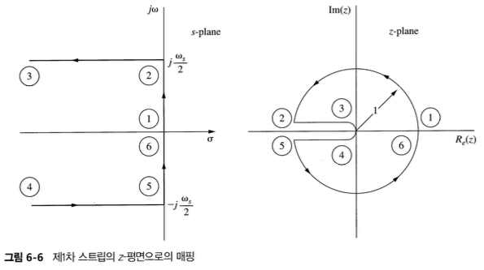
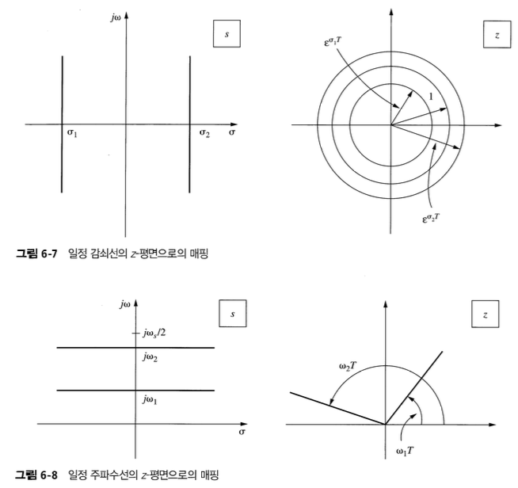

## 1. Introduction

이 장에서는 5가지의 중요한 주제를 다룬다.

1. 이산 시간 시스템의 시간 응답
2. s-plane상의 영역을 z-plane으로 mapping한다.
3. 각 평면에서 매핑된 영역들의 연관 관계를 통해 z-평면상의 극점이 시간 응답에 미치는 영향에 대해서 논의한다.
4. 전달함수 특성들이 정상 상태에서의 시스템 오차에 미치는 영향을 생각해본다.
5. 아날로그 시스템과 이산 시간 시스템의 모의 실험을 소개한다.

## 2. System Time Response

## 3. 시스템 특성 응답

In studying the characteristics of analog systems, we are able to assign time-response characteristics to closed-loop pole locations. It is desirable to be able to do the same for sampled-data systems.

샘플링 순간에 샘플값은 연속 시간 신호와 같아진다. 만약 $e(t) = e^{-at}$,

$$
E(s) = \dfrac{1}{s + a}, \;\;\; E^*(s) = \dfrac{e^{Ts}}{e^{Ts} - e^{-Ts}}, \;\;\; E(z) = \dfrac{z}{z - e^{-aT}}
$$

따라서 s-plane에서 $s = -a$에서의 극점은 z-plane의 극점 $z = e^{-aT}$가 된다.

## 4. s-평면에서 z-평면으로 mapping

Consider first the mapping of the left half-plane portion of the primary strip into the z-plane.

Along the $jw$ axis,

$$
z = e^{sT} = e^{\rho T}e^{j\omega T} = e^{j\omega T} = \cos{\omega T} + j\sin{\omega T}
$$

- 따라서 z-plane에서의 단위원에 위치한 극점들은 s-plane의 허수축에 위치한 극점에 대응한다.
- $j\omega$ 축의 $-j\omega/2$와 $j\omega/2$ 사이는 z-plane의 단위원으로 매핑된다.

## 5. 정상 상태 정확도

## 6. 모의 실험

## Reference

Charles L. Philips - Digital Control System
