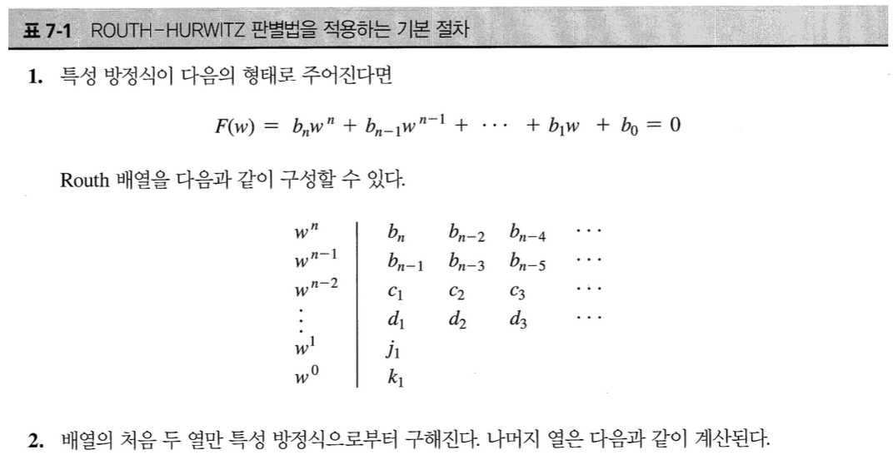
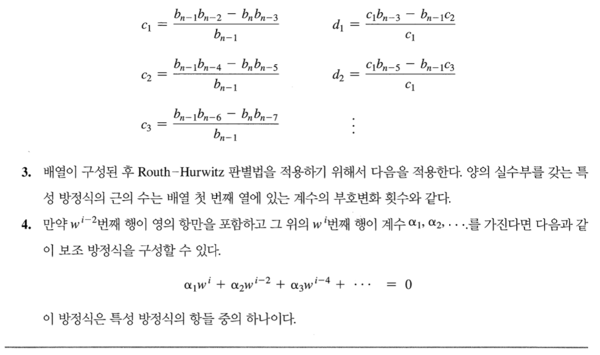
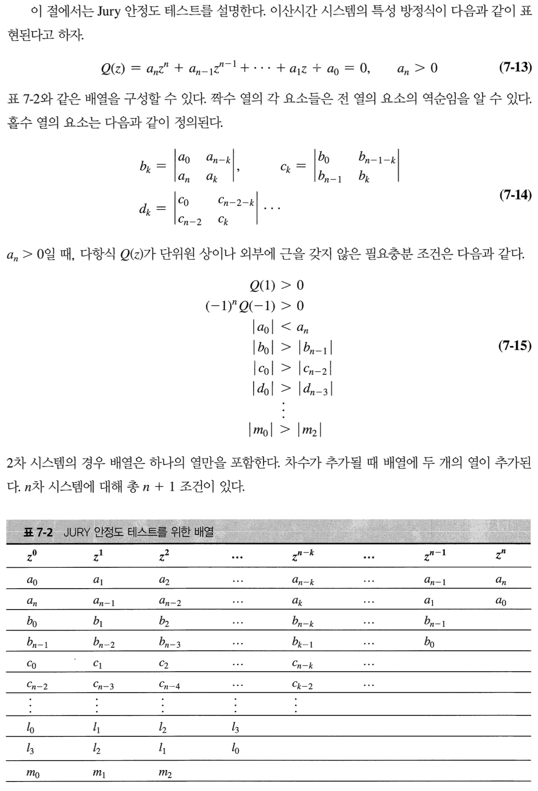
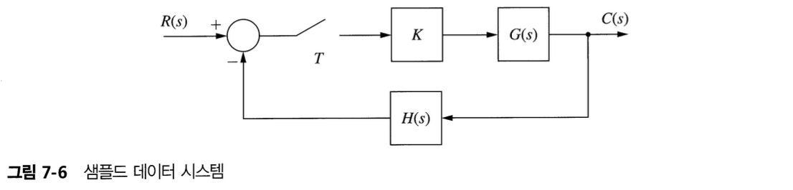
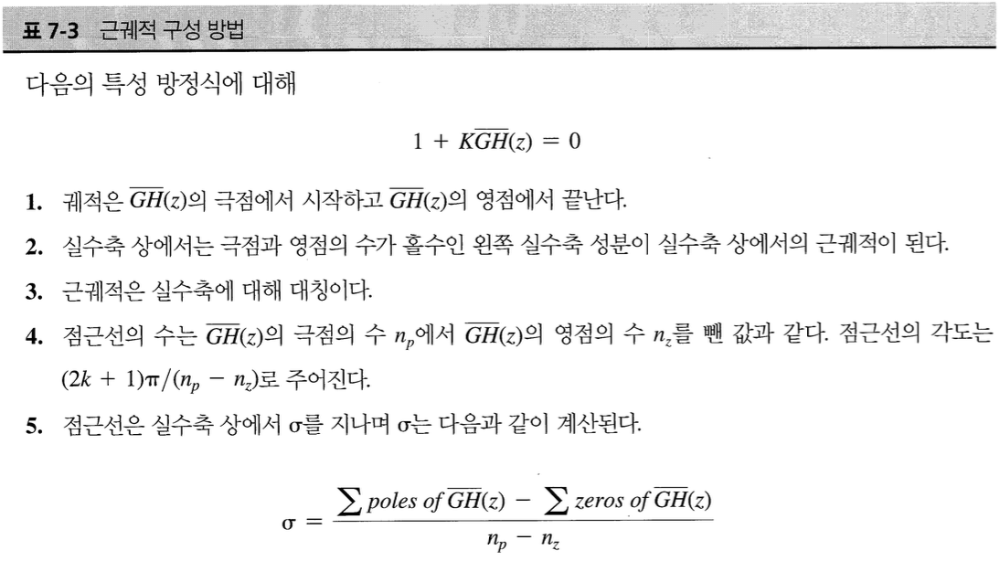
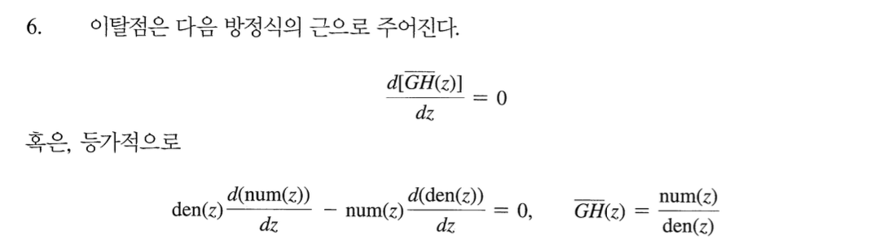

## 1. Introduction

Linear time invariant discrete time system의 stability analysis methods를 배운다.

- Routh-Hurwiz criterion
- Root-locus procedure
- Frequency-response methods
- Jury stability test

Routh-Hurwiz criterion이나 Jury stability test는 특성방정식을 구할 수 있을 때 사용할 수 있다.

## 2. Stability

## 3. Bilinear Transformation

Routh-Hurwitz 판별법, Bode 기법은 연속시간 LTI 시스템의 많은 해석 기법이다. s-plane 상에서 안정도의 경계가 허수축인 점을 이용한다. z-plane 상에서 안정성의 경계는 단위원이기 때문에 이러한 기법들은 LTI 이산시간 시스템에 적용할 수 없다. 하지만 bilinear transformation을 통해 z-plane 상의 단위원이 w-plane 상의 허수축으로 변환된다.

- Continuous-time LTI systems : the stability boundary is the imaginary axis in the s-plane.
- Discrete-time LTI systems : the stability boundary is the unit circle in the z-plane

$$
z = \dfrac{1 + (T/2)w}{1 - (T/2)w}, \;\; \text{or} \;\; w = \dfrac{2}{T}\dfrac{z - 1}{z + 1}
$$

## 4. The Routh-Hurwitz Criterion

- Routh-Hurwiz criterion may be used in the analysis of LTI continuous-time systems to determine if any roots of a given equation are in the right half of the s-plane.
- If the characteristic equation is expressed as a function of the bilinear transform variable w (not z), the the stability of the system may be determined by directly applying the Routh-Hurwiz criterion. 하지만 만약 특성 방정식이 bilinear transformation에 의해 변수 w로 표현된다면, Routh-Hurwiz 판별법을 적용하여 시스템의 안정성을 판별할 수 있다.
- 연속시간 시스템에서 Routh-Hurwiz 판별법을 이용하여 근궤적이 우반평면을 지나는 순간 (즉 시스템이 불안정해지는) K 값을 결정하는 데 사용될 수 있다.
- 시스템의 안정성이 샘플 주기에 따라 잘라질 수 있다. 샘플주기가 증가할 때 안정성이 저하되는 이유는 샘플러와 데이터 홀드에 의해 발생하는 위상 지연 때문이다.

## 5. Jury's Stability Test

- Since the stability boundary in the z-plane is different from that in the s-plane, the Routh-Hurwiz criterion cannot be directly applied to discrete-time systems if the system characteristic equation is expressed as a function of z.
- Routh-Hurwiz : 시스템의 특성 방정식이 z의 함수로 표현된 이산 시간 시스템에서는 Routh-Hurwiz 판별법을 바로 적용할 수 없다.
- Jury 안정도 테스트 : z의 함수로 나타나는 특성 방정식에 바로 적용할 수 있다.

Jury 안정도 테스트

1. 세 조건 $Q(1) > 0, (-1)^nQ(-1) > 0, \vert a_0 \vert < a_n$을 확인한다. 이 조건 중 하나라도 만족되지 않으면 테스트를 중단한다.
2. 각 행이 계산될 때 (7-15)의 조건을 확인하여 배열을 구성한다. 어느 조건이라도 만족되지 않으면 검사를 중단한다.

## 6. Root Locus (근 궤적)

그림 7-6의 LTI sampled data hold system에서

$$
\dfrac{C(z)}{R(z)} = \dfrac{KG(z)}{1+K\bar{GH}(z)}
$$

특성 방정식은 다음과 같다.

$$
1 + K\bar{GH}(z) = 0
$$

근 궤적 : z-plane에서 K의 함수로 위 특정 방정식의 근의 궤적을 그린 그림

## 7. The Nyquist Criterion

Gain margin과 phase margin을 구할 때 필요하다.

## 8. The Bode Diagram

## 9. Interpretation of the Frequency Response

## 10. Closed-Loop Frequency Response

## Reference

Charles L. Philips - Digital Control System
