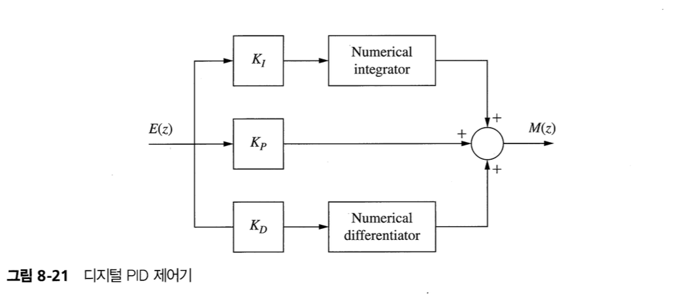

## 1. Introduction

In this chapter we consider the total design problem : How do we design a digital controller transfer function?

- Phase-lag and phase-lead controller
- Proportional-plus-integral-plus-integral(PID) controller
- 근 궤적을 이용하는 설계 방법

All numerical design procedures are based on an inexact model of the physical system.

Design is generally too complex if the accurate simulation model is used.

## 2. Control System Specifications

제어 시스템 설계는 원하는 시스템 특성을 얻기 위해서 시스템 파라미터를 바꾸거나 보상기라고 부르는 부시스템을 추가하는 것을 포함한다.

원하는 특성 도는 성능 사양한 보통 정상 상태 정확도, 과도 응답, 상대 안정도, 시스템 파라미터의 변화에 대한 민감도 및 외란 제거 등과 연관되어 있다.

### Steady-State Accuracy

개루프 함수에 $z=1$의 극점을 추가하거나 개루프 이득을 키우면 정상상태 정확도가 증가한다.

### Transient Reponse (과도 응답)

- 상승시간 : 시스템 응답이 최종값의 10%에서 90%꺼지 증가하는 데 걸리는 시간
- 최대 오버슈트 : 주파수 응답의 공진 첨두치
- 최대 오버슈트까지의 시간
- 정착 시간 : 시스템 응답이 최종값에서 특정 백분율 이내로 정착해들어가는 데 필요한 시간

### Relative Stability (상대안정도)

- gain margin, phase margin : 개루프 주파수응답의 Nyquist 선도가 점 -1에 얼마나 가까운지를 근사적으로 나타내는 지표.

### Sensitivity

### Disturbance Rejection

### Control Effort

## 3. Compensaion

We will limit the discussion to the design of compensators for single-input, single output systems

- Cascade (or series) compensation
- Feedback (or parallel) compensation

다음과 같은 형태의 1차 보상기에 대해 다루자.

$$
D(z) = \dfrac{K_d(z-z_0)}{z-z_p}
$$

주파수 영역에서 보드기법을 이용하여 보상기를 설계할 것이다. Bilinear transform을 이용해서 $D(z)$를 w-plane으ㅡ로 전환하자.

$$
D(w) = a_0 \left[ \dfrac{1 + w/\omega_{w0}}{1 + w/\omega_{wp}} \right]
$$

여기서 $\omega_{w0}$는 영점의 위치이고, $\omega_{wp}$는 극점의 위치이다.

영점과 극점의 상대적인 위치에 따라 보상기를 구분한다.

- If $\omega_{w0} < \omega_{wp}$ : phase-lead compensation
- If $\omega_{w0} > \omega_{wp}$ : phase-lag compensation

## 4. Phase-Lag Compensation

- 저주파에 비해서 고주파 영역의 gain margin이 커진다.
- Phase margin을 작게 한다. 위상뒤짐을 가져온다. 일반적으로 위상뒤짐은 시스템을 불안정하게 하는 경향이 있다. (Nyquist plot을 -1 쪽으로 회전시킨다.)

## 5. Phase-Lead Compensation

- phase margin을 크게한다.
- 고주파 이득이 저주파 이득에 비해 상대적으로 커져서 gain margin이 작아진다.

## 6. Phase-Lead Design Procedure

## 7. Lag-Lead Compensation

시스템에서 경사 입력에 대한 정상상태 오차를 줄여야 한다고 생각해보자.

시스템의 저주파 이득을 증가시켜야 한다.

위상앞섬 보상기를 사용한다면 모든 주파수에서의 이득을 증가시켜야 한다.

이때 phase-lag compensator와 phase lead compensator를 연결해 사용할 수 있다. (Lag-lead compensator)

## 8. Integration and Differentiation Filters

## 9. PID Controller

- 비례-적분-미분 제어기
- lead-lag compensator의 특수한 형태

- $K_P$ : 경로 적분의 이득
- $K_I$ : 미분 경로의 이득
- $K_D$ : 적분 경로의 이득

$$
D(w) = K_p + \dfrac{K_I}{w} + K_Dw
$$

PI 제어기 : $\omega_{wp} = 0$에 극점을 위치시킨 것과 같은 형태 (phase lag compensator)

$$
D(w) = K_p + \dfrac{K_I}{w} = K_I\dfrac{1 + w/\omega_{w0}}{w}
$$

where $\omega_{w0} = K_I/K_P$

- 저주파이득 증가 -> 정상상태 오차 감소

PD 제어기 (phase lead compensator)

## 10. PID Controller Design

## 11. Design by Root Locus

## Reference

Charles L. Philips - Digital Control System
