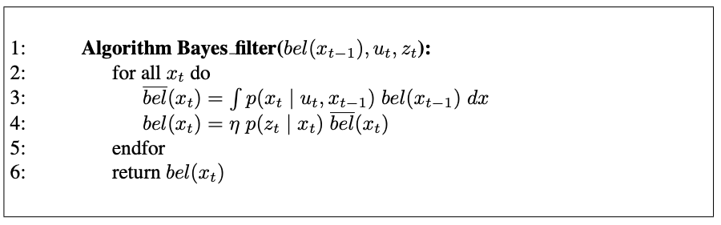

# Bayes Filters

## 1. The Bayes Filter Algorithm

The most general algorithm for calculating beliefs is given by the Bayes Filter algorithm.

The general algorithm for Bayes filtering

{: .align-center}

- recursive
- $bel(x_t)$ at time $t$ is calculated from the belief $bel(x_{t-1})$ at the time $t-1$

input

- belief *bel* at time $t-1$
- most recent control $u_t$
- most recent measuremnt $z_t$

output

- belief *bel$(x_t)$* at time t

The Bayes filter algorithm possesses two essential steps.

- update step (, control update, or prediction)
- measurment update
