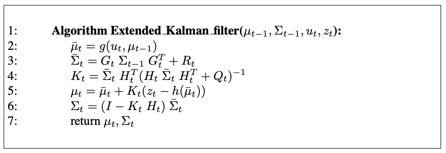

# 1. Introduction

- Kalman filter : 선형 동역학과 측정 함수가 있는 제한된 문제에 대해 모멘트 표현을 사용하여 베이즈 필터를 구현한다.
- Extened Kalman filter : 비선형 문제로 칼만 필터를 확장한 것
- Information filter : 가우시안의 정준 표현을 사용하는 칼만 필터의 쌍대

# 2. The Kalman Filter

## 2.1 Linear Gaussian Systems

- 베이즈 필터를 구현하는 가장 잘 연구된 기술은 칼만 필터이다.
- 칼만 필터는 모멘트 표현을 사용하여 신념을 표현한다.
- 시간 t에서 신념은 평균 $\mu_t$과 공분산 $\sum_t$으로 표현한다.
- 상태를 가우시안 분포로 가정하여 평균과 공분산 행렬로 상태를 표현한다.
- Bayes filter with Gaussians
- Developed in the lated 1950’s

베이즈 필터의 마르코프 가정 외에 다음의 세 가지 조건이 충족된다면, 사후 확률은 가우시안 분포를 따른다.

1. The next state probability $p(x_t \vert u_t, x_{t-1})$ must be a linear function in its arguments with added Gaussian noise.

$$
x_t = A_t x_{t-1} + B_t u_t + \epsilon_t
$$

2. The measurement probability $p(z_t \vert x_t)$ must also be linear in it arguments, with added Gaussian noise:

$$
z_t = C_t x_t + \delta_t
$$

3. The initial belief *bel($x_0$)* must be normal distributed 

$$
bel(x_0) = p(x_0) = det(2\pi \Sigma_0)^{-\dfrac{1}{2}} exp \left[ -\dfrac{1}{2} (x_0 - \mu_0)^T \Sigma_0^{-1} (x_0 - \mu_0) \right]
$$

## 2.2 The Kalman Filter Algorithm

{: .align-center}

칼만 필터는 시간 $t$에서 신념 *bel($x_t$)*을 평균 $\mu_t$과 공분산 $\sum_t$으로 표현한다.

Input

- the belief at time $t-1$, represented by $\mu_{t-1}$ and $\Sigma_{t-1}$
- the control $u_t$
- the measurement $z_t$

Output

- the belief at time $t$, represented by $\mu_t$ and $\Sigma_t$

Prediction Step

Predicted belief $\overline{\mu}$ and $\overline{\Sigma}$ representing the belief $\overline{bel}(x_t)$ one time step later is calculated.

The mean is updated using the deterministic version of the state transition function.

The update of the covariance considers the fact that states depend on previous states through the linear matrix $A_t$. This matrix is multiplied twice into the covariance, since the covariance is a quadratic matrix.

Correction Step

The belief $\overline{bel}(x_t)$ is subsequently transformed into the desired belief $bel(x_t)$ in lines 4 through 6, be incorporating the measurement $z_t$.

Kalman gain $K_t$ : specifies the degree to which the measurement is incorporated into the new state estimate

Line 5 : manipulates the mean, by adjusting it in proportion to the Kalman gain K_t and the deviation of the actual measurement, $z_t$, and the measurement predicted according to the measurement probability.

The key concept is the *innovation*, which is the difference between the actual measurement $z_t$ and the expected measurement $C_t, \overline{\mu_t}$

Line 6 : new covariance of the posterior belief is calculated, adjusting for the information gain resulting from the measurement.

# 3. The Extended Kalman Filter

## 3.1 Why Linearize?

$$
\begin{align*}
  x_t &= g(u_t, x_{t-1}) + \epsilon_t \\
  \\
  z_t &= h(x_t) + \delta_t
\end{align*}
$$

Unfortunately, with arbitrary functions $g$ and $h$, the belief is no longer a Gaussian.

In fact performing the belief update exactly is usually impossible for nonlinear functions $g$ and $h$, and the Bayes filter does not possess a closed-form solution.

## 3.2 Linearization Via Taylor Expansion

The key advantage of the linearization lies in its efficiency.

There exist many technigues for linearizing nonlinear functions.

EKFs utilize a method called Taylor expansion

## 3.3 The EKF Algorithm

{: .align-center}

The linear predictions in Kalman filters are replaced by their nonlinear generalization in EKFs.

||Kalman Filter|Extended Kalman Filter|
|---|:---:|:---:|
|State prediction (line 2)|$A_t \mu_{t-1} + B_t u_t$|$g(u_t, \mu_{t-1})$|
|measurement prediction (line 5)|$C_t \mu_t$|$h(\mu_t)$|

|KF|EKF|
|:---:|:---:|
|Matrices $A_t, B_t$|Jacobians $G_t$|
|Matrix $C_t$|Jacobian $H_t$|

## 궁금한 점

- KF에서 covariance를 업데이트하는 식은 어디서 파생된 걸까?
- 사후 확률 분포가 뭘까?
