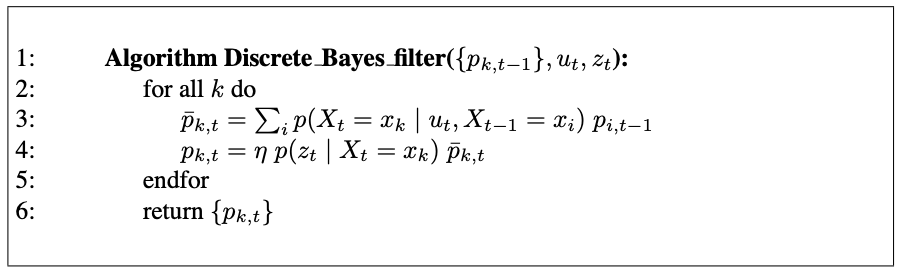
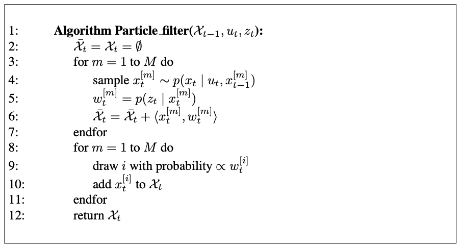

# 1. The Histogram Filter

Histogram filters decompose the state space into finitely many regions and represent the cumulative posterior for each region by a single probability value.

- Discrete Bayes filter : when applied to finite spaces
- Histogram filter : when applied to continuous spaces

## 1.1 The Discrete Bayes Filter Algorithm

{: .align-center}

Discrete Bayes filters apply to problems with finite state spaces, where the random variable $X_t$ can take on finitely many values.

The discrete Bayes filter is derived from the general Bayes filter by replacing the integration with a finite sum.

- $x_i, x_t$ : individual states, of which there may only be finitely many.
- $p_{k, t}$ : discrete probaility distribution

Input

- discrete probaility distribution $p_{k, t}$
- the most recent control $u_t$
- measurement $z_t$

Output

- the belief at time $t$, represented by $\mu_t$ and $\Sigma_t$, $p_{k, t}$

Prediction Step (Linea 3)

calculates the prediciton, the belief for the new state based on the control alone

Measurement Update (Linea 4)

incorporate the measurement

# 3. The Particle Filter

## 3.1 Basic Algorithm

The particle filter is an alternative nonparametric implementation of the Bayes filter.

The key idea of the particle filter is to represent the posterior $bel(x_t)$ by a set of random state samples drawn from this posterior.

Instead of representing the distribution by a parametric form, partile filters represent a distribution by a set of samples drawn from this distribution.

Such a representation is approximate, but it is nonparametric, and therefore can represent a much broader space of distributions than Gaussians.

Anothor advantage of the smaple based representation is its ability ot model nonlinear transformations of random variables.

{: .align-center}

In particle filters, the samples of a posterior distribution are called partilces and are denoted

$$
\mathcal{X}_t := x_t^{[1]}, x_t^{[2]}, \dots, x_t^{[M]}
$$

Each particle $x_t^{[m]} (1 \leq m \leq M$) is a concrete instantiation of the state at time $t$.

A particle is a hypothesis as to what the true world state may be at time $t$.

$M$ : the number of paribles in the partible set $\mathcal{X}_t$, e.g. $M = 1,000$, sometimes a function of t or other quantities related to the belief $bel(x_t)$.

The intuition behind particle filters is to approximate the belief $bel(x_t)$ by the set of partiles $\mathcal{X}_t$.

Ideally, the likelihood for a state hypothesis $x_t$ to be inclueded in the particle set $\mathcal{X}_t$ shall be proportional to its Bayes filter posterior

$$bel(x_t) : x_t^{[m]} \sim p(x_t \vert z_{1:t}, u_{1:t})$$

As a consequence, the denser a subregion of the state space is populated by samples, the more likely it is that the true state falls into this region.

Just like all other Bayes filter algorithms, the particle filter algorithm constructs the belief $bel(x_t)$ recursively from the belief $bel(x_{t-1})$ one time step earlier.

Since beliefs are represented by sets of particles, this means that particle filters construct the particles et $\mathcal{X}_t$ recursively from the set $\mathcal{X}_{t-1}$.

Input

- particle set $\mathcal{X}_{t-1}$
- the most recent control $u_t$
- the most recent measurement $z_t$

Output

- the set $\mathcal{X}_t$, which approximates the posterior distribution $bel(x_t)$

Linea 4

generates a hypothetical state $x_t^{[m]}$ for time $t$ based on the particle $x_{t-1}^{[m]}$ and the control $u_t$.

The resulting sample is indexed by $m$, indicating that it is generated from the $m$-th particle in $\mathcal{X}_{t-1}$.

This step involves sampling from the state transition distribution $p(x_t \vert u_t, x_{t-1}$.

The set of particles obtained after $M$ iterations is the filter's representation of $\overline{bel}(x_t)$.

Linea 5

calculates for each particle $x_t^{[m]}$

*importance factor* $w_t^{[m]}$ : incorporate the measurement $z_t$ into the partilce set

If we interpret $w_t^{[m]}$ as the weight of a particle, the set of weighted partiles represents the Bayes filter posterior $bel(x_t)$.

Linea 8 - 11

resampling (or *importance smapling*)
